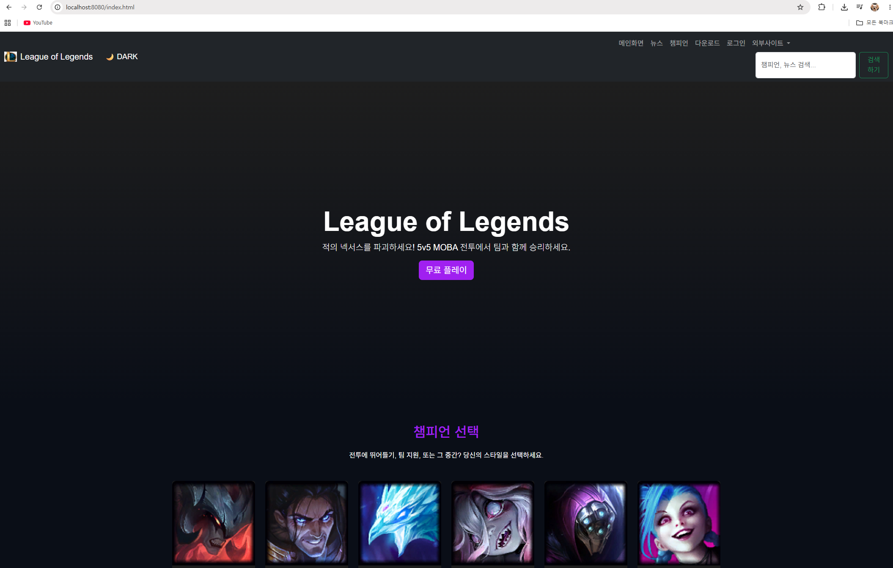
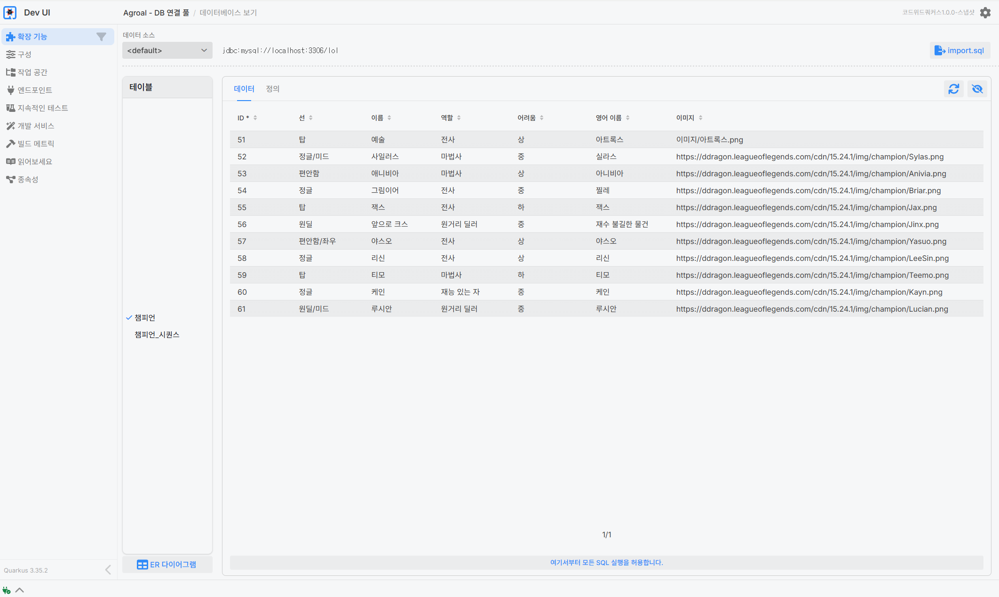
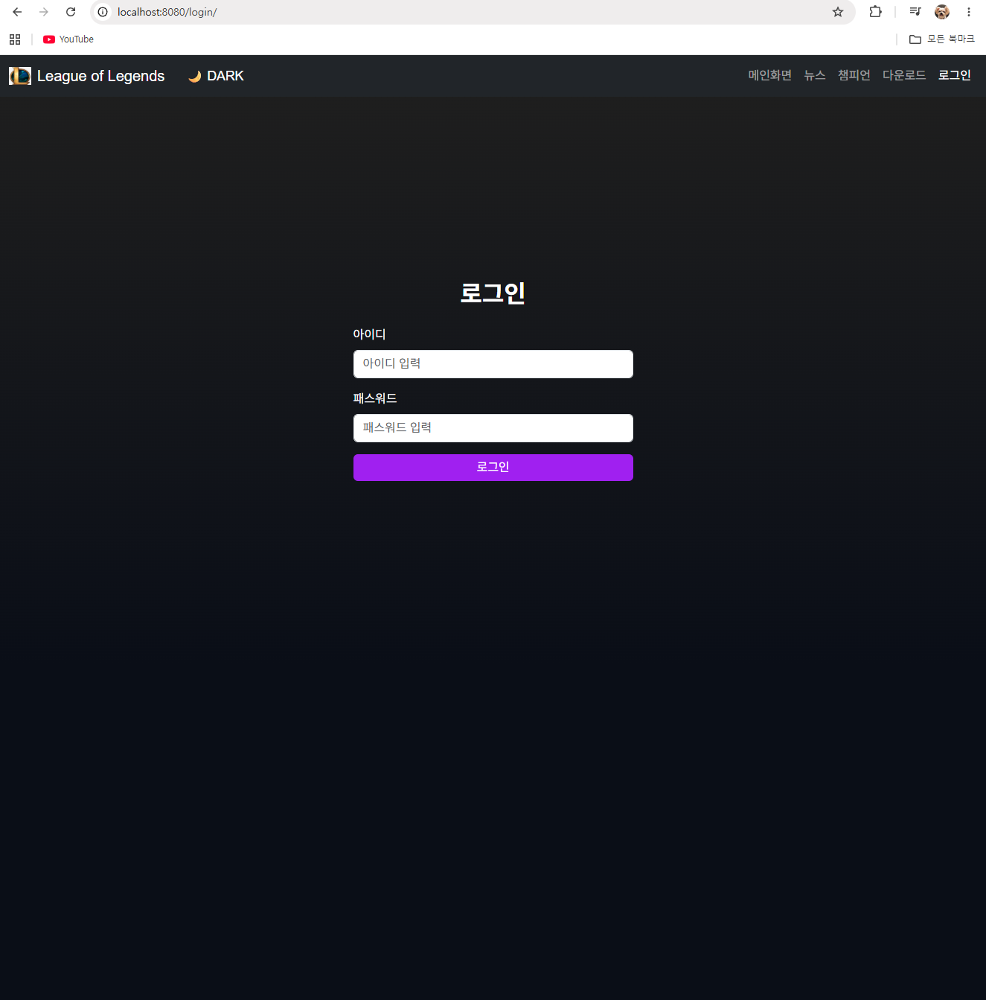
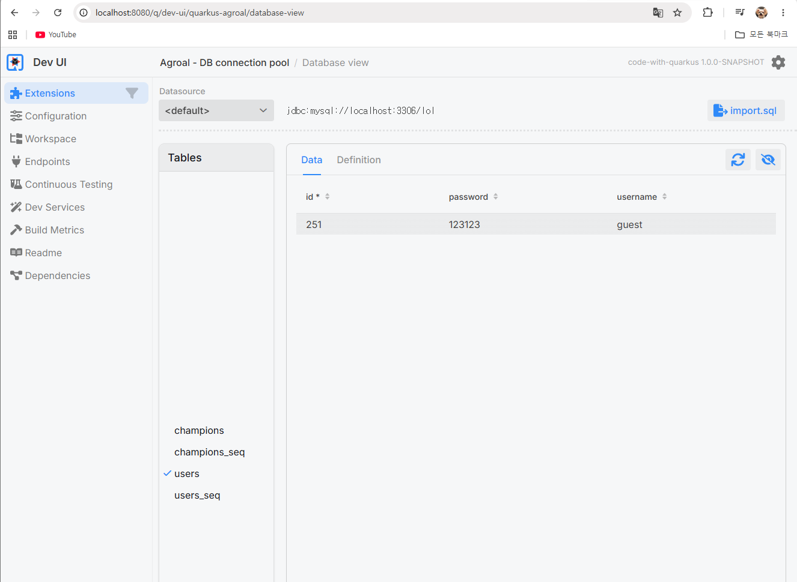
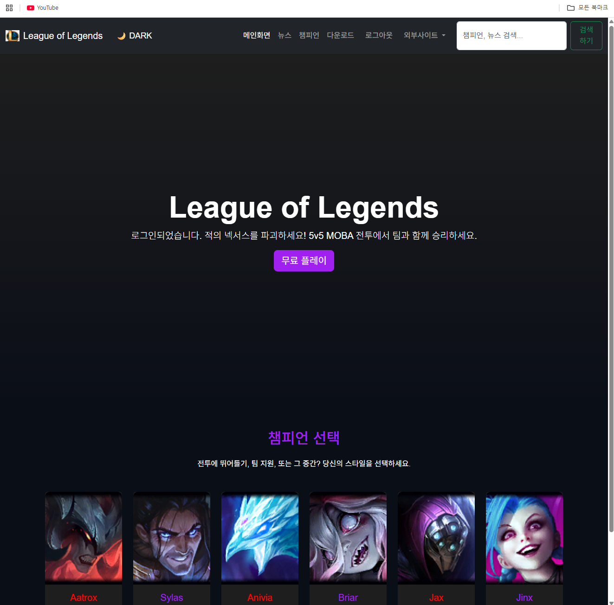
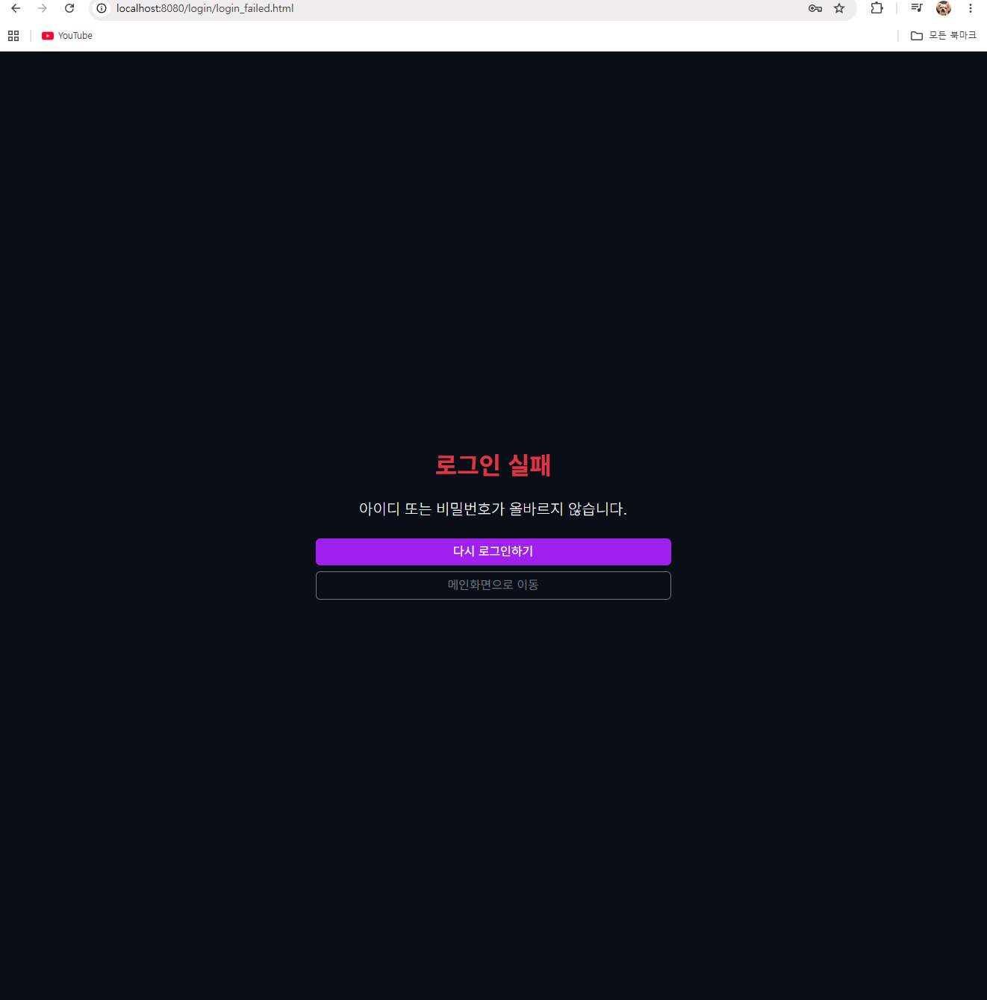
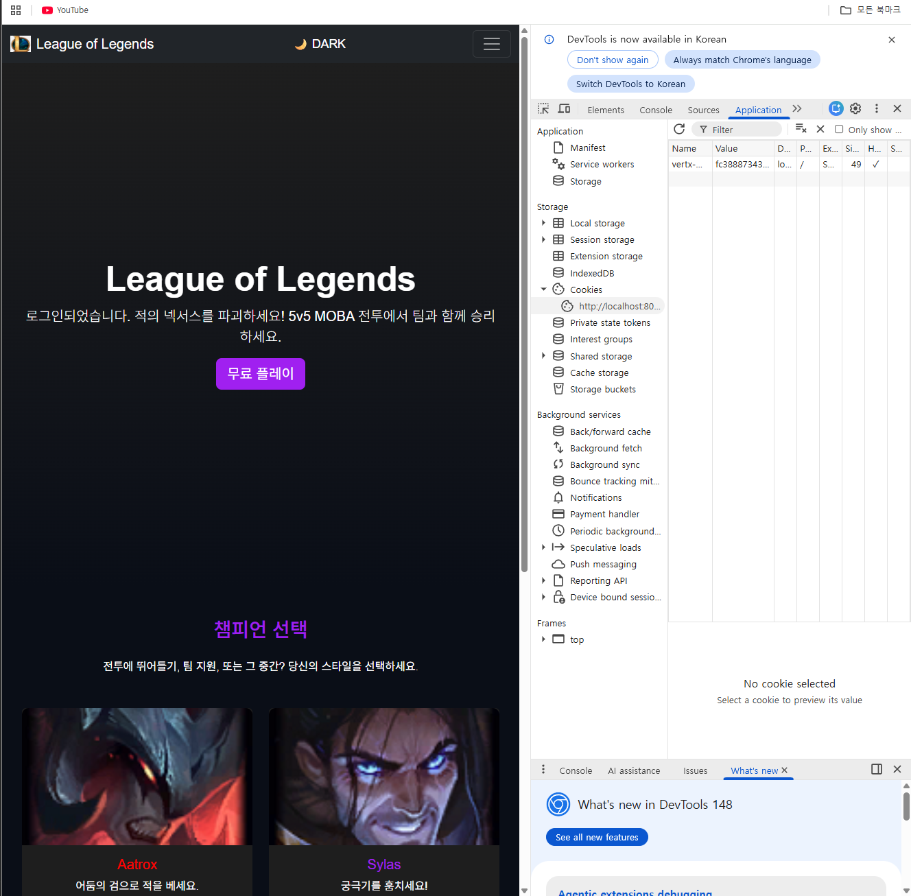
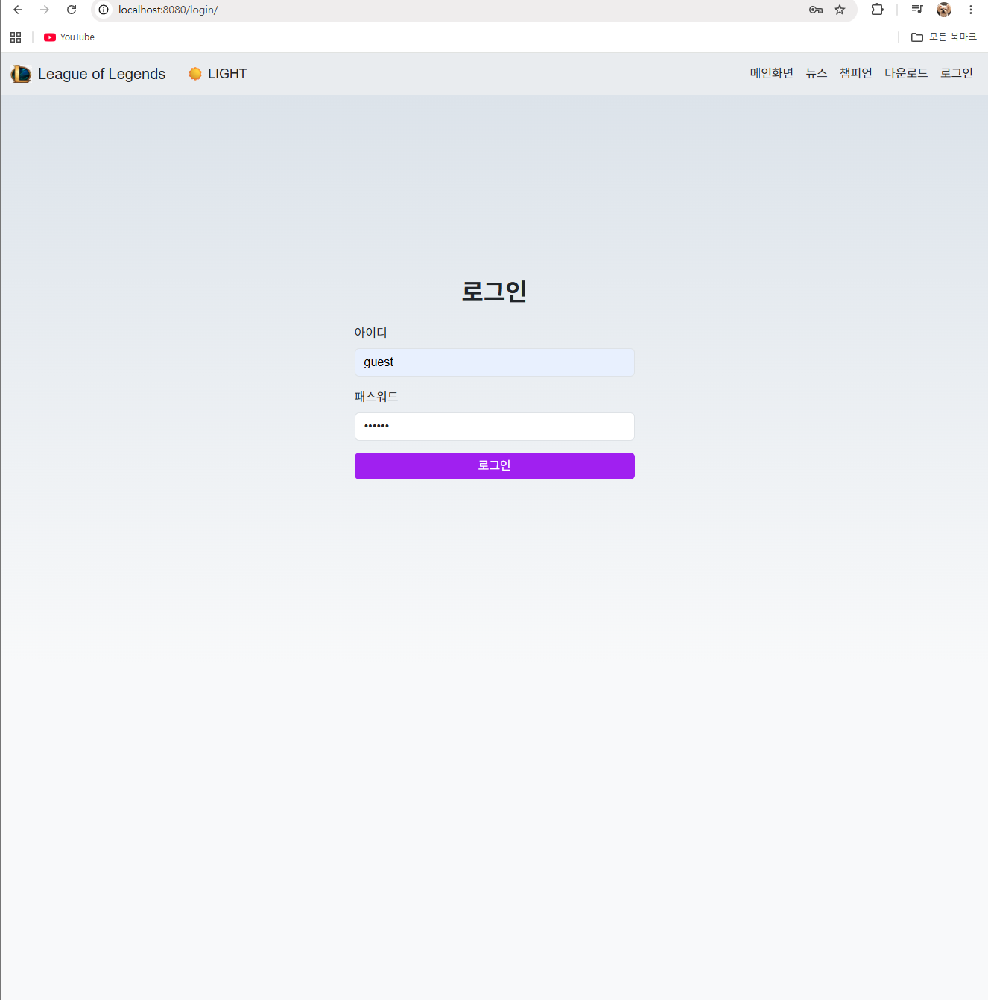

# Quarkus LOL Fan Site

자바웹프로그래밍 수업 실습 프로젝트입니다.  
Quarkus 기반으로 LOL 팬 사이트 메인 페이지, 챔피언 상세 모달, 로그인 페이지, 다운로드 페이지를 구현했습니다.

## 2주차 수업 내용

- Quarkus 개발 환경 구축
- `http://localhost:8080/` 서버 실행 확인
- `META-INF/resources/index.html` 생성
- HTML 기본 태그 작성
- Bootstrap 5 적용
- LOL 메인화면 프로토타입 구현
- 다크 테마 CSS 및 카드 hover 효과 적용

## 4주차 수업 내용

- 네비게이션 바 수정
- 메인화면 / 뉴스 / 챔피언 / 다운로드 / 로그인 메뉴 구성
- 외부사이트 드롭다운 메뉴 추가
- LOL 공식 웹사이트, Bootstrap 공식문서, Quarkus 공식문서 링크 연결
- 챔피언 카드 6개 구성
- Aatrox 상세보기 버튼 추가
- Bootstrap 모달창 구현
- `modals/Aatrox.html` 상세 페이지 생성
- iframe 방식으로 모달 내용 분리
- `images/Aatrox.png` 로컬 이미지 적용
- 로그인 서브 페이지 생성
- `login_page_sub/login.html` 연결
- 다운로드 서브 페이지 생성
- `main_page_sub/download.html` 연결
- `download-banner.jpg` 배경 이미지 적용
- 권장 시스템 사양 표 추가
- `download.css` 파일로 CSS 분리

## 실행 방법

```bash
cmd /c mvnw.cmd quarkus:dev
```

브라우저에서 아래 주소로 접속합니다.

```text
http://localhost:8080/
```

## 주요 페이지

- 메인 페이지: `http://localhost:8080/`
- 로그인 페이지: `http://localhost:8080/login_page_sub/login.html`
- 다운로드 페이지: `http://localhost:8080/main_page_sub/download.html`
- 아트록스 상세 페이지: `http://localhost:8080/modals/Aatrox.html`

## 화면 예시

### 메인 페이지


### 아트록스 상세 모달


### 다운로드 페이지


## 6주차 수업 내용

- JavaScript 기본 문법 학습
- 검색창 form 구성 및 search.js 연동
- 챔피언/뉴스 데이터 배열 생성
- 실시간 검색 결과 화면 구현
- 챔피언/뉴스 카테고리 전환 기능 구현
- 추가 구현: 챔피언 데이터 3개 이상 추가
- 추가 구현: 검색어가 없거나 공백일 때 메인화면으로 복귀

## 실행 화면

### 메인 페이지


### 다운로드 페이지


### 챔피언 모달 화면


---

## 9주차 수업 내용

### 1. JavaScript 기능 추가

- `test2.js`를 활용하여 배열과 객체 배열의 성능 테스트를 진행하였다.
- `toggle.js`를 추가하여 다크 모드와 라이트 모드 전환 기능을 구현하였다.
- 검색 결과 챔피언 카드를 클릭하면 기존 상세보기 모달창이 열리도록 수정하였다.

### 2. MySQL 데이터베이스 연동

- MySQL Server 8.x를 설치하고 `lol` 데이터베이스를 생성하였다.
- `pom.xml`에 MySQL JDBC, Hibernate ORM Panache, REST Jackson 의존성을 추가하였다.
- `application.properties`에 MySQL 접속 정보를 설정하였다.
- Quarkus Dev UI와 VS Code DB 확장 기능을 통해 데이터베이스 연결을 확인하였다.

### 3. 챔피언 테이블 및 API 구현

- `Champion.java` 파일을 생성하여 `champions` 테이블과 Java 클래스를 매핑하였다.
- `ChampionResource.java` 파일을 생성하여 `/champions` API를 구현하였다.
- `DataSeeder.java` 파일을 생성하여 초기 챔피언 데이터를 데이터베이스에 삽입하였다.

### 4. 검색 기능 DB 연동

- 기존 `search.js`의 고정 챔피언 배열 대신 `/champions` API에서 데이터를 불러오도록 수정하였다.
- 검색창에서 챔피언 이름, 영어 이름, 역할, 라인을 기준으로 검색되도록 구현하였다.
- 검색 결과 화면에서 MySQL 데이터베이스에 저장된 챔피언 정보가 정상 출력되는 것을 확인하였다.

### 9주차 실행 화면

#### 9주차 메인 페이지



#### 9주차 MySQL 챔피언 데이터 확인



## 10주차 수업 내용 - 로그인과 로그아웃 구현

이번 10주차에서는 Quarkus 프로젝트에 로그인과 로그아웃 기능을 구현하였다. 기존에는 정적 HTML 파일을 직접 이동하는 방식이었지만, 로그인 기능은 사용자 인증과 세션 처리가 필요하기 때문에 Quarkus 백엔드 엔드포인트를 통해 접근하도록 구조를 변경하였다.

### 1. 로그인 페이지 엔드포인트 연결

메인 페이지의 네비게이션 바에서 로그인 버튼의 이동 경로를 기존 정적 파일 경로가 아닌 `/login`으로 수정하였다. 이후 `AuthResource.java`에 `GET /login` 엔드포인트를 추가하여 `resources/META-INF/resources/login/login.html` 파일을 서버에서 읽어 브라우저에 반환하도록 구현하였다.

이를 통해 로그인 페이지가 단순 정적 페이지가 아니라 Quarkus 서버를 거쳐 출력되도록 변경하였다.



### 2. 로그인 폼 작성 및 POST 요청 처리

`login.html` 파일에 아이디와 비밀번호를 입력할 수 있는 로그인 폼을 작성하였다. 로그인 폼은 `method="POST"` 방식으로 `/login_check` 엔드포인트에 데이터를 전송하도록 구성하였다.

POST 방식을 사용하면 아이디와 비밀번호가 주소창에 노출되지 않기 때문에 로그인과 같은 중요한 정보 전송에 적합하다. 서버에서는 `@FormParam("username")`, `@FormParam("password")`를 이용하여 사용자가 입력한 값을 전달받도록 구현하였다.

### 3. 사용자 엔티티 및 users 테이블 생성

로그인 정보를 데이터베이스에서 확인하기 위해 `User.java` 엔티티를 생성하였다. `users` 테이블에는 사용자 아이디와 비밀번호를 저장하도록 구성하였으며, `username` 값을 기준으로 사용자를 조회할 수 있도록 `findByUsername()` 메서드를 추가하였다.

또한 `DataSeeder.java`를 수정하여 서버 시작 시 실습용 사용자 계정인 `guest / 123123`이 자동으로 등록되도록 하였다.



### 4. 데이터베이스 기반 로그인 검증

`POST /login_check` 엔드포인트에서 입력받은 아이디를 기준으로 `users` 테이블을 조회하도록 구현하였다. 조회된 사용자가 없거나 비밀번호가 일치하지 않으면 로그인 실패 페이지로 이동하고, 아이디와 비밀번호가 모두 일치하면 로그인 후 페이지로 이동하도록 처리하였다.

이를 통해 아무 값이나 입력해도 로그인되는 임시 로그인 방식에서 벗어나, 데이터베이스에 저장된 사용자 정보와 비교하는 인증 구조로 변경하였다.





### 5. 세션 기반 로그인 상태 유지

로그인 성공 시 `RoutingContext`의 세션에 `loginUser` 값을 저장하도록 구현하였다. 이후 `/after_login` 엔드포인트에서는 세션에 저장된 로그인 사용자 정보가 있는지 확인하고, 로그인 정보가 존재하는 경우에만 로그인 후 페이지를 출력하도록 하였다.

세션이 없거나 로그아웃된 상태에서 `/after_login` 주소로 직접 접근하면 로그인 페이지로 강제 이동하도록 처리하였다. 이를 통해 로그인하지 않은 사용자가 로그인 후 페이지에 직접 접근하는 문제를 방지하였다.

브라우저 개발자 도구의 Application 탭에서 `vertx-web.session` 쿠키가 생성되는 것도 확인하였다.



### 6. 로그아웃 기능 구현

로그인 후 페이지의 네비게이션 바에는 기존 로그인 버튼 대신 로그아웃 버튼을 추가하였다. 로그아웃 버튼은 `/logout` 엔드포인트로 연결되며, 서버에서는 현재 세션을 삭제한 뒤 메인 페이지로 이동하도록 구현하였다.

로그아웃 후에는 `/after_login` 페이지에 직접 접근하더라도 세션 정보가 없기 때문에 다시 로그인 페이지로 이동한다. 이를 통해 로그인 상태 유지와 로그아웃 후 접근 차단이 정상적으로 작동하는 것을 확인하였다.

### 7. 로그인 페이지 다크/라이트 모드 적용

과제 내용에 맞춰 로그인 페이지에도 기존 메인 페이지에서 사용하던 네비게이션 바, CSS, 다크/라이트 모드 버튼을 재사용하였다. 이를 통해 메인 페이지와 로그인 페이지의 디자인을 통일하고, 로그인 화면에서도 다크/라이트 모드가 정상적으로 작동하도록 구성하였다.

기존 화면은 다크모드 상태로 확인하였고, 추가로 라이트모드 화면도 캡처하여 두 모드가 모두 적용되는 것을 확인하였다.



### 주요 파일

- `src/main/resources/META-INF/resources/index.html`
  - 로그인 링크를 `/login`으로 수정

- `src/main/resources/META-INF/resources/login/login.html`
  - 로그인 폼 작성
  - 다크/라이트 모드 버튼 적용

- `src/main/resources/META-INF/resources/login/main_after_login.html`
  - 로그인 후 메인 페이지 작성
  - 로그아웃 버튼 추가

- `src/main/resources/META-INF/resources/login/login_failed.html`
  - 로그인 실패 화면 작성

- `src/main/java/org/acme/login/User.java`
  - 사용자 엔티티 생성
  - `users` 테이블과 연결

- `src/main/java/org/acme/login/AuthResource.java`
  - `/login`, `/login_check`, `/after_login`, `/logout` 엔드포인트 구현
  - DB 로그인 검증 및 세션 처리 구현

- `src/main/java/org/acme/login/SessionConfig.java`
  - Quarkus 세션 기능 등록

- `src/main/java/org/acme/common/DataSeeder.java`
  - 실습용 사용자 `guest / 123123` 자동 등록

### 실행 및 확인 결과

- `/login` 접속 시 로그인 페이지 출력 확인
- `guest / 123123` 입력 시 로그인 성공 확인
- 잘못된 아이디 또는 비밀번호 입력 시 로그인 실패 페이지 출력 확인
- Dev UI에서 `users` 테이블과 `guest` 계정 저장 확인
- 로그인 성공 후 `/after_login` 접근 가능 확인
- 로그인 성공 시 `vertx-web.session` 쿠키 생성 확인
- 로그아웃 시 세션 삭제 후 메인 페이지 이동 확인
- 로그아웃 후 `/after_login` 직접 접근 시 로그인 페이지로 이동 확인
- 로그인 페이지에서 다크/라이트 모드 동작 확인

### 10주차 정리

이번 주차에서는 단순한 화면 이동이 아닌, 실제 웹 서비스에서 사용하는 로그인 흐름을 구현하였다. 사용자가 입력한 로그인 정보를 서버로 전달하고, 서버는 데이터베이스의 사용자 정보와 비교하여 로그인 성공 여부를 판단하였다. 또한 세션을 이용하여 로그인 상태를 유지하고, 로그아웃 시 세션을 삭제하도록 구현하였다.

이를 통해 Quarkus에서 정적 HTML 페이지와 백엔드 엔드포인트를 연결하는 방법, POST 방식의 폼 데이터 처리, 데이터베이스 기반 사용자 인증, 세션 기반 로그인 상태 유지, 로그아웃 처리 과정을 학습하였다.
