# Quarkus LOL Fan Site

자바웹프로그래밍 수업 실습 프로젝트입니다.  
Quarkus 기반으로 LOL 팬 사이트 메인 페이지, 챔피언 상세 모달, 로그인 페이지, 다운로드 페이지를 구현했습니다.

## 2주차 수업 내용

- Quarkus 개발 환경 구축
- `http://localhost:8080/` 서버 실행 확인
- `META-INF/resources/index.html` 생성
- HTML 기본 태그 작성
- Bootstrap 5 적용
- LOL 메인화면 프로토타입 구현
- 다크 테마 CSS 및 카드 hover 효과 적용

## 4주차 수업 내용

- 네비게이션 바 수정
- 메인화면 / 뉴스 / 챔피언 / 다운로드 / 로그인 메뉴 구성
- 외부사이트 드롭다운 메뉴 추가
- LOL 공식 웹사이트, Bootstrap 공식문서, Quarkus 공식문서 링크 연결
- 챔피언 카드 6개 구성
- Aatrox 상세보기 버튼 추가
- Bootstrap 모달창 구현
- `modals/Aatrox.html` 상세 페이지 생성
- iframe 방식으로 모달 내용 분리
- `images/Aatrox.png` 로컬 이미지 적용
- 로그인 서브 페이지 생성
- `login_page_sub/login.html` 연결
- 다운로드 서브 페이지 생성
- `main_page_sub/download.html` 연결
- `download-banner.jpg` 배경 이미지 적용
- 권장 시스템 사양 표 추가
- `download.css` 파일로 CSS 분리

## 실행 방법

```bash
cmd /c mvnw.cmd quarkus:dev
```

브라우저에서 아래 주소로 접속합니다.

```text
http://localhost:8080/
```

## 주요 페이지

- 메인 페이지: `http://localhost:8080/`
- 로그인 페이지: `http://localhost:8080/login_page_sub/login.html`
- 다운로드 페이지: `http://localhost:8080/main_page_sub/download.html`
- 아트록스 상세 페이지: `http://localhost:8080/modals/Aatrox.html`

## 화면 예시

### 메인 페이지


### 아트록스 상세 모달


### 다운로드 페이지


## 6주차 수업 내용

- JavaScript 기본 문법 학습
- 검색창 form 구성 및 search.js 연동
- 챔피언/뉴스 데이터 배열 생성
- 실시간 검색 결과 화면 구현
- 챔피언/뉴스 카테고리 전환 기능 구현
- 추가 구현: 챔피언 데이터 3개 이상 추가
- 추가 구현: 검색어가 없거나 공백일 때 메인화면으로 복귀

## 실행 화면

### 메인 페이지


### 다운로드 페이지


### 챔피언 모달 화면


---

## 9주차 수업 내용

### 1. JavaScript 기능 추가

- `test2.js`를 활용하여 배열과 객체 배열의 성능 테스트를 진행하였다.
- `toggle.js`를 추가하여 다크 모드와 라이트 모드 전환 기능을 구현하였다.
- 검색 결과 챔피언 카드를 클릭하면 기존 상세보기 모달창이 열리도록 수정하였다.

### 2. MySQL 데이터베이스 연동

- MySQL Server 8.x를 설치하고 `lol` 데이터베이스를 생성하였다.
- `pom.xml`에 MySQL JDBC, Hibernate ORM Panache, REST Jackson 의존성을 추가하였다.
- `application.properties`에 MySQL 접속 정보를 설정하였다.
- Quarkus Dev UI와 VS Code DB 확장 기능을 통해 데이터베이스 연결을 확인하였다.

### 3. 챔피언 테이블 및 API 구현

- `Champion.java` 파일을 생성하여 `champions` 테이블과 Java 클래스를 매핑하였다.
- `ChampionResource.java` 파일을 생성하여 `/champions` API를 구현하였다.
- `DataSeeder.java` 파일을 생성하여 초기 챔피언 데이터를 데이터베이스에 삽입하였다.

### 4. 검색 기능 DB 연동

- 기존 `search.js`의 고정 챔피언 배열 대신 `/champions` API에서 데이터를 불러오도록 수정하였다.
- 검색창에서 챔피언 이름, 영어 이름, 역할, 라인을 기준으로 검색되도록 구현하였다.
- 검색 결과 화면에서 MySQL 데이터베이스에 저장된 챔피언 정보가 정상 출력되는 것을 확인하였다.

### 9주차 실행 화면

#### 9주차 메인 페이지


#### 9주차 MySQL 챔피언 데이터 확인


## 10주차 수업 내용 - 로그인과 로그아웃 구현

이번 10주차에서는 Quarkus 프로젝트에 로그인과 로그아웃 기능을 구현하였다. 기존에는 정적 HTML 파일을 직접 이동하는 방식이었지만, 로그인 기능은 사용자 인증과 세션 처리가 필요하기 때문에 Quarkus 백엔드 엔드포인트를 통해 접근하도록 구조를 변경하였다.

### 1. 로그인 페이지 엔드포인트 연결

메인 페이지의 네비게이션 바에서 로그인 버튼의 이동 경로를 기존 정적 파일 경로가 아닌 `/login`으로 수정하였다. 이후 `AuthResource.java`에 `GET /login` 엔드포인트를 추가하여 `resources/META-INF/resources/login/login.html` 파일을 서버에서 읽어 브라우저에 반환하도록 구현하였다.

이를 통해 로그인 페이지가 단순 정적 페이지가 아니라 Quarkus 서버를 거쳐 출력되도록 변경하였다.


### 2. 로그인 폼 작성 및 POST 요청 처리

`login.html` 파일에 아이디와 비밀번호를 입력할 수 있는 로그인 폼을 작성하였다. 로그인 폼은 `method="POST"` 방식으로 `/login_check` 엔드포인트에 데이터를 전송하도록 구성하였다.

POST 방식을 사용하면 아이디와 비밀번호가 주소창에 노출되지 않기 때문에 로그인과 같은 중요한 정보 전송에 적합하다. 서버에서는 `@FormParam("username")`, `@FormParam("password")`를 이용하여 사용자가 입력한 값을 전달받도록 구현하였다.

### 3. 사용자 엔티티 및 users 테이블 생성

로그인 정보를 데이터베이스에서 확인하기 위해 `User.java` 엔티티를 생성하였다. `users` 테이블에는 사용자 아이디와 비밀번호를 저장하도록 구성하였으며, `username` 값을 기준으로 사용자를 조회할 수 있도록 `findByUsername()` 메서드를 추가하였다.

또한 `DataSeeder.java`를 수정하여 서버 시작 시 실습용 사용자 계정인 `guest / 123123`이 자동으로 등록되도록 하였다.


### 4. 데이터베이스 기반 로그인 검증

`POST /login_check` 엔드포인트에서 입력받은 아이디를 기준으로 `users` 테이블을 조회하도록 구현하였다. 조회된 사용자가 없거나 비밀번호가 일치하지 않으면 로그인 실패 페이지로 이동하고, 아이디와 비밀번호가 모두 일치하면 로그인 후 페이지로 이동하도록 처리하였다.

이를 통해 아무 값이나 입력해도 로그인되는 임시 로그인 방식에서 벗어나, 데이터베이스에 저장된 사용자 정보와 비교하는 인증 구조로 변경하였다.


### 5. 세션 기반 로그인 상태 유지

로그인 성공 시 `RoutingContext`의 세션에 `loginUser` 값을 저장하도록 구현하였다. 이후 `/after_login` 엔드포인트에서는 세션에 저장된 로그인 사용자 정보가 있는지 확인하고, 로그인 정보가 존재하는 경우에만 로그인 후 페이지를 출력하도록 하였다.

세션이 없거나 로그아웃된 상태에서 `/after_login` 주소로 직접 접근하면 로그인 페이지로 강제 이동하도록 처리하였다. 이를 통해 로그인하지 않은 사용자가 로그인 후 페이지에 직접 접근하는 문제를 방지하였다.

브라우저 개발자 도구의 Application 탭에서 `vertx-web.session` 쿠키가 생성되는 것도 확인하였다.


### 6. 로그아웃 기능 구현

로그인 후 페이지의 네비게이션 바에는 기존 로그인 버튼 대신 로그아웃 버튼을 추가하였다. 로그아웃 버튼은 `/logout` 엔드포인트로 연결되며, 서버에서는 현재 세션을 삭제한 뒤 메인 페이지로 이동하도록 구현하였다.

로그아웃 후에는 `/after_login` 페이지에 직접 접근하더라도 세션 정보가 없기 때문에 다시 로그인 페이지로 이동한다. 이를 통해 로그인 상태 유지와 로그아웃 후 접근 차단이 정상적으로 작동하는 것을 확인하였다.

### 7. 로그인 페이지 다크/라이트 모드 적용

과제 내용에 맞춰 로그인 페이지에도 기존 메인 페이지에서 사용하던 네비게이션 바, CSS, 다크/라이트 모드 버튼을 재사용하였다. 이를 통해 메인 페이지와 로그인 페이지의 디자인을 통일하고, 로그인 화면에서도 다크/라이트 모드가 정상적으로 작동하도록 구성하였다.

기존 화면은 다크모드 상태로 확인하였고, 추가로 라이트모드 화면도 캡처하여 두 모드가 모두 적용되는 것을 확인하였다.


### 주요 파일

- `src/main/resources/META-INF/resources/index.html`
  - 로그인 링크를 `/login`으로 수정

- `src/main/resources/META-INF/resources/login/login.html`
  - 로그인 폼 작성
  - 다크/라이트 모드 버튼 적용

- `src/main/resources/META-INF/resources/login/main_after_login.html`
  - 로그인 후 메인 페이지 작성
  - 로그아웃 버튼 추가

- `src/main/resources/META-INF/resources/login/login_failed.html`
  - 로그인 실패 화면 작성

- `src/main/java/org/acme/login/User.java`
  - 사용자 엔티티 생성
  - `users` 테이블과 연결

- `src/main/java/org/acme/login/AuthResource.java`
  - `/login`, `/login_check`, `/after_login`, `/logout` 엔드포인트 구현
  - DB 로그인 검증 및 세션 처리 구현

- `src/main/java/org/acme/login/SessionConfig.java`
  - Quarkus 세션 기능 등록

- `src/main/java/org/acme/common/DataSeeder.java`
  - 실습용 사용자 `guest / 123123` 자동 등록

### 실행 및 확인 결과

- `/login` 접속 시 로그인 페이지 출력 확인
- `guest / 123123` 입력 시 로그인 성공 확인
- 잘못된 아이디 또는 비밀번호 입력 시 로그인 실패 페이지 출력 확인
- Dev UI에서 `users` 테이블과 `guest` 계정 저장 확인
- 로그인 성공 후 `/after_login` 접근 가능 확인
- 로그인 성공 시 `vertx-web.session` 쿠키 생성 확인
- 로그아웃 시 세션 삭제 후 메인 페이지 이동 확인
- 로그아웃 후 `/after_login` 직접 접근 시 로그인 페이지로 이동 확인
- 로그인 페이지에서 다크/라이트 모드 동작 확인

### 10주차 정리

이번 주차에서는 단순한 화면 이동이 아닌, 실제 웹 서비스에서 사용하는 로그인 흐름을 구현하였다. 사용자가 입력한 로그인 정보를 서버로 전달하고, 서버는 데이터베이스의 사용자 정보와 비교하여 로그인 성공 여부를 판단하였다. 또한 세션을 이용하여 로그인 상태를 유지하고, 로그아웃 시 세션을 삭제하도록 구현하였다.

이를 통해 Quarkus에서 정적 HTML 페이지와 백엔드 엔드포인트를 연결하는 방법, POST 방식의 폼 데이터 처리, 데이터베이스 기반 사용자 인증, 세션 기반 로그인 상태 유지, 로그아웃 처리 과정을 학습하였다.

- 마무리 과제로 로그인 화면에도 `login.js`를 추가하여 아이디와 비밀번호 입력값을 정규식으로 검사하고, 비밀번호는 SHA-256 해시 처리 후 서버로 전송되도록 수정하였다.

## 11주차 - 회원가입 및 비밀번호 암호화

### 학습 목표

- 기존 로그인 기능에 회원가입 기능을 추가한다.
- 회원가입 입력값에 대한 유효성 검사를 구현한다.
- 아이디와 이메일 중복 검사를 처리한다.
- 비밀번호를 평문이 아닌 SHA-256 해시값으로 암호화하여 저장한다.

### 구현 내용

- 로그인 페이지에 회원가입 버튼을 추가하였다.
- `/register` 엔드포인트를 추가하여 회원가입 페이지로 이동할 수 있도록 구현하였다.
- `register.html`을 생성하여 아이디, 패스워드, 패스워드 확인, 이메일, 연락처 입력 폼을 작성하였다.
- `User.java`에 `email`, `phone` 컬럼을 추가하였다.
- `findByEmail()` 메서드를 추가하여 이메일 중복 검사가 가능하도록 하였다.
- `input_check.js`를 생성하여 회원가입 입력값 유효성 검사를 구현하였다.
- 아이디는 4~20자 영문/숫자 형식으로 검사하였다.
- 패스워드는 8자 이상, 영문/숫자/특수문자를 포함하도록 검사하였다.
- 이메일과 연락처 형식을 정규식으로 검사하였다.
- 회원가입 확인 모달을 추가하여 입력값 확인 후 가입이 진행되도록 하였다.
- `/register_check` 엔드포인트를 추가하여 회원가입 요청을 처리하였다.
- 아이디와 이메일 중복 시 다시 회원가입 페이지로 이동하고 오류 메시지를 출력하도록 구현하였다.
- `register_success.html`과 `/register_success` 엔드포인트를 추가하여 회원가입 완료 페이지를 구현하였다.
- `input_sha256.js`를 생성하여 Web Crypto API 기반 SHA-256 암호화를 구현하였다.
- 회원가입 시 입력한 비밀번호를 SHA-256 해시값으로 변환한 뒤 hidden input을 통해 서버로 전송하였다.
- Dev UI에서 `users` 테이블을 확인하여 비밀번호가 평문이 아닌 해시값으로 저장되는 것을 확인하였다.

### 추가/수정 파일

- `src/main/java/org/acme/login/User.java`
- `src/main/java/org/acme/login/AuthResource.java`
- `src/main/resources/META-INF/resources/login/login.html`
- `src/main/resources/META-INF/resources/login/register.html`
- `src/main/resources/META-INF/resources/login/register_success.html`
- `src/main/resources/META-INF/resources/js/input_check.js`
- `src/main/resources/META-INF/resources/js/input_sha256.js`

### 실행 및 확인

- `http://localhost:8080/login`에서 회원가입 버튼이 보이는지 확인하였다.
- `http://localhost:8080/register`에서 회원가입 폼이 정상 출력되는지 확인하였다.
- 잘못된 입력값에 대해 유효성 검사 메시지가 출력되는지 확인하였다.
- 정상 입력 후 회원가입 확인 모달이 출력되는지 확인하였다.
- 회원가입 완료 후 `/register_success` 페이지로 이동하는지 확인하였다.
- Quarkus Dev UI에서 `users` 테이블에 회원 정보와 암호화된 비밀번호가 저장되는지 확인하였다.

### 캡처 이미지

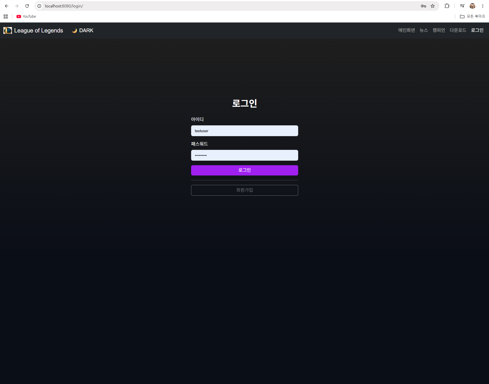
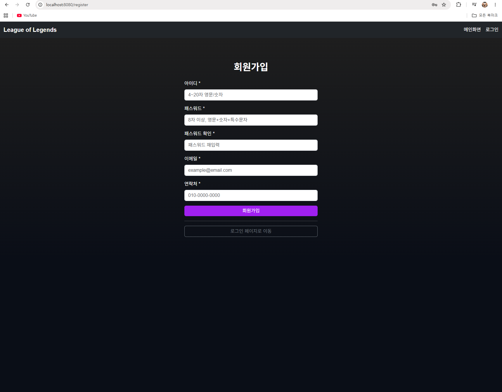
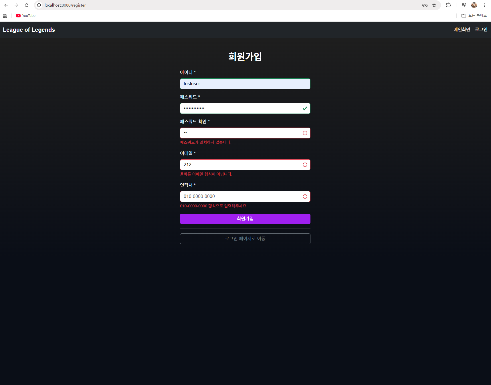
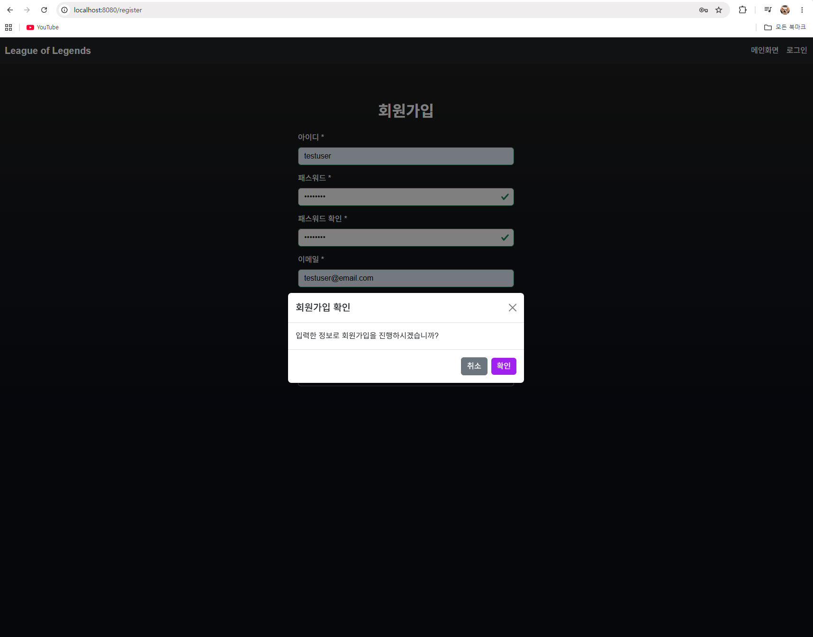
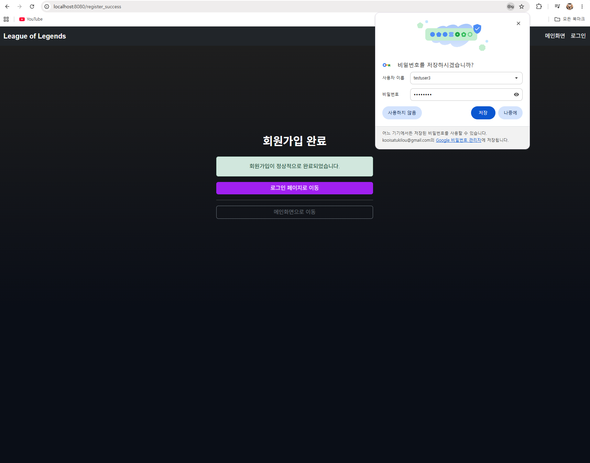
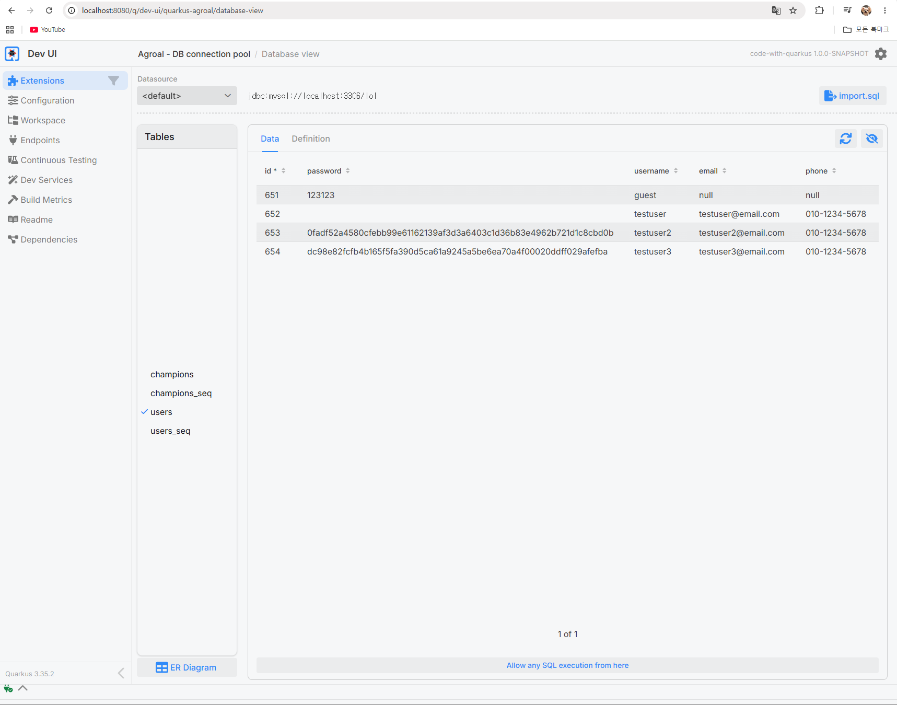

## 12주차 - 회원관리 페이지 1: 프로필 페이지 및 이미지 업로드

### 학습 목표

- 로그인 암호화 처리 후 로그인 기능이 정상 작동하는지 확인한다.
- 로그인 세션을 기반으로 프로필 페이지에 접근할 수 있도록 구현한다.
- 로그인한 사용자의 아이디, 이메일, 연락처 정보를 프로필 페이지에 출력한다.
- 사용자 프로필 이미지를 업로드하고 서버 폴더에 저장한다.
- 업로드된 이미지 파일명을 DB의 `profileImage` 컬럼에 저장한다.
- 로그인 실패 및 이미지 업로드 실패 시 오류 메시지를 화면에 출력한다.

### 구현 내용

### 1. 로그인 암호화 체크

11주차에서 구현한 SHA-256 암호화 로그인 기능이 실제 로그인 과정에서 정상적으로 작동하는지 확인하였다.
`login.js`에서 사용자가 입력한 비밀번호를 `input_sha256.js`의 `hashPassword()` 함수를 이용해 SHA-256 해시값으로 변환한 뒤 서버로 전송하도록 구성하였다.

기존 실습용 계정 `guest / 123123`의 비밀번호가 평문으로 저장되어 있으면 로그인 시 전송되는 해시값과 DB 값이 일치하지 않기 때문에 로그인에 실패하였다. 따라서 `DataSeeder.java`와 MySQL `users` 테이블의 `guest` 비밀번호를 `123123`의 SHA-256 해시값으로 수정하였다.

이를 통해 로그인 시 서버로 평문 비밀번호가 전달되지 않고, 해시값을 기준으로 로그인 검증이 이루어지도록 확인하였다.

### 2. 로그인 후 메인화면 네비바 수정

로그인 후 이동하는 `main_after_login.html` 파일의 네비게이션 바에 프로필 페이지로 이동할 수 있는 링크를 추가하였다.

기존 로그아웃 버튼 앞에 `👤 프로필` 메뉴를 추가하였고, 해당 메뉴를 클릭하면 `/profile` 엔드포인트로 이동하도록 설정하였다.

```html
<li class="nav-item">
  <a class="nav-link" href="/profile">👤 프로필</a>
</li>
```

이를 통해 로그인한 사용자가 메인화면에서 바로 자신의 프로필 페이지로 이동할 수 있도록 구현하였다.

### 3. User 엔티티 수정

프로필 이미지를 사용자별로 저장하기 위해 `User.java`에 `profileImage` 필드를 추가하였다.

```java
public String profileImage;
```

이 필드는 실제 이미지 파일을 저장하는 것이 아니라, 업로드된 이미지의 파일명만 DB에 저장하기 위해 사용하였다.
이미지 파일 자체는 서버의 `uploads/profile` 폴더에 저장하고, DB에는 해당 파일명을 저장하는 방식으로 구현하였다.

### 4. 프로필 페이지 엔드포인트 구현

`AuthResource.java`에 `/profile` 엔드포인트를 추가하였다.
프로필 페이지는 로그인한 사용자만 접근할 수 있어야 하므로, 세션에 `loginUser` 값이 존재하는지 먼저 확인하였다.

로그인 정보가 없으면 `/login`으로 이동하도록 처리하였고, 로그인 상태라면 `profile.html`을 반환하도록 구현하였다.

```java
@GET
@Path("/profile")
@Produces(MediaType.TEXT_HTML)
public Response profilePage() {
    if (context.session() == null || context.session().get("loginUser") == null) {
        return Response
                .seeOther(URI.create("/login"))
                .build();
    }

    InputStream html = getClass()
            .getClassLoader()
            .getResourceAsStream("META-INF/resources/login/profile.html");

    return Response.ok(html).build();
}
```

### 5. 프로필 정보 JSON 엔드포인트 구현

프로필 페이지에서 사용자 정보를 출력하기 위해 `/profile/info` 엔드포인트를 추가하였다.

이 엔드포인트는 현재 로그인한 사용자의 정보를 DB에서 조회한 뒤 JSON 형식으로 반환한다.
`profile.html`에서는 JavaScript의 `fetch("/profile/info")`를 이용하여 사용자 정보를 가져오고, 아이디, 이메일, 연락처, 프로필 이미지를 화면에 출력하였다.

반환되는 정보는 다음과 같다.

- `username`
- `email`
- `phone`
- `profileImage`

이메일과 연락처가 없는 경우에는 화면에 `정보 없음`으로 표시되도록 처리하였다.

### 6. profile.html 화면 작성

`profile.html` 파일을 생성하여 프로필 페이지 화면을 작성하였다.

구성한 화면 요소는 다음과 같다.

- `👤 내 프로필` 제목
- 프로필 이미지 출력 영역
- 아이디, 이메일, 연락처 정보 표
- 프로필 사진 변경 파일 선택 input
- 사진 업로드 버튼
- 업로드 실패 시 오류 메시지 출력 영역

파일 업로드 폼에는 파일 전송을 위해 `enctype="multipart/form-data"`를 설정하였다.
또한 이미지 파일만 선택할 수 있도록 `accept="image/*"` 속성을 추가하였다.

```html
<form
  id="uploadForm"
  method="POST"
  action="/profile/upload"
  enctype="multipart/form-data"
>
  <input type="file" name="profileImage" accept="image/*" />
</form>
```

### 7. 프로필 이미지 업로드 구현

`AuthResource.java`에 `/profile/upload` 엔드포인트를 추가하여 프로필 사진 업로드 기능을 구현하였다.

업로드 과정은 다음과 같이 처리하였다.

1. 로그인 세션 확인
2. 업로드 파일 존재 여부 확인
3. 이미지 확장자 검사
4. 파일 크기 검사
5. 서버의 `uploads/profile` 폴더에 이미지 저장
6. 저장된 파일명을 DB의 `profileImage` 컬럼에 저장
7. 다시 `/profile` 페이지로 이동

파일명 중복을 방지하기 위해 저장 파일명은 다음 형식으로 생성하였다.

```text
사용자아이디_UUID.확장자
```

예시:

```text
guest_b8df9540-098d-4905-a321-b6826cc87f1c.jpg
```

업로드된 이미지는 아래 폴더에 저장되도록 구현하였다.

```text
src/main/resources/META-INF/resources/uploads/profile
```

### 8. DB 저장 확인

MySQL에서 `users` 테이블을 조회하여 `profileImage` 컬럼에 업로드된 이미지 파일명이 저장되는 것을 확인하였다.

실행한 SQL은 다음과 같다.

```sql
USE lol;

SELECT id, username, email, phone, profileImage
FROM users;
```

조회 결과 `guest` 계정의 `profileImage` 컬럼에 업로드된 이미지 파일명이 저장된 것을 확인하였다.

### 9. 프로필 이미지 유지 확인

프로필 이미지를 업로드한 후 `/profile` 페이지를 새로고침해도 업로드한 이미지가 계속 유지되는 것을 확인하였다.

이는 프로필 페이지가 로드될 때 `/profile/info`에서 DB에 저장된 `profileImage` 파일명을 다시 불러오고, 해당 파일 경로를 이미지 태그의 `src`에 적용하기 때문이다.

```javascript
if (profileImage) {
  document.getElementById("profileImg").src =
    "/uploads/profile/" + profileImage;
}
```

### 10. 로그인 에러 처리

기존에는 로그인 실패 시 별도의 `login_failed.html` 페이지로 이동하였다.
12주차 마무리 과제에서는 로그인 실패 시 다시 로그인 페이지로 이동하면서 오류 메시지를 출력하도록 수정하였다.

로그인 실패 시 `/login/?error=1`로 이동하도록 `AuthResource.java`를 수정하였다.

```java
if (user == null || !user.password.equals(password)) {
    return Response
            .seeOther(URI.create("/login/?error=1"))
            .build();
}
```

`login.js`에서는 URL의 `error=1` 값을 확인하여 로그인 화면에 오류 메시지를 출력하도록 구현하였다.

```javascript
const params = new URLSearchParams(window.location.search);
const error = params.get("error");

if (error === "1") {
  showLoginError(
    usernameInput,
    usernameMsg,
    "아이디 또는 패스워드가 올바르지 않습니다.",
  );
}
```

이를 통해 잘못된 아이디 또는 비밀번호를 입력하면 로그인 페이지에서 바로 오류 메시지가 표시되도록 개선하였다.

### 11. 업로드 에러 처리

프로필 이미지 업로드 시 잘못된 파일을 업로드하는 경우 오류 메시지가 출력되도록 구현하였다.

처리한 오류 상황은 다음과 같다.

- 이미지 파일이 아닌 경우
- 파일 크기가 5MB를 초과한 경우
- 파일을 선택하지 않은 경우
- 업로드 중 예외가 발생한 경우

이미지 확장자는 아래 형식만 허용하였다.

```text
jpg, jpeg, png, gif, webp
```

이미지가 아닌 파일을 업로드하려고 하면 `/profile?error=invalid_type`으로 이동하고, 프로필 페이지에서 아래 메시지가 출력되도록 하였다.

```text
jpg, png, gif, webp 파일만 가능합니다.
```

### 추가/수정 파일

- `src/main/java/org/acme/login/User.java`
  - `profileImage` 필드 추가

- `src/main/java/org/acme/login/AuthResource.java`
  - `/profile` 엔드포인트 추가
  - `/profile/info` 엔드포인트 추가
  - `/profile/upload` 엔드포인트 추가
  - 로그인 실패 시 `/login/?error=1`로 이동하도록 수정
  - 업로드 실패 시 `/profile?error=...` 형식으로 오류 파라미터 전달

- `src/main/resources/META-INF/resources/login/main_after_login.html`
  - 네비게이션 바에 `👤 프로필` 링크 추가

- `src/main/resources/META-INF/resources/login/profile.html`
  - 프로필 페이지 화면 작성
  - 사용자 정보 출력 영역 작성
  - 프로필 이미지 출력 영역 작성
  - 파일 업로드 폼 작성
  - `/profile/info` 정보를 불러오는 JavaScript 추가
  - 업로드 오류 메시지 출력 기능 추가

- `src/main/resources/META-INF/resources/js/login.js`
  - 로그인 실패 시 URL의 `error=1` 값을 확인하여 오류 메시지 출력

- `src/main/resources/META-INF/resources/uploads/profile/`
  - 업로드된 프로필 이미지 저장 폴더

### 실행 및 확인

- `guest / 123123` 계정으로 로그인 시 SHA-256 해시값 기반 로그인이 정상적으로 작동하는 것을 확인하였다.
- `/after_login` 화면에서 로그인 후 메인화면이 정상 출력되는 것을 확인하였다.
- 로그인 후 메인화면의 네비게이션 바에 `👤 프로필` 링크가 추가된 것을 확인하였다.
- `/profile` 접속 시 프로필 페이지가 정상 출력되는 것을 확인하였다.
- `/profile/info` 접속 시 로그인한 사용자 정보가 JSON으로 반환되는 것을 확인하였다.
- 프로필 페이지에서 아이디, 이메일, 연락처가 정상 출력되는 것을 확인하였다.
- 프로필 사진을 업로드하면 이미지가 변경되는 것을 확인하였다.
- MySQL에서 `users` 테이블의 `profileImage` 컬럼에 업로드된 이미지 파일명이 저장되는 것을 확인하였다.
- 프로필 페이지를 새로고침해도 업로드한 이미지가 유지되는 것을 확인하였다.
- 잘못된 아이디 또는 비밀번호로 로그인 시 로그인 페이지에서 오류 메시지가 출력되는 것을 확인하였다.
- 이미지가 아닌 파일 업로드 시 프로필 페이지에서 오류 메시지가 출력되는 것을 확인하였다.

### 캡처 이미지

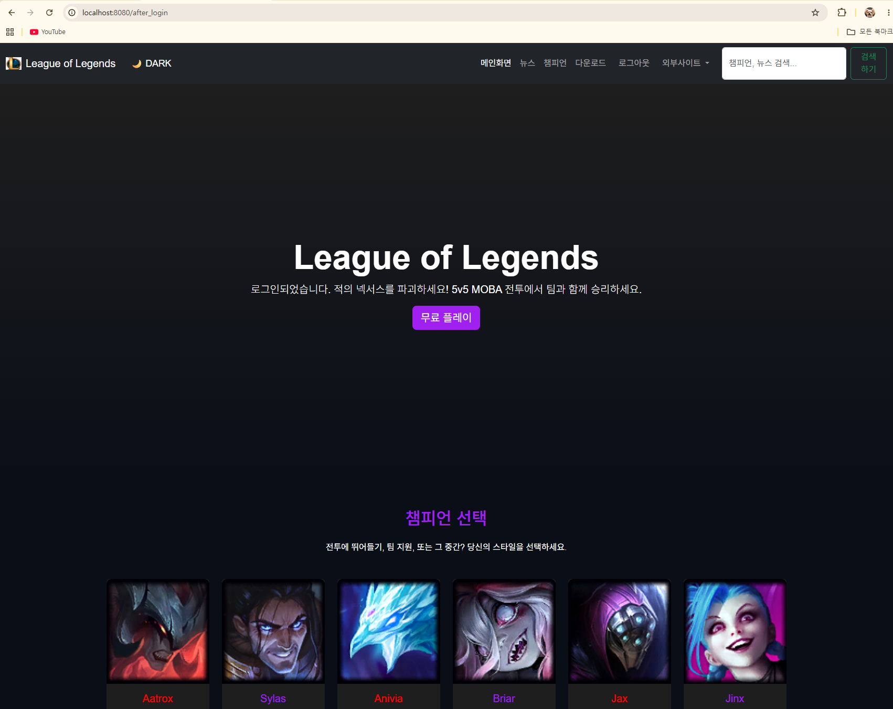

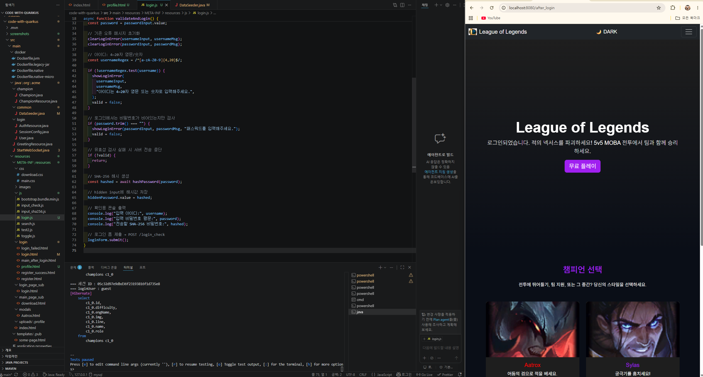

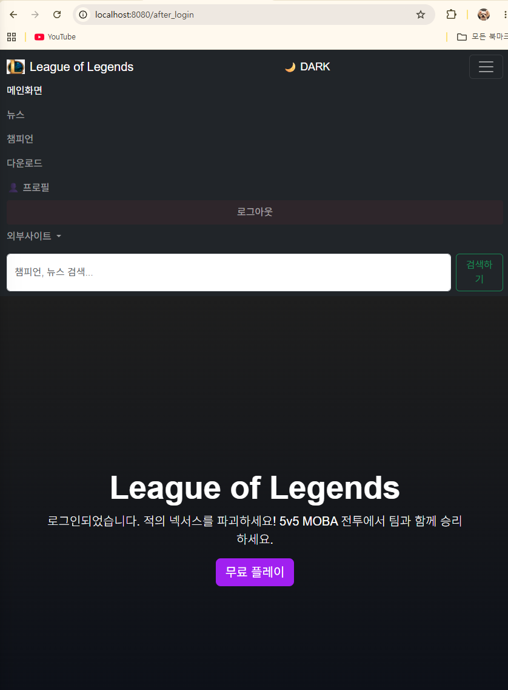

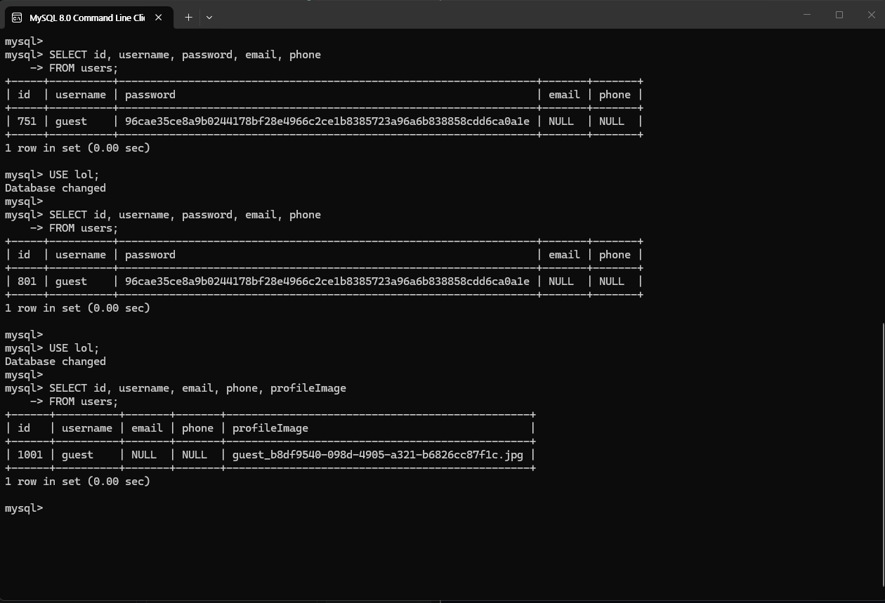

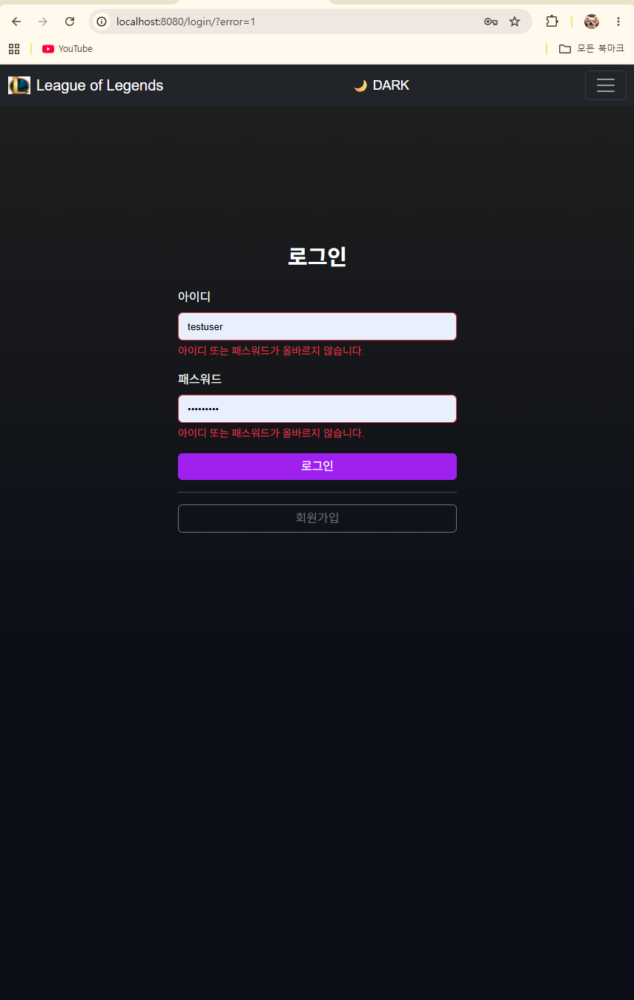

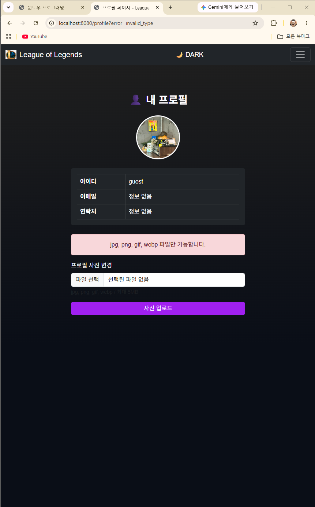

### 12주차 정리

이번 12주차에서는 로그인 세션을 기반으로 회원관리 기능의 기본이 되는 프로필 페이지를 구현하였다. 로그인한 사용자만 프로필 페이지에 접근할 수 있도록 세션 체크를 적용하였고, 서버에서 사용자 정보를 JSON으로 제공하여 화면에 출력하였다.

또한 프로필 사진 업로드 기능을 구현하여 이미지 파일은 서버 폴더에 저장하고, DB에는 파일명을 저장하도록 처리하였다. 이를 통해 실제 웹 서비스에서 자주 사용하는 파일 업로드, 사용자별 프로필 이미지 저장, DB 파일명 관리 흐름을 학습하였다.

마무리 과제로는 로그인 실패와 업로드 실패 상황에서 별도의 실패 화면으로 이동하지 않고, 현재 페이지에서 오류 메시지를 출력하도록 개선하였다. 이를 통해 사용자 입력 오류와 파일 업로드 오류를 화면에서 명확하게 안내하는 방법을 학습하였다.

## 13주차 - 회원정보 수정 및 Toast 알림 처리

### 학습 목표

- 프로필 페이지에서 회원정보를 수정할 수 있도록 구현한다.
- 이메일과 연락처 입력값에 대한 유효성 검사를 처리한다.
- 비밀번호 변경 기능을 추가하고 SHA-256 암호화 방식으로 저장한다.
- 기존 alert 방식의 알림을 Bootstrap Toast 방식으로 개선한다.
- 비밀번호 변경 후 자동 로그아웃 및 재로그인 흐름을 구현한다.

### 구현 내용

- `profile.html`에 개인정보 수정 버튼과 Collapse 형식의 수정 폼을 추가하였다.
- 개인정보 수정 폼에는 이메일과 연락처 입력칸을 구성하였다.
- `profile.js`에서 `/profile/info` API를 호출하여 기존 회원정보를 화면에 출력하고, 수정 폼에도 기존 값을 자동으로 채우도록 구현하였다.
- 이메일은 기본 이메일 형식으로 검사하고, 연락처는 `010-0000-0000` 형식으로 검사하도록 정규식을 적용하였다.
- `AuthResource.java`에 `/profile/update` 엔드포인트를 추가하여 이메일과 연락처를 데이터베이스에 저장하도록 구현하였다.
- 회원정보 수정 성공 시 `/profile?success=updated`로 이동하고, 화면에 수정 완료 메시지가 출력되도록 처리하였다.
- `profile.html`에 비밀번호 변경 버튼과 Collapse 형식의 비밀번호 변경 폼을 추가하였다.
- 비밀번호 변경 폼에는 현재 비밀번호, 새 비밀번호, 새 비밀번호 확인 입력칸을 구성하였다.
- `profile.js`에서 비밀번호 입력값을 검사하고, 새 비밀번호는 8자 이상이며 영문, 숫자, 특수문자를 포함하도록 정규식을 적용하였다.
- 현재 비밀번호와 새 비밀번호는 `input_sha256.js`의 SHA-256 함수로 해시 처리한 뒤 서버로 전송하도록 구현하였다.
- `AuthResource.java`에 `/profile/password` 엔드포인트를 추가하여 현재 비밀번호 검증 후 새 비밀번호를 저장하도록 구현하였다.
- 현재 비밀번호가 일치하지 않을 경우 `/profile?error=wrong_password`로 이동하여 오류 메시지를 표시하도록 처리하였다.
- 비밀번호 변경 성공 시 `/profile?success=password_changed`로 이동하고, 프로필 화면에서 Toast 메시지를 출력한 뒤 일정 시간 후 로그아웃되도록 구현하였다.
- 로그아웃 처리 시 `next=login` 파라미터를 활용하여 비밀번호 변경 후에는 로그인 페이지로 이동하도록 수정하였다.
- 로그인 페이지에서는 비밀번호 변경 성공 메시지를 출력하도록 `login.js`를 수정하였다.
- 메인 페이지, 로그인 후 메인 페이지, 프로필 페이지에서 기존 alert 방식 대신 Bootstrap Toast를 활용하여 알림을 표시하도록 개선하였다.

### 추가/수정 파일

- `src/main/java/org/acme/login/AuthResource.java`
  - `/profile/update` 엔드포인트 추가
  - `/profile/password` 엔드포인트 추가
  - `/logout?next=login` 처리 추가

- `src/main/resources/META-INF/resources/login/profile.html`
  - 개인정보 수정 폼 추가
  - 비밀번호 변경 폼 추가
  - Toast 컨테이너 추가

- `src/main/resources/META-INF/resources/js/profile.js`
  - 프로필 정보 출력
  - 개인정보 수정 유효성 검사
  - 비밀번호 변경 유효성 검사
  - SHA-256 암호화 처리
  - 비밀번호 변경 성공 Toast 처리

- `src/main/resources/META-INF/resources/js/login.js`
  - 로그인 실패 메시지 처리
  - 비밀번호 변경 성공 메시지 처리

- `src/main/resources/META-INF/resources/login/main_after_login.html`
  - 로그인 성공 Toast 적용
  - 프로필 Tooltip 적용

- `src/main/resources/META-INF/resources/js/test.js`
  - 공통 Toast 출력 함수 작성

### 실행 및 확인

- `/after_login` 접속 시 로그인 성공 Toast가 정상 출력되는지 확인하였다.
- 네비게이션 바의 프로필 메뉴에 마우스를 올리면 로그인 사용자명이 Tooltip으로 표시되는지 확인하였다.
- `/profile`에서 개인정보 수정 버튼 클릭 시 이메일과 연락처 수정 폼이 펼쳐지는지 확인하였다.
- 잘못된 이메일과 연락처 입력 시 정규식 검사 오류 메시지가 출력되는지 확인하였다.
- 정상 이메일과 연락처 입력 후 수정 완료 시 DB에 값이 반영되고 성공 메시지가 출력되는지 확인하였다.
- 비밀번호 변경 버튼 클릭 시 현재 비밀번호, 새 비밀번호, 새 비밀번호 확인 입력칸이 출력되는지 확인하였다.
- 잘못된 새 비밀번호 입력 시 정규식 검사 오류 메시지가 출력되는지 확인하였다.
- 현재 비밀번호가 일치하지 않을 경우 오류 처리가 되는지 확인하였다.
- 비밀번호 변경 성공 후 자동으로 로그아웃되고 로그인 페이지로 이동하는지 확인하였다.
- 새 비밀번호로 다시 로그인되는지 확인하였다.
- 비밀번호 변경 성공 시 Toast 메시지가 출력되는지 확인하였다.
- `register.html`, `register_success.html`에서 JavaScript `alert()`가 남아 있지 않은 것을 확인하였다.

### 캡처 이미지

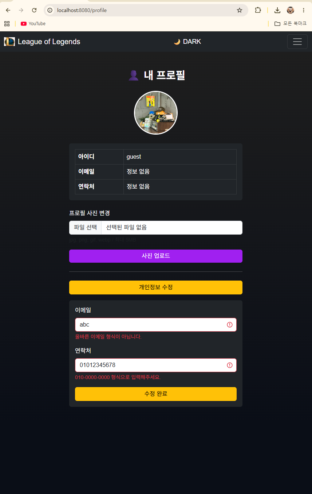

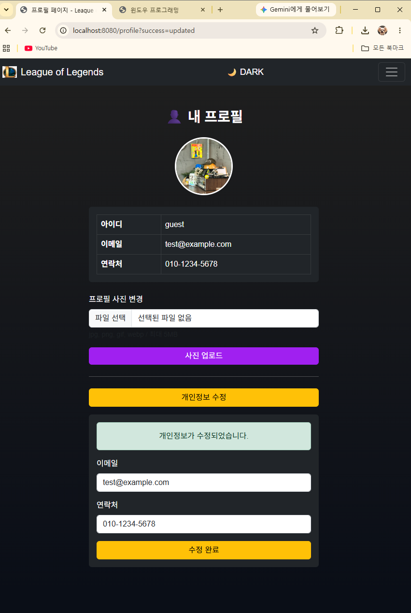

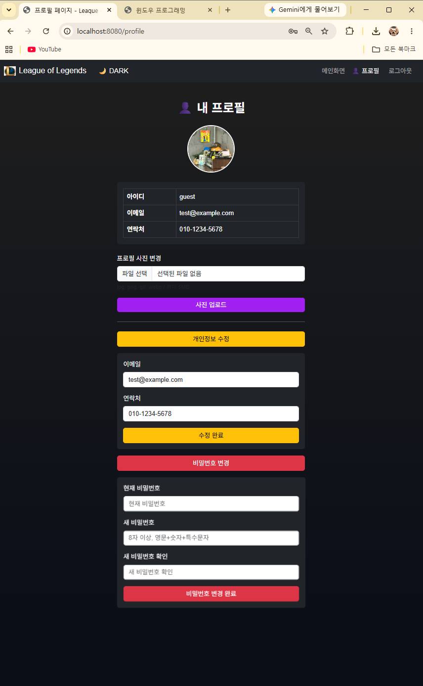

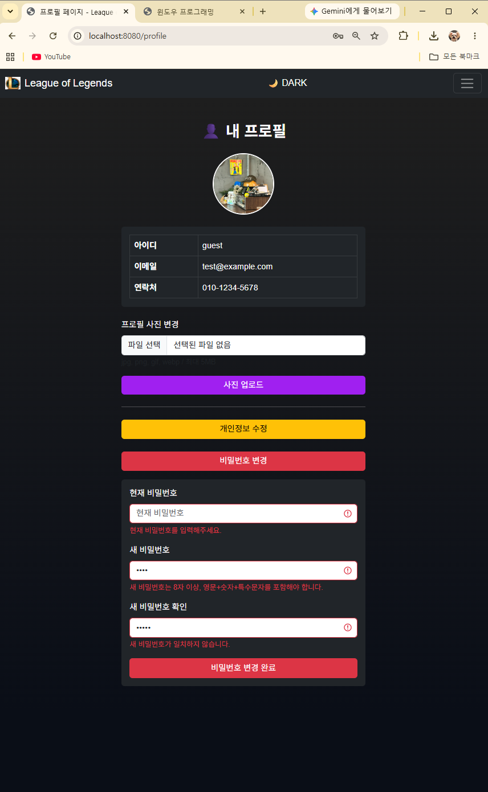

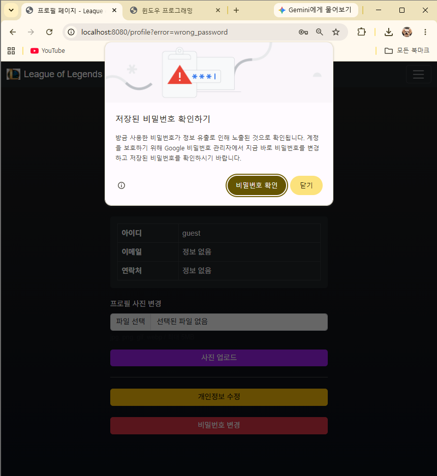

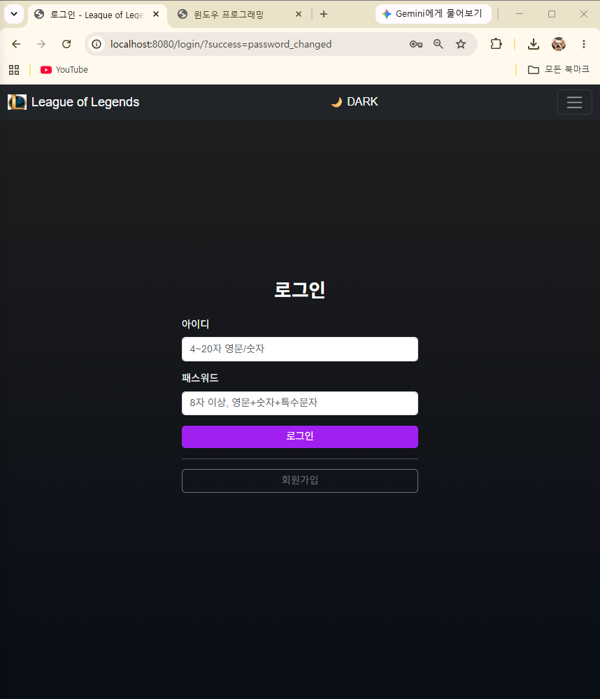

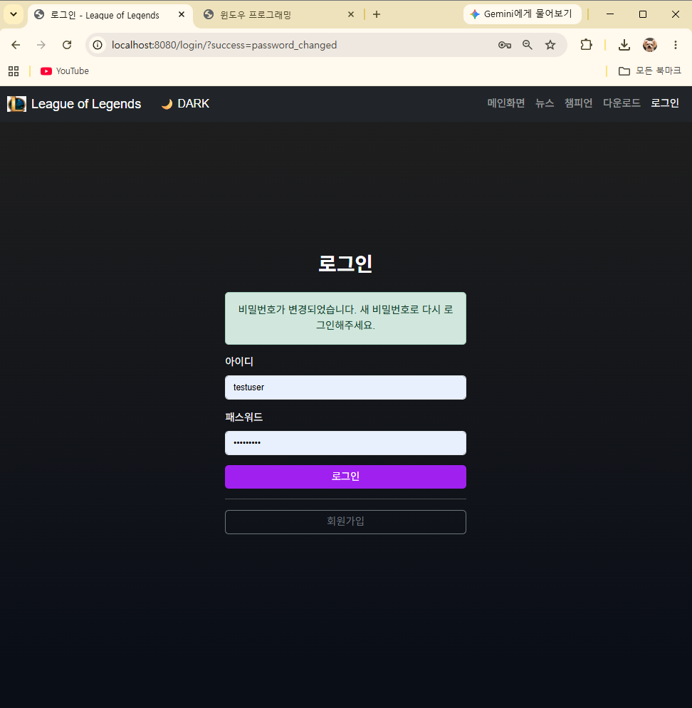

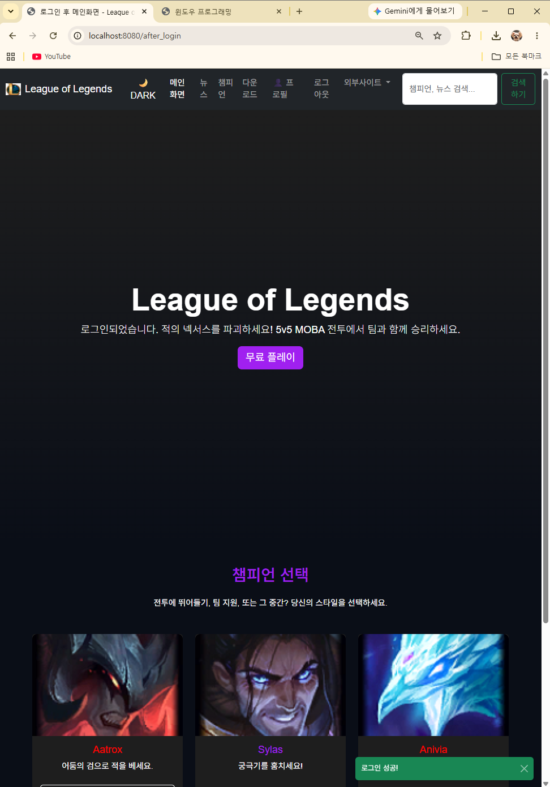

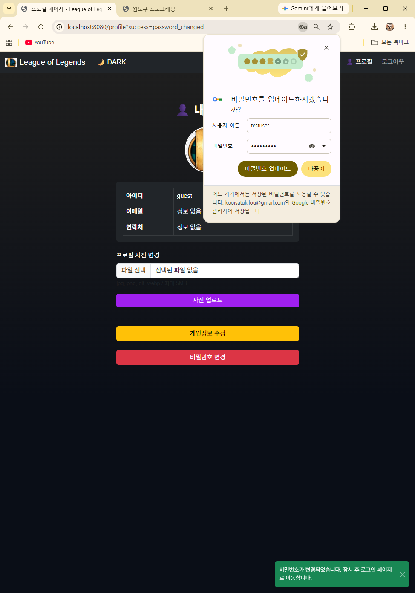

### 13주차 정리

이번 주차에서는 기존 로그인과 회원가입 기능을 확장하여 프로필 기반 회원정보 관리 기능을 구현하였다. 사용자는 로그인 후 프로필 페이지에서 이메일과 연락처를 수정할 수 있으며, 입력값은 정규식을 통해 올바른 형식인지 검사된다. 또한 비밀번호 변경 기능을 추가하여 현재 비밀번호를 확인한 뒤 새 비밀번호를 SHA-256 방식으로 암호화하여 저장하도록 구현하였다.

비밀번호 변경 후에는 보안을 위해 로그인 상태를 유지하지 않고 자동으로 로그아웃되도록 처리하였다. 이 과정에서 Bootstrap Toast를 활용하여 사용자에게 비밀번호 변경 완료 메시지를 보여준 뒤 로그인 페이지로 이동하도록 구성하였다. 기존 alert 방식보다 자연스럽고 사용자 경험이 좋은 알림 방식으로 개선하였으며, 프로필 페이지, 로그인 후 메인 페이지, 로그인 페이지 등 여러 화면에서 메시지 처리를 통일하였다.

이를 통해 Quarkus에서 세션 기반 인증 상태를 활용하는 방법, 사용자 정보 수정 처리, 비밀번호 변경 처리, SHA-256 암호화 전송, Bootstrap Collapse와 Toast를 활용한 UI 개선 방법을 학습하였다.
