# Quarkus LOL Fan Site

자바웹프로그래밍 수업 실습 프로젝트입니다.  
Quarkus 기반으로 LOL 팬 사이트 메인 페이지, 챔피언 상세 모달, 로그인 페이지, 다운로드 페이지를 구현했습니다.

## 2주차 수업 내용

- Quarkus 개발 환경 구축
- `http://localhost:8080/` 서버 실행 확인
- `META-INF/resources/index.html` 생성
- HTML 기본 태그 작성
- Bootstrap 5 적용
- LOL 메인화면 프로토타입 구현
- 다크 테마 CSS 및 카드 hover 효과 적용

## 4주차 수업 내용

- 네비게이션 바 수정
- 메인화면 / 뉴스 / 챔피언 / 다운로드 / 로그인 메뉴 구성
- 외부사이트 드롭다운 메뉴 추가
- LOL 공식 웹사이트, Bootstrap 공식문서, Quarkus 공식문서 링크 연결
- 챔피언 카드 6개 구성
- Aatrox 상세보기 버튼 추가
- Bootstrap 모달창 구현
- `modals/Aatrox.html` 상세 페이지 생성
- iframe 방식으로 모달 내용 분리
- `images/Aatrox.png` 로컬 이미지 적용
- 로그인 서브 페이지 생성
- `login_page_sub/login.html` 연결
- 다운로드 서브 페이지 생성
- `main_page_sub/download.html` 연결
- `download-banner.jpg` 배경 이미지 적용
- 권장 시스템 사양 표 추가
- `download.css` 파일로 CSS 분리

## 실행 방법

```bash
cmd /c mvnw.cmd quarkus:dev
```

브라우저에서 아래 주소로 접속합니다.

```text
http://localhost:8080/
```

## 주요 페이지

- 메인 페이지: `http://localhost:8080/`
- 로그인 페이지: `http://localhost:8080/login_page_sub/login.html`
- 다운로드 페이지: `http://localhost:8080/main_page_sub/download.html`
- 아트록스 상세 페이지: `http://localhost:8080/modals/Aatrox.html`

## 화면 예시

### 메인 페이지


### 아트록스 상세 모달


### 다운로드 페이지


## 6주차 수업 내용

- JavaScript 기본 문법 학습
- 검색창 form 구성 및 search.js 연동
- 챔피언/뉴스 데이터 배열 생성
- 실시간 검색 결과 화면 구현
- 챔피언/뉴스 카테고리 전환 기능 구현
- 추가 구현: 챔피언 데이터 3개 이상 추가
- 추가 구현: 검색어가 없거나 공백일 때 메인화면으로 복귀

## 실행 화면

### 메인 페이지


### 다운로드 페이지


### 챔피언 모달 화면


---

## 중간고사 시험공부 요약 정리

중간고사 범위는 2주차부터 6주차까지이며, 시험 유형은 객관식 10문제와 주관식 단답형 5문제로 구성된다. 이번 중간고사 범위에서는 Quarkus 개발 환경 구축, HTML 기본 구조, Bootstrap 5 활용, CSS 심화, 하이퍼링크와 이미지 경로, 모달창 구현, 서브 페이지 구성, JavaScript 기본 문법, DOM 조작, 검색 기능 구현 등을 중심으로 학습하였다.

### 1주차 - 강의 소개 및 수업 방향 정리

1주차에서는 자바웹프로그래밍 수업의 전체적인 방향과 평가 방식, 한 학기 동안 진행할 프로젝트 흐름을 확인하였다. 수업은 최신 웹 개발 트렌드와 실습을 함께 진행하는 방식이며, 프론트엔드와 백엔드를 모두 다루는 풀스택 프로젝트 형태로 구성된다.

수업에서 사용할 주요 기술은 HTML, CSS, JavaScript, Bootstrap 5, Quarkus, REST API, DB, JWT, WebSocket 등이다. 프로젝트 주제는 LOL 팬 사이트이며, 메인 화면, 회원제, 실시간 채팅, 반응형 화면, REST API 연동 등을 단계적으로 구현하는 것이 목표이다.

또한 GitHub를 활용하여 매주 실습 결과물을 업로드하고, README.md 파일에 수업 내용과 실행 화면을 정리하는 방식으로 프로젝트를 관리한다.

#### 1주차 핵심 정리

- 자바웹프로그래밍 수업 방향 확인
- 최신 웹 개발 트렌드 이해
- 클라우드 네이티브와 Kubernetes 개념 확인
- Spring Boot와 Quarkus 비교
- Quarkus의 특징 이해
- Bootstrap 5와 JavaScript를 활용한 프론트엔드 구성
- Quarkus 기반 백엔드 개발 흐름 확인
- GitHub를 활용한 프로젝트 관리 방식 확인
- 중간고사 범위와 시험 유형 확인

### 2주차 - 개발 환경 구축 및 HTML 기본

2주차에서는 Quarkus 개발 환경을 구축하고, HTML 기본 구조를 학습한 뒤 LOL 팬 사이트 메인 화면 프로토타입을 구현하였다.

먼저 VS Code를 설치하고 Quarkus Tools, Extension Pack for Java, REST Client, Korean 확장 프로그램 등을 설치하였다. Quarkus 프로젝트는 `code.quarkus.io`에서 생성하였고, 프로젝트를 다운로드한 뒤 VS Code에서 폴더를 열어 내부 구조를 확인하였다.

Quarkus 프로젝트에서는 Java 소스 파일, resources 폴더, `pom.xml`, `application.properties` 등의 역할을 이해하는 것이 중요하다. 정적 HTML 파일은 `src/main/resources/META-INF/resources` 폴더 안에 작성해야 하며, `index.html` 파일을 생성하면 `http://localhost:8080/` 주소에서 기본 페이지로 출력된다.

서버 실행은 터미널에서 다음 명령어를 사용한다.

```bash
cmd /c mvnw.cmd quarkus:dev
```

수업에서는 `application.properties`에 기본 포트와 시작 페이지, 테스트 설정을 추가하였다.

```properties
quarkus.http.port=8080
quarkus.http.static-resources.index-page=index.html
quarkus.test.continuous-testing=disabled
```

이후 HTML 기본 문법을 학습하였다. `<!doctype html>`, `<html>`, `<head>`, `<body>`, `<meta>`, `<title>`, `<div>`, `<h1>`, `<p>`, `<ul>`, `<li>` 태그를 사용하여 기본 문서 구조를 만들었다.

그 다음 LOL 메인 화면 프로토타입을 구현하였다. 처음에는 HTML 태그만 사용하여 제목, 설명, 챔피언 목록, 뉴스 영역을 작성하였고, 이후 Bootstrap 5를 적용하여 네비게이션 바, 카드 레이아웃, 버튼 등을 구성하였다. 마지막으로 CSS를 추가하여 어두운 배경, 보라색 포인트 컬러, 카드 hover 효과, 이미지 크기 조정 등을 적용하였다.

#### 2주차 핵심 정리

- VS Code 설치
- Quarkus Tools 확장 설치
- JDK 21 설치
- `code.quarkus.io`에서 Quarkus 프로젝트 생성
- Quarkus 프로젝트 폴더 구조 확인
- `src/main/resources/META-INF/resources/index.html` 생성
- `application.properties` 기본 설정
- `http://localhost:8080/` 접속 확인
- HTML 기본 태그 학습
- LOL 메인 화면 기본 구조 작성
- Bootstrap 5 CDN 연결
- 네비게이션 바 구현
- 챔피언 카드 구현
- CSS로 다크 테마 적용
- 카드 hover 효과 구현
- GitHub 업로드 흐름 학습

#### 2주차 주요 코드 개념

```html
<!doctype html>
<html lang="ko">
  <head>
    <meta charset="UTF-8" />
    <meta name="viewport" content="width=device-width, initial-scale=1.0" />
    <title>League of Legends</title>
  </head>
  <body>
    <h1>League of Legends</h1>
    <p>적의 넥서스를 파괴하세요!</p>
  </body>
</html>
```

#### 2주차 공부 포인트

2주차에서 가장 중요한 부분은 Quarkus에서 정적 HTML 파일을 어디에 작성해야 하는지 이해하는 것이다. `META-INF/resources/index.html` 위치에 파일을 작성해야 기본 페이지로 인식된다.

또한 Bootstrap 5를 사용하면 직접 CSS를 모두 작성하지 않아도 빠르게 네비게이션 바, 카드, 버튼, 반응형 레이아웃을 만들 수 있다. 시험에서는 `container`, `row`, `col`, `card`, `navbar`, `btn` 같은 Bootstrap 클래스의 역할을 구분하는 것이 중요하다.

### 4주차 - HTML과 CSS 심화

4주차에서는 HTML/CSS 기본 내용을 복습하고, Bootstrap 5를 활용하여 LOL 팬 사이트의 화면 구성을 더 발전시켰다. 주요 내용은 하이퍼링크, 이미지 경로, CSS 선택자, 네비게이션 바 수정, 챔피언 카드 추가, 모달창 구현, 서브 페이지 추가이다.

먼저 Bootstrap 5 문서를 참고하여 네비게이션 바와 카드, 버튼, 모달 컴포넌트를 학습하였다. HTML5 태그는 문서의 구조를 담당하고, Bootstrap 클래스는 디자인과 레이아웃을 담당한다. 예를 들어 `<nav>` 태그는 HTML 구조이고, `navbar`, `navbar-expand-lg`, `navbar-dark`, `bg-dark` 같은 클래스는 Bootstrap 디자인 속성이다.

하이퍼링크는 `<a href="">` 태그로 작성하며, 잘못된 주소를 입력하면 404 오류가 발생한다. 링크의 대상은 `_self`, `_blank`, `_parent`, `_top` 속성으로 제어할 수 있다. 이미지 출력은 `` 태그를 사용하며, 외부 이미지뿐만 아니라 로컬 이미지도 사용할 수 있다.

로컬 이미지를 사용하기 위해 `resources/META-INF/resources/images` 폴더를 만들고, 이미지 파일을 저장하였다. 이때 현재 HTML 파일의 위치에 따라 상대 경로가 달라지므로 경로 설정이 중요하다. 특히 `modals/Aatrox.html`처럼 하위 폴더에 있는 파일에서 상위 폴더의 이미지를 불러올 때는 `../images/Aatrox.png`처럼 `../`를 사용해야 한다.

CSS 심화에서는 개발자 도구 F12를 통해 HTML 구조와 CSS 적용 상태를 확인하였다. CSS 선택자의 우선순위는 요소 선택자, 클래스 선택자, ID 선택자, 인라인 스타일, `!important` 순서로 강해진다. 따라서 같은 요소에 여러 스타일이 적용될 때 어떤 스타일이 우선 적용되는지 이해해야 한다.

이후 네비게이션 바를 수정하여 메인화면, 뉴스, 챔피언, 다운로드, 로그인, 외부사이트 메뉴를 구성하였다. 외부사이트 메뉴는 드롭다운 방식으로 만들었고, LOL 공식 웹사이트, Bootstrap 공식문서, Quarkus 공식문서 등으로 연결하였다.

챔피언 카드에는 이미지, 이름, 역할, 난이도, 상세보기 버튼을 추가하였다. 상세보기 버튼은 Bootstrap 모달과 연결되며, `data-bs-toggle="modal"`과 `data-bs-target="#modalAatrox"` 속성을 사용한다. 모달창 내부에는 iframe을 사용하여 `modals/Aatrox.html` 파일을 불러오도록 구성하였다.

또한 다운로드 서브 페이지를 추가하였다. `main_page_sub/download.html` 파일을 만들고, 기존 메인 페이지의 네비게이션 바 디자인을 재사용하였다. 다운로드 페이지에는 다운로드 배너, Windows 다운로드 버튼, Mac 다운로드 버튼, 권장 시스템 사양 표를 추가하였다. CSS는 `css/download.css` 파일로 분리하여 관리하였다.

#### 4주차 핵심 정리

- Bootstrap 5 문서 활용
- HTML5 태그와 Bootstrap 클래스 구분
- `<a href="">` 하이퍼링크 작성
- 링크 주소 오류 시 404 발생
- `` 이미지 태그 사용
- 외부 이미지와 로컬 이미지 차이 이해
- `images` 폴더 생성 및 로컬 이미지 저장
- 상대 경로와 절대 경로 이해
- `../`는 한 단계 상위 폴더를 의미
- F12 개발자 도구로 HTML/CSS 확인
- CSS 선택자 우선순위 이해
- 네비게이션 바 수정
- 드롭다운 메뉴 추가
- 챔피언 카드 추가
- Bootstrap 모달창 구현
- iframe으로 상세 페이지 삽입
- `modals/Aatrox.html` 생성
- 다운로드 서브 페이지 생성
- `download.css`로 CSS 분리
- 시스템 사양 표 구현
- README.md 작성 및 screenshots 폴더 생성

#### 4주차 주요 코드 개념

```html
<a class="nav-link" href="main_page_sub/download.html">다운로드</a>
```

```html

```

```html
<button
  class="btn btn-outline-light w-100"
  data-bs-toggle="modal"
  data-bs-target="#modalAatrox"
>
  상세 보기
</button>
```

```html
<iframe
  src="modals/Aatrox.html"
  frameborder="0"
  style="width: 100%; height: 100%; border: none;"
></iframe>
```

#### 4주차 공부 포인트

4주차에서 가장 중요한 부분은 경로와 컴포넌트 연결이다. 이미지나 HTML 파일을 불러올 때 현재 파일의 위치를 기준으로 경로를 작성해야 하며, 하위 폴더에서 상위 폴더로 이동할 때는 `../`를 사용한다.

또한 Bootstrap 모달은 버튼의 `data-bs-target` 값과 모달의 `id` 값이 일치해야 정상적으로 열린다. 예를 들어 버튼이 `data-bs-target="#modalAatrox"`를 가지고 있다면, 모달 영역은 `id="modalAatrox"`를 가져야 한다.

### 6주차 - JavaScript 기초 및 LOL 검색 기능 구현

6주차에서는 JavaScript의 기본 개념과 문법을 학습하고, LOL 팬 사이트에 실시간 검색 기능을 구현하였다.

JavaScript는 HTML과 CSS로 만들어진 화면에 동작을 추가하는 역할을 한다. HTML은 구조, CSS는 디자인, JavaScript는 동작을 담당한다. 예를 들어 버튼 클릭, 검색, 드롭다운, 모달, 화면 전환 같은 기능은 JavaScript로 처리한다.

JavaScript는 웹 브라우저 안에서 실행되며, 대표적으로 Chrome의 V8 엔진이 사용된다. JavaScript는 인터프리터 언어이면서 함수와 객체를 중심으로 동작한다. 브라우저는 DOM, Timer, Network 같은 Web API를 제공하며, Event Loop를 통해 비동기 동작을 처리한다.

JavaScript 파일은 `<script>` 태그로 HTML에 연결한다. 수업에서는 `resources/META-INF/resources/js` 폴더를 만들고, `bootstrap.bundle.min.js`, `test.js`, `search.js` 파일을 관리하였다. JavaScript 작성 방식에는 인라인 스크립트, 내부 스크립트, 외부 스크립트, CDN 방식이 있다. 이 중 유지보수와 재사용성을 고려하면 외부 스크립트 방식이 가장 권장된다.

JavaScript 기본 문법에서는 `var`, `let`, `const`의 차이를 학습하였다. `var`는 재선언과 재할당이 가능하며 함수 스코프를 가진다. `let`은 재선언은 불가능하지만 재할당은 가능하며 블록 스코프를 가진다. `const`는 재선언과 재할당이 불가능하며 블록 스코프를 가진다.

호이스팅도 중요한 개념이다. `var`는 선언이 위로 끌어올려지며 `undefined`로 초기화되지만, `let`과 `const`는 TDZ가 발생하여 초기화 전에 접근하면 오류가 발생한다. 함수 선언식은 함수 전체가 호이스팅되므로 선언 전에 호출해도 동작할 수 있다.

DOM은 Document Object Model의 약자로, HTML 문서를 트리 구조로 표현한 것이다. JavaScript는 DOM을 통해 HTML 요소를 선택하고, 내용이나 스타일을 변경할 수 있다. `document.getElementById()`, `document.querySelector()`, `document.querySelectorAll()` 같은 메서드를 사용하여 HTML 요소에 접근한다.

검색 기능 구현에서는 `searchForm`의 submit 이벤트를 감지하고, `preventDefault()`를 사용하여 폼의 기본 새로고침 동작을 막았다. 이후 검색어를 `trim()`으로 공백 제거하고, `toLowerCase()`로 소문자로 변환한 뒤 챔피언 데이터와 뉴스 데이터에서 검색어가 포함된 항목을 찾았다.

초기 검색 기능은 Google 검색 새 창을 여는 방식으로 구현하였지만, 이후 사이트 내부에 검색 결과 섹션을 만들고 챔피언과 뉴스 결과를 카테고리별로 출력하도록 수정하였다. 검색 결과가 없을 경우에는 “검색 결과 없음” 메시지를 출력하고, 검색어가 비어 있거나 공백이면 메인 화면으로 돌아가는 기능도 추가하였다.

#### 6주차 핵심 정리

- JavaScript는 웹 페이지의 동작을 담당
- HTML은 구조, CSS는 디자인, JS는 동작
- `<script>` 태그로 JavaScript 연결
- CDN 방식과 로컬 파일 방식 구분
- 인라인 스크립트는 유지보수와 보안 측면에서 비추천
- 외부 스크립트 방식이 권장됨
- `var`, `let`, `const` 차이 이해
- 스코프, 재선언, 재할당 차이 이해
- 호이스팅 개념 이해
- TDZ 개념 이해
- DOM 구조 이해
- `document.getElementById()` 사용
- `addEventListener()`로 이벤트 등록
- `preventDefault()`로 기본 동작 차단
- `trim()`으로 공백 제거
- `toLowerCase()`로 소문자 변환
- `filter()`로 조건에 맞는 데이터 검색
- `map()`과 `join()`으로 HTML 문자열 생성
- 검색 결과 카운트 출력
- 챔피언/뉴스 카테고리 전환 구현
- 검색 결과가 없을 때 메시지 출력
- 검색어가 없을 때 메인 화면 복귀

#### 6주차 주요 코드 개념

```javascript
document.getElementById("searchForm").addEventListener("submit", function (e) {
  e.preventDefault();

  const query = document.getElementById("searchInput").value.trim();

  if (!query) {
    return;
  }

  performSearch(query);
});
```

```javascript
const champResults = CHAMPIONS.filter(
  (c) =>
    c.name.includes(q) ||
    c.engName.toLowerCase().includes(q) ||
    c.role.includes(q) ||
    c.lane.includes(q),
);
```

```javascript
document.getElementById("champCount").textContent = `(${champResults.length})`;
```

```javascript
champList.innerHTML = champResults
  .map(
    (c) => `
    <div class="search-result-card">
      
      <div>
        <strong>${c.name}</strong>
        <span>(${c.engName})</span>
        <p>역할: ${c.role} | 라인: ${c.lane} | 난이도: ${c.difficulty}</p>
      </div>
    </div>
  `,
  )
  .join("");
```

#### 6주차 공부 포인트

6주차에서 가장 중요한 부분은 JavaScript가 HTML 화면을 어떻게 제어하는지 이해하는 것이다. `document.getElementById()`로 HTML 요소를 가져오고, `addEventListener()`로 이벤트를 연결하며, `innerHTML`이나 `textContent`를 사용하여 화면 내용을 변경한다.

또한 `preventDefault()`는 form 태그의 기본 제출 동작을 막기 위해 사용한다. 검색 기능처럼 페이지를 새로고침하지 않고 JavaScript로 화면을 바꾸고 싶을 때 반드시 필요하다.

검색 기능에서는 배열과 객체 배열의 차이를 이해해야 한다. 단순 배열은 값만 저장하지만, 객체 배열은 이름, 영어 이름, 역할, 라인, 이미지, 난이도처럼 여러 속성을 가진 데이터를 저장할 수 있다. 챔피언 검색 기능은 객체 배열에서 조건에 맞는 항목을 `filter()`로 찾아 화면에 출력하는 방식이다.

### 중간고사 전체 핵심 키워드

- Quarkus
- VS Code
- JDK 21
- `code.quarkus.io`
- `mvnw quarkus:dev`
- `application.properties`
- `META-INF/resources/index.html`
- HTML 기본 구조
- `<head>`, `<body>`, `<div>`, `<section>`
- Bootstrap 5
- CDN
- navbar
- card
- grid
- button
- modal
- iframe
- hyperlink
- `<a href="">`
- image
- ``
- 상대 경로
- 절대 경로
- `../`
- CSS 선택자
- class
- id
- hover
- `!important`
- JavaScript
- `<script>`
- 외부 스크립트
- `var`, `let`, `const`
- scope
- hoisting
- TDZ
- DOM
- `document.getElementById()`
- `addEventListener()`
- `preventDefault()`
- `filter()`
- `map()`
- `join()`
- `innerHTML`
- `textContent`
- GitHub
- commit
- push
- README.md
- screenshots

### 중간고사 예상 문제 정리

#### 객관식 예상 문제

1. Quarkus 정적 HTML 파일을 저장해야 하는 기본 위치는?
   - `src/main/resources/META-INF/resources`

2. Quarkus 개발 서버 실행 명령어는?
   - `mvnw quarkus:dev`

3. 기본 접속 주소는?
   - `http://localhost:8080/`

4. Bootstrap 5를 빠르게 적용하기 위해 사용하는 방식은?
   - CDN 방식

5. HTML에서 링크를 만들 때 사용하는 태그는?
   - `<a>`

6. HTML에서 이미지를 출력할 때 사용하는 태그는?
   - ``

7. 한 단계 상위 폴더를 의미하는 상대 경로 표현은?
   - `../`

8. Bootstrap 모달 버튼에서 연결 대상 모달을 지정하는 속성은?
   - `data-bs-target`

9. JavaScript 파일을 HTML에 연결할 때 사용하는 태그는?
   - `<script>`

10. form 태그의 기본 새로고침 동작을 막는 JavaScript 함수는?
    - `preventDefault()`

11. HTML 문서를 트리 구조로 표현한 객체 모델은?
    - DOM

12. JavaScript에서 재선언과 재할당이 모두 가능한 변수 선언 키워드는?
    - `var`

13. JavaScript에서 재선언은 불가능하지만 재할당은 가능한 변수 선언 키워드는?
    - `let`

14. JavaScript에서 재선언과 재할당이 모두 불가능한 변수 선언 키워드는?
    - `const`

15. 배열에서 조건에 맞는 요소만 추출할 때 사용하는 함수는?
    - `filter()`

#### 주관식 예상 문제

1. Quarkus에서 `META-INF/resources/index.html`의 역할을 설명하시오.

답: Quarkus에서 정적 웹 페이지를 제공하기 위한 기본 위치이다. `index.html`을 이 폴더에 작성하면 `http://localhost:8080/` 주소로 접속했을 때 기본 페이지로 출력된다.

2. Bootstrap을 사용하는 이유를 설명하시오.

답: Bootstrap은 네비게이션 바, 버튼, 카드, 그리드, 모달 같은 디자인 요소를 클래스만으로 빠르게 구현할 수 있게 해준다. 반응형 레이아웃을 쉽게 만들 수 있고, 직접 CSS를 많이 작성하지 않아도 화면 구성이 가능하다.

3. 상대 경로에서 `../`의 의미를 설명하시오.

답: `../`는 현재 파일이 있는 위치에서 한 단계 상위 폴더로 이동한다는 의미이다. 하위 폴더에 있는 HTML 파일에서 상위 폴더의 이미지나 CSS 파일을 불러올 때 사용한다.

4. `var`, `let`, `const`의 차이를 설명하시오.

답: `var`는 재선언과 재할당이 가능하고 함수 스코프를 가진다. `let`은 재선언은 불가능하지만 재할당은 가능하고 블록 스코프를 가진다. `const`는 재선언과 재할당이 모두 불가능하고 블록 스코프를 가진다.

5. DOM이 무엇인지 설명하시오.

답: DOM은 Document Object Model의 약자로, HTML 문서를 트리 구조로 표현한 객체 모델이다. JavaScript는 DOM을 통해 HTML 요소를 선택하고, 내용이나 스타일을 변경할 수 있다.

6. `preventDefault()`의 역할을 설명하시오.

답: `preventDefault()`는 form 제출이나 링크 이동처럼 HTML 요소가 기본적으로 수행하는 동작을 막는 함수이다. 검색 기능에서 페이지 새로고침 없이 JavaScript로 검색 결과를 출력하기 위해 사용한다.

7. `addEventListener()`의 역할을 설명하시오.

답: `addEventListener()`는 특정 HTML 요소에 클릭, 제출, 입력 같은 이벤트를 등록하는 함수이다. 이벤트가 발생했을 때 실행할 함수를 연결할 수 있다.

8. Bootstrap 모달이 열리는 원리를 설명하시오.

답: 모달을 여는 버튼에는 `data-bs-toggle="modal"`과 `data-bs-target="#모달ID"`를 작성한다. 이때 `data-bs-target` 값과 실제 모달 영역의 `id` 값이 일치해야 버튼 클릭 시 해당 모달이 열린다.

9. 외부 JavaScript 파일을 사용하는 장점을 설명하시오.

답: 외부 JavaScript 파일을 사용하면 HTML과 JavaScript 코드를 분리할 수 있어 유지보수가 쉽다. 여러 페이지에서 같은 코드를 재사용할 수 있고, 브라우저 캐시를 활용할 수 있다.

10. `filter()` 함수의 역할을 설명하시오.

답: `filter()`는 배열에서 조건을 만족하는 요소만 골라 새로운 배열로 반환하는 함수이다. 챔피언 검색 기능에서는 검색어가 이름, 영어 이름, 역할, 라인에 포함된 챔피언만 추출하는 데 사용하였다.

### 중간고사 공부 후 정리

중간고사 범위를 공부하면서 Quarkus 프로젝트의 기본 구조와 HTML, CSS, JavaScript가 각각 어떤 역할을 하는지 이해할 수 있었다. HTML은 웹 페이지의 구조를 만들고, CSS와 Bootstrap은 디자인과 레이아웃을 담당하며, JavaScript는 검색, 클릭, 모달, 화면 전환 같은 동작을 처리한다.

또한 Quarkus에서는 정적 파일을 `META-INF/resources` 폴더에서 관리하고, 서버 실행 후 `localhost:8080` 주소로 결과를 확인한다는 점을 학습하였다. GitHub를 통해 매주 실습 내용을 업로드하면서 프로젝트 변경 이력을 관리하는 방법도 익혔다.

이번 중간고사 공부를 통해 단순히 코드를 따라 작성하는 것뿐만 아니라, 각 파일의 위치, 태그의 역할, Bootstrap 클래스의 의미, JavaScript 이벤트 처리 방식까지 함께 정리할 수 있었다.

---

## 9주차 수업 내용

### 1. JavaScript 기능 추가

- `test2.js`를 활용하여 배열과 객체 배열의 성능 테스트를 진행하였다.
- `toggle.js`를 추가하여 다크 모드와 라이트 모드 전환 기능을 구현하였다.
- 검색 결과 챔피언 카드를 클릭하면 기존 상세보기 모달창이 열리도록 수정하였다.

### 2. MySQL 데이터베이스 연동

- MySQL Server 8.x를 설치하고 `lol` 데이터베이스를 생성하였다.
- `pom.xml`에 MySQL JDBC, Hibernate ORM Panache, REST Jackson 의존성을 추가하였다.
- `application.properties`에 MySQL 접속 정보를 설정하였다.
- Quarkus Dev UI와 VS Code DB 확장 기능을 통해 데이터베이스 연결을 확인하였다.

### 3. 챔피언 테이블 및 API 구현

- `Champion.java` 파일을 생성하여 `champions` 테이블과 Java 클래스를 매핑하였다.
- `ChampionResource.java` 파일을 생성하여 `/champions` API를 구현하였다.
- `DataSeeder.java` 파일을 생성하여 초기 챔피언 데이터를 데이터베이스에 삽입하였다.

### 4. 검색 기능 DB 연동

- 기존 `search.js`의 고정 챔피언 배열 대신 `/champions` API에서 데이터를 불러오도록 수정하였다.
- 검색창에서 챔피언 이름, 영어 이름, 역할, 라인을 기준으로 검색되도록 구현하였다.
- 검색 결과 화면에서 MySQL 데이터베이스에 저장된 챔피언 정보가 정상 출력되는 것을 확인하였다.

### 9주차 실행 화면

#### 9주차 메인 페이지


#### 9주차 MySQL 챔피언 데이터 확인


## 10주차 수업 내용 - 로그인과 로그아웃 구현

이번 10주차에서는 Quarkus 프로젝트에 로그인과 로그아웃 기능을 구현하였다. 기존에는 정적 HTML 파일을 직접 이동하는 방식이었지만, 로그인 기능은 사용자 인증과 세션 처리가 필요하기 때문에 Quarkus 백엔드 엔드포인트를 통해 접근하도록 구조를 변경하였다.

### 1. 로그인 페이지 엔드포인트 연결

메인 페이지의 네비게이션 바에서 로그인 버튼의 이동 경로를 기존 정적 파일 경로가 아닌 `/login`으로 수정하였다. 이후 `AuthResource.java`에 `GET /login` 엔드포인트를 추가하여 `resources/META-INF/resources/login/login.html` 파일을 서버에서 읽어 브라우저에 반환하도록 구현하였다.

이를 통해 로그인 페이지가 단순 정적 페이지가 아니라 Quarkus 서버를 거쳐 출력되도록 변경하였다.


### 2. 로그인 폼 작성 및 POST 요청 처리

`login.html` 파일에 아이디와 비밀번호를 입력할 수 있는 로그인 폼을 작성하였다. 로그인 폼은 `method="POST"` 방식으로 `/login_check` 엔드포인트에 데이터를 전송하도록 구성하였다.

POST 방식을 사용하면 아이디와 비밀번호가 주소창에 노출되지 않기 때문에 로그인과 같은 중요한 정보 전송에 적합하다. 서버에서는 `@FormParam("username")`, `@FormParam("password")`를 이용하여 사용자가 입력한 값을 전달받도록 구현하였다.

### 3. 사용자 엔티티 및 users 테이블 생성

로그인 정보를 데이터베이스에서 확인하기 위해 `User.java` 엔티티를 생성하였다. `users` 테이블에는 사용자 아이디와 비밀번호를 저장하도록 구성하였으며, `username` 값을 기준으로 사용자를 조회할 수 있도록 `findByUsername()` 메서드를 추가하였다.

또한 `DataSeeder.java`를 수정하여 서버 시작 시 실습용 사용자 계정인 `guest / 123123`이 자동으로 등록되도록 하였다.


### 4. 데이터베이스 기반 로그인 검증

`POST /login_check` 엔드포인트에서 입력받은 아이디를 기준으로 `users` 테이블을 조회하도록 구현하였다. 조회된 사용자가 없거나 비밀번호가 일치하지 않으면 로그인 실패 페이지로 이동하고, 아이디와 비밀번호가 모두 일치하면 로그인 후 페이지로 이동하도록 처리하였다.

이를 통해 아무 값이나 입력해도 로그인되는 임시 로그인 방식에서 벗어나, 데이터베이스에 저장된 사용자 정보와 비교하는 인증 구조로 변경하였다.


### 5. 세션 기반 로그인 상태 유지

로그인 성공 시 `RoutingContext`의 세션에 `loginUser` 값을 저장하도록 구현하였다. 이후 `/after_login` 엔드포인트에서는 세션에 저장된 로그인 사용자 정보가 있는지 확인하고, 로그인 정보가 존재하는 경우에만 로그인 후 페이지를 출력하도록 하였다.

세션이 없거나 로그아웃된 상태에서 `/after_login` 주소로 직접 접근하면 로그인 페이지로 강제 이동하도록 처리하였다. 이를 통해 로그인하지 않은 사용자가 로그인 후 페이지에 직접 접근하는 문제를 방지하였다.

브라우저 개발자 도구의 Application 탭에서 `vertx-web.session` 쿠키가 생성되는 것도 확인하였다.


### 6. 로그아웃 기능 구현

로그인 후 페이지의 네비게이션 바에는 기존 로그인 버튼 대신 로그아웃 버튼을 추가하였다. 로그아웃 버튼은 `/logout` 엔드포인트로 연결되며, 서버에서는 현재 세션을 삭제한 뒤 메인 페이지로 이동하도록 구현하였다.

로그아웃 후에는 `/after_login` 페이지에 직접 접근하더라도 세션 정보가 없기 때문에 다시 로그인 페이지로 이동한다. 이를 통해 로그인 상태 유지와 로그아웃 후 접근 차단이 정상적으로 작동하는 것을 확인하였다.

### 7. 로그인 페이지 다크/라이트 모드 적용

과제 내용에 맞춰 로그인 페이지에도 기존 메인 페이지에서 사용하던 네비게이션 바, CSS, 다크/라이트 모드 버튼을 재사용하였다. 이를 통해 메인 페이지와 로그인 페이지의 디자인을 통일하고, 로그인 화면에서도 다크/라이트 모드가 정상적으로 작동하도록 구성하였다.

기존 화면은 다크모드 상태로 확인하였고, 추가로 라이트모드 화면도 캡처하여 두 모드가 모두 적용되는 것을 확인하였다.


### 주요 파일

- `src/main/resources/META-INF/resources/index.html`
  - 로그인 링크를 `/login`으로 수정

- `src/main/resources/META-INF/resources/login/login.html`
  - 로그인 폼 작성
  - 다크/라이트 모드 버튼 적용

- `src/main/resources/META-INF/resources/login/main_after_login.html`
  - 로그인 후 메인 페이지 작성
  - 로그아웃 버튼 추가

- `src/main/resources/META-INF/resources/login/login_failed.html`
  - 로그인 실패 화면 작성

- `src/main/java/org/acme/login/User.java`
  - 사용자 엔티티 생성
  - `users` 테이블과 연결

- `src/main/java/org/acme/login/AuthResource.java`
  - `/login`, `/login_check`, `/after_login`, `/logout` 엔드포인트 구현
  - DB 로그인 검증 및 세션 처리 구현

- `src/main/java/org/acme/login/SessionConfig.java`
  - Quarkus 세션 기능 등록

- `src/main/java/org/acme/common/DataSeeder.java`
  - 실습용 사용자 `guest / 123123` 자동 등록

### 실행 및 확인 결과

- `/login` 접속 시 로그인 페이지 출력 확인
- `guest / 123123` 입력 시 로그인 성공 확인
- 잘못된 아이디 또는 비밀번호 입력 시 로그인 실패 페이지 출력 확인
- Dev UI에서 `users` 테이블과 `guest` 계정 저장 확인
- 로그인 성공 후 `/after_login` 접근 가능 확인
- 로그인 성공 시 `vertx-web.session` 쿠키 생성 확인
- 로그아웃 시 세션 삭제 후 메인 페이지 이동 확인
- 로그아웃 후 `/after_login` 직접 접근 시 로그인 페이지로 이동 확인
- 로그인 페이지에서 다크/라이트 모드 동작 확인

### 10주차 정리

이번 주차에서는 단순한 화면 이동이 아닌, 실제 웹 서비스에서 사용하는 로그인 흐름을 구현하였다. 사용자가 입력한 로그인 정보를 서버로 전달하고, 서버는 데이터베이스의 사용자 정보와 비교하여 로그인 성공 여부를 판단하였다. 또한 세션을 이용하여 로그인 상태를 유지하고, 로그아웃 시 세션을 삭제하도록 구현하였다.

이를 통해 Quarkus에서 정적 HTML 페이지와 백엔드 엔드포인트를 연결하는 방법, POST 방식의 폼 데이터 처리, 데이터베이스 기반 사용자 인증, 세션 기반 로그인 상태 유지, 로그아웃 처리 과정을 학습하였다.

- 마무리 과제로 로그인 화면에도 `login.js`를 추가하여 아이디와 비밀번호 입력값을 정규식으로 검사하고, 비밀번호는 SHA-256 해시 처리 후 서버로 전송되도록 수정하였다.

## 11주차 - 회원가입 및 비밀번호 암호화

### 학습 목표

- 기존 로그인 기능에 회원가입 기능을 추가한다.
- 회원가입 입력값에 대한 유효성 검사를 구현한다.
- 아이디와 이메일 중복 검사를 처리한다.
- 비밀번호를 평문이 아닌 SHA-256 해시값으로 암호화하여 저장한다.

### 구현 내용

- 로그인 페이지에 회원가입 버튼을 추가하였다.
- `/register` 엔드포인트를 추가하여 회원가입 페이지로 이동할 수 있도록 구현하였다.
- `register.html`을 생성하여 아이디, 패스워드, 패스워드 확인, 이메일, 연락처 입력 폼을 작성하였다.
- `User.java`에 `email`, `phone` 컬럼을 추가하였다.
- `findByEmail()` 메서드를 추가하여 이메일 중복 검사가 가능하도록 하였다.
- `input_check.js`를 생성하여 회원가입 입력값 유효성 검사를 구현하였다.
- 아이디는 4~20자 영문/숫자 형식으로 검사하였다.
- 패스워드는 8자 이상, 영문/숫자/특수문자를 포함하도록 검사하였다.
- 이메일과 연락처 형식을 정규식으로 검사하였다.
- 회원가입 확인 모달을 추가하여 입력값 확인 후 가입이 진행되도록 하였다.
- `/register_check` 엔드포인트를 추가하여 회원가입 요청을 처리하였다.
- 아이디와 이메일 중복 시 다시 회원가입 페이지로 이동하고 오류 메시지를 출력하도록 구현하였다.
- `register_success.html`과 `/register_success` 엔드포인트를 추가하여 회원가입 완료 페이지를 구현하였다.
- `input_sha256.js`를 생성하여 Web Crypto API 기반 SHA-256 암호화를 구현하였다.
- 회원가입 시 입력한 비밀번호를 SHA-256 해시값으로 변환한 뒤 hidden input을 통해 서버로 전송하였다.
- Dev UI에서 `users` 테이블을 확인하여 비밀번호가 평문이 아닌 해시값으로 저장되는 것을 확인하였다.

### 추가/수정 파일

- `src/main/java/org/acme/login/User.java`
- `src/main/java/org/acme/login/AuthResource.java`
- `src/main/resources/META-INF/resources/login/login.html`
- `src/main/resources/META-INF/resources/login/register.html`
- `src/main/resources/META-INF/resources/login/register_success.html`
- `src/main/resources/META-INF/resources/js/input_check.js`
- `src/main/resources/META-INF/resources/js/input_sha256.js`

### 실행 및 확인

- `http://localhost:8080/login`에서 회원가입 버튼이 보이는지 확인하였다.
- `http://localhost:8080/register`에서 회원가입 폼이 정상 출력되는지 확인하였다.
- 잘못된 입력값에 대해 유효성 검사 메시지가 출력되는지 확인하였다.
- 정상 입력 후 회원가입 확인 모달이 출력되는지 확인하였다.
- 회원가입 완료 후 `/register_success` 페이지로 이동하는지 확인하였다.
- Quarkus Dev UI에서 `users` 테이블에 회원 정보와 암호화된 비밀번호가 저장되는지 확인하였다.

### 캡처 이미지


## 12주차 - 회원관리 페이지 1: 프로필 페이지 및 이미지 업로드

### 학습 목표

- 로그인 암호화 처리 후 로그인 기능이 정상 작동하는지 확인한다.
- 로그인 세션을 기반으로 프로필 페이지에 접근할 수 있도록 구현한다.
- 로그인한 사용자의 아이디, 이메일, 연락처 정보를 프로필 페이지에 출력한다.
- 사용자 프로필 이미지를 업로드하고 서버 폴더에 저장한다.
- 업로드된 이미지 파일명을 DB의 `profileImage` 컬럼에 저장한다.
- 로그인 실패 및 이미지 업로드 실패 시 오류 메시지를 화면에 출력한다.

### 구현 내용

### 1. 로그인 암호화 체크

11주차에서 구현한 SHA-256 암호화 로그인 기능이 실제 로그인 과정에서 정상적으로 작동하는지 확인하였다.
`login.js`에서 사용자가 입력한 비밀번호를 `input_sha256.js`의 `hashPassword()` 함수를 이용해 SHA-256 해시값으로 변환한 뒤 서버로 전송하도록 구성하였다.

기존 실습용 계정 `guest / 123123`의 비밀번호가 평문으로 저장되어 있으면 로그인 시 전송되는 해시값과 DB 값이 일치하지 않기 때문에 로그인에 실패하였다. 따라서 `DataSeeder.java`와 MySQL `users` 테이블의 `guest` 비밀번호를 `123123`의 SHA-256 해시값으로 수정하였다.

이를 통해 로그인 시 서버로 평문 비밀번호가 전달되지 않고, 해시값을 기준으로 로그인 검증이 이루어지도록 확인하였다.

### 2. 로그인 후 메인화면 네비바 수정

로그인 후 이동하는 `main_after_login.html` 파일의 네비게이션 바에 프로필 페이지로 이동할 수 있는 링크를 추가하였다.

기존 로그아웃 버튼 앞에 `👤 프로필` 메뉴를 추가하였고, 해당 메뉴를 클릭하면 `/profile` 엔드포인트로 이동하도록 설정하였다.

```html
<li class="nav-item">
  <a class="nav-link" href="/profile">👤 프로필</a>
</li>
```

이를 통해 로그인한 사용자가 메인화면에서 바로 자신의 프로필 페이지로 이동할 수 있도록 구현하였다.

### 3. User 엔티티 수정

프로필 이미지를 사용자별로 저장하기 위해 `User.java`에 `profileImage` 필드를 추가하였다.

```java
public String profileImage;
```

이 필드는 실제 이미지 파일을 저장하는 것이 아니라, 업로드된 이미지의 파일명만 DB에 저장하기 위해 사용하였다.
이미지 파일 자체는 서버의 `uploads/profile` 폴더에 저장하고, DB에는 해당 파일명을 저장하는 방식으로 구현하였다.

### 4. 프로필 페이지 엔드포인트 구현

`AuthResource.java`에 `/profile` 엔드포인트를 추가하였다.
프로필 페이지는 로그인한 사용자만 접근할 수 있어야 하므로, 세션에 `loginUser` 값이 존재하는지 먼저 확인하였다.

로그인 정보가 없으면 `/login`으로 이동하도록 처리하였고, 로그인 상태라면 `profile.html`을 반환하도록 구현하였다.

```java
@GET
@Path("/profile")
@Produces(MediaType.TEXT_HTML)
public Response profilePage() {
    if (context.session() == null || context.session().get("loginUser") == null) {
        return Response
                .seeOther(URI.create("/login"))
                .build();
    }

    InputStream html = getClass()
            .getClassLoader()
            .getResourceAsStream("META-INF/resources/login/profile.html");

    return Response.ok(html).build();
}
```

### 5. 프로필 정보 JSON 엔드포인트 구현

프로필 페이지에서 사용자 정보를 출력하기 위해 `/profile/info` 엔드포인트를 추가하였다.

이 엔드포인트는 현재 로그인한 사용자의 정보를 DB에서 조회한 뒤 JSON 형식으로 반환한다.
`profile.html`에서는 JavaScript의 `fetch("/profile/info")`를 이용하여 사용자 정보를 가져오고, 아이디, 이메일, 연락처, 프로필 이미지를 화면에 출력하였다.

반환되는 정보는 다음과 같다.

- `username`
- `email`
- `phone`
- `profileImage`

이메일과 연락처가 없는 경우에는 화면에 `정보 없음`으로 표시되도록 처리하였다.

### 6. profile.html 화면 작성

`profile.html` 파일을 생성하여 프로필 페이지 화면을 작성하였다.

구성한 화면 요소는 다음과 같다.

- `👤 내 프로필` 제목
- 프로필 이미지 출력 영역
- 아이디, 이메일, 연락처 정보 표
- 프로필 사진 변경 파일 선택 input
- 사진 업로드 버튼
- 업로드 실패 시 오류 메시지 출력 영역

파일 업로드 폼에는 파일 전송을 위해 `enctype="multipart/form-data"`를 설정하였다.
또한 이미지 파일만 선택할 수 있도록 `accept="image/*"` 속성을 추가하였다.

```html
<form
  id="uploadForm"
  method="POST"
  action="/profile/upload"
  enctype="multipart/form-data"
>
  <input type="file" name="profileImage" accept="image/*" />
</form>
```

### 7. 프로필 이미지 업로드 구현

`AuthResource.java`에 `/profile/upload` 엔드포인트를 추가하여 프로필 사진 업로드 기능을 구현하였다.

업로드 과정은 다음과 같이 처리하였다.

1. 로그인 세션 확인
2. 업로드 파일 존재 여부 확인
3. 이미지 확장자 검사
4. 파일 크기 검사
5. 서버의 `uploads/profile` 폴더에 이미지 저장
6. 저장된 파일명을 DB의 `profileImage` 컬럼에 저장
7. 다시 `/profile` 페이지로 이동

파일명 중복을 방지하기 위해 저장 파일명은 다음 형식으로 생성하였다.

```text
사용자아이디_UUID.확장자
```

예시:

```text
guest_b8df9540-098d-4905-a321-b6826cc87f1c.jpg
```

업로드된 이미지는 아래 폴더에 저장되도록 구현하였다.

```text
src/main/resources/META-INF/resources/uploads/profile
```

### 8. DB 저장 확인

MySQL에서 `users` 테이블을 조회하여 `profileImage` 컬럼에 업로드된 이미지 파일명이 저장되는 것을 확인하였다.

실행한 SQL은 다음과 같다.

```sql
USE lol;

SELECT id, username, email, phone, profileImage
FROM users;
```

조회 결과 `guest` 계정의 `profileImage` 컬럼에 업로드된 이미지 파일명이 저장된 것을 확인하였다.

### 9. 프로필 이미지 유지 확인

프로필 이미지를 업로드한 후 `/profile` 페이지를 새로고침해도 업로드한 이미지가 계속 유지되는 것을 확인하였다.

이는 프로필 페이지가 로드될 때 `/profile/info`에서 DB에 저장된 `profileImage` 파일명을 다시 불러오고, 해당 파일 경로를 이미지 태그의 `src`에 적용하기 때문이다.

```javascript
if (profileImage) {
  document.getElementById("profileImg").src =
    "/uploads/profile/" + profileImage;
}
```

### 10. 로그인 에러 처리

기존에는 로그인 실패 시 별도의 `login_failed.html` 페이지로 이동하였다.
12주차 마무리 과제에서는 로그인 실패 시 다시 로그인 페이지로 이동하면서 오류 메시지를 출력하도록 수정하였다.

로그인 실패 시 `/login/?error=1`로 이동하도록 `AuthResource.java`를 수정하였다.

```java
if (user == null || !user.password.equals(password)) {
    return Response
            .seeOther(URI.create("/login/?error=1"))
            .build();
}
```

`login.js`에서는 URL의 `error=1` 값을 확인하여 로그인 화면에 오류 메시지를 출력하도록 구현하였다.

```javascript
const params = new URLSearchParams(window.location.search);
const error = params.get("error");

if (error === "1") {
  showLoginError(
    usernameInput,
    usernameMsg,
    "아이디 또는 패스워드가 올바르지 않습니다.",
  );
}
```

이를 통해 잘못된 아이디 또는 비밀번호를 입력하면 로그인 페이지에서 바로 오류 메시지가 표시되도록 개선하였다.

### 11. 업로드 에러 처리

프로필 이미지 업로드 시 잘못된 파일을 업로드하는 경우 오류 메시지가 출력되도록 구현하였다.

처리한 오류 상황은 다음과 같다.

- 이미지 파일이 아닌 경우
- 파일 크기가 5MB를 초과한 경우
- 파일을 선택하지 않은 경우
- 업로드 중 예외가 발생한 경우

이미지 확장자는 아래 형식만 허용하였다.

```text
jpg, jpeg, png, gif, webp
```

이미지가 아닌 파일을 업로드하려고 하면 `/profile?error=invalid_type`으로 이동하고, 프로필 페이지에서 아래 메시지가 출력되도록 하였다.

```text
jpg, png, gif, webp 파일만 가능합니다.
```

### 추가/수정 파일

- `src/main/java/org/acme/login/User.java`
  - `profileImage` 필드 추가

- `src/main/java/org/acme/login/AuthResource.java`
  - `/profile` 엔드포인트 추가
  - `/profile/info` 엔드포인트 추가
  - `/profile/upload` 엔드포인트 추가
  - 로그인 실패 시 `/login/?error=1`로 이동하도록 수정
  - 업로드 실패 시 `/profile?error=...` 형식으로 오류 파라미터 전달

- `src/main/resources/META-INF/resources/login/main_after_login.html`
  - 네비게이션 바에 `👤 프로필` 링크 추가

- `src/main/resources/META-INF/resources/login/profile.html`
  - 프로필 페이지 화면 작성
  - 사용자 정보 출력 영역 작성
  - 프로필 이미지 출력 영역 작성
  - 파일 업로드 폼 작성
  - `/profile/info` 정보를 불러오는 JavaScript 추가
  - 업로드 오류 메시지 출력 기능 추가

- `src/main/resources/META-INF/resources/js/login.js`
  - 로그인 실패 시 URL의 `error=1` 값을 확인하여 오류 메시지 출력

- `src/main/resources/META-INF/resources/uploads/profile/`
  - 업로드된 프로필 이미지 저장 폴더

### 실행 및 확인

- `guest / 123123` 계정으로 로그인 시 SHA-256 해시값 기반 로그인이 정상적으로 작동하는 것을 확인하였다.
- `/after_login` 화면에서 로그인 후 메인화면이 정상 출력되는 것을 확인하였다.
- 로그인 후 메인화면의 네비게이션 바에 `👤 프로필` 링크가 추가된 것을 확인하였다.
- `/profile` 접속 시 프로필 페이지가 정상 출력되는 것을 확인하였다.
- `/profile/info` 접속 시 로그인한 사용자 정보가 JSON으로 반환되는 것을 확인하였다.
- 프로필 페이지에서 아이디, 이메일, 연락처가 정상 출력되는 것을 확인하였다.
- 프로필 사진을 업로드하면 이미지가 변경되는 것을 확인하였다.
- MySQL에서 `users` 테이블의 `profileImage` 컬럼에 업로드된 이미지 파일명이 저장되는 것을 확인하였다.
- 프로필 페이지를 새로고침해도 업로드한 이미지가 유지되는 것을 확인하였다.
- 잘못된 아이디 또는 비밀번호로 로그인 시 로그인 페이지에서 오류 메시지가 출력되는 것을 확인하였다.
- 이미지가 아닌 파일 업로드 시 프로필 페이지에서 오류 메시지가 출력되는 것을 확인하였다.

### 캡처 이미지


### 12주차 정리

이번 12주차에서는 로그인 세션을 기반으로 회원관리 기능의 기본이 되는 프로필 페이지를 구현하였다. 로그인한 사용자만 프로필 페이지에 접근할 수 있도록 세션 체크를 적용하였고, 서버에서 사용자 정보를 JSON으로 제공하여 화면에 출력하였다.

또한 프로필 사진 업로드 기능을 구현하여 이미지 파일은 서버 폴더에 저장하고, DB에는 파일명을 저장하도록 처리하였다. 이를 통해 실제 웹 서비스에서 자주 사용하는 파일 업로드, 사용자별 프로필 이미지 저장, DB 파일명 관리 흐름을 학습하였다.

마무리 과제로는 로그인 실패와 업로드 실패 상황에서 별도의 실패 화면으로 이동하지 않고, 현재 페이지에서 오류 메시지를 출력하도록 개선하였다. 이를 통해 사용자 입력 오류와 파일 업로드 오류를 화면에서 명확하게 안내하는 방법을 학습하였다.

## 13주차 - 회원정보 수정 및 Toast 알림 처리

### 학습 목표

- 프로필 페이지에서 회원정보를 수정할 수 있도록 구현한다.
- 이메일과 연락처 입력값에 대한 유효성 검사를 처리한다.
- 비밀번호 변경 기능을 추가하고 SHA-256 암호화 방식으로 저장한다.
- 기존 alert 방식의 알림을 Bootstrap Toast 방식으로 개선한다.
- 비밀번호 변경 후 자동 로그아웃 및 재로그인 흐름을 구현한다.

### 구현 내용

- `profile.html`에 개인정보 수정 버튼과 Collapse 형식의 수정 폼을 추가하였다.
- 개인정보 수정 폼에는 이메일과 연락처 입력칸을 구성하였다.
- `profile.js`에서 `/profile/info` API를 호출하여 기존 회원정보를 화면에 출력하고, 수정 폼에도 기존 값을 자동으로 채우도록 구현하였다.
- 이메일은 기본 이메일 형식으로 검사하고, 연락처는 `010-0000-0000` 형식으로 검사하도록 정규식을 적용하였다.
- `AuthResource.java`에 `/profile/update` 엔드포인트를 추가하여 이메일과 연락처를 데이터베이스에 저장하도록 구현하였다.
- 회원정보 수정 성공 시 `/profile?success=updated`로 이동하고, 화면에 수정 완료 메시지가 출력되도록 처리하였다.
- `profile.html`에 비밀번호 변경 버튼과 Collapse 형식의 비밀번호 변경 폼을 추가하였다.
- 비밀번호 변경 폼에는 현재 비밀번호, 새 비밀번호, 새 비밀번호 확인 입력칸을 구성하였다.
- `profile.js`에서 비밀번호 입력값을 검사하고, 새 비밀번호는 8자 이상이며 영문, 숫자, 특수문자를 포함하도록 정규식을 적용하였다.
- 현재 비밀번호와 새 비밀번호는 `input_sha256.js`의 SHA-256 함수로 해시 처리한 뒤 서버로 전송하도록 구현하였다.
- `AuthResource.java`에 `/profile/password` 엔드포인트를 추가하여 현재 비밀번호 검증 후 새 비밀번호를 저장하도록 구현하였다.
- 현재 비밀번호가 일치하지 않을 경우 `/profile?error=wrong_password`로 이동하여 오류 메시지를 표시하도록 처리하였다.
- 비밀번호 변경 성공 시 `/profile?success=password_changed`로 이동하고, 프로필 화면에서 Toast 메시지를 출력한 뒤 일정 시간 후 로그아웃되도록 구현하였다.
- 로그아웃 처리 시 `next=login` 파라미터를 활용하여 비밀번호 변경 후에는 로그인 페이지로 이동하도록 수정하였다.
- 로그인 페이지에서는 비밀번호 변경 성공 메시지를 출력하도록 `login.js`를 수정하였다.
- 메인 페이지, 로그인 후 메인 페이지, 프로필 페이지에서 기존 alert 방식 대신 Bootstrap Toast를 활용하여 알림을 표시하도록 개선하였다.

### 추가/수정 파일

- `src/main/java/org/acme/login/AuthResource.java`
  - `/profile/update` 엔드포인트 추가
  - `/profile/password` 엔드포인트 추가
  - `/logout?next=login` 처리 추가

- `src/main/resources/META-INF/resources/login/profile.html`
  - 개인정보 수정 폼 추가
  - 비밀번호 변경 폼 추가
  - Toast 컨테이너 추가

- `src/main/resources/META-INF/resources/js/profile.js`
  - 프로필 정보 출력
  - 개인정보 수정 유효성 검사
  - 비밀번호 변경 유효성 검사
  - SHA-256 암호화 처리
  - 비밀번호 변경 성공 Toast 처리

- `src/main/resources/META-INF/resources/js/login.js`
  - 로그인 실패 메시지 처리
  - 비밀번호 변경 성공 메시지 처리

- `src/main/resources/META-INF/resources/login/main_after_login.html`
  - 로그인 성공 Toast 적용
  - 프로필 Tooltip 적용

- `src/main/resources/META-INF/resources/js/test.js`
  - 공통 Toast 출력 함수 작성

### 실행 및 확인

- `/after_login` 접속 시 로그인 성공 Toast가 정상 출력되는지 확인하였다.
- 네비게이션 바의 프로필 메뉴에 마우스를 올리면 로그인 사용자명이 Tooltip으로 표시되는지 확인하였다.
- `/profile`에서 개인정보 수정 버튼 클릭 시 이메일과 연락처 수정 폼이 펼쳐지는지 확인하였다.
- 잘못된 이메일과 연락처 입력 시 정규식 검사 오류 메시지가 출력되는지 확인하였다.
- 정상 이메일과 연락처 입력 후 수정 완료 시 DB에 값이 반영되고 성공 메시지가 출력되는지 확인하였다.
- 비밀번호 변경 버튼 클릭 시 현재 비밀번호, 새 비밀번호, 새 비밀번호 확인 입력칸이 출력되는지 확인하였다.
- 잘못된 새 비밀번호 입력 시 정규식 검사 오류 메시지가 출력되는지 확인하였다.
- 현재 비밀번호가 일치하지 않을 경우 오류 처리가 되는지 확인하였다.
- 비밀번호 변경 성공 후 자동으로 로그아웃되고 로그인 페이지로 이동하는지 확인하였다.
- 새 비밀번호로 다시 로그인되는지 확인하였다.
- 비밀번호 변경 성공 시 Toast 메시지가 출력되는지 확인하였다.
- `register.html`, `register_success.html`에서 JavaScript `alert()`가 남아 있지 않은 것을 확인하였다.

### 캡처 이미지


### 13주차 정리

이번 주차에서는 기존 로그인과 회원가입 기능을 확장하여 프로필 기반 회원정보 관리 기능을 구현하였다. 사용자는 로그인 후 프로필 페이지에서 이메일과 연락처를 수정할 수 있으며, 입력값은 정규식을 통해 올바른 형식인지 검사된다. 또한 비밀번호 변경 기능을 추가하여 현재 비밀번호를 확인한 뒤 새 비밀번호를 SHA-256 방식으로 암호화하여 저장하도록 구현하였다.

비밀번호 변경 후에는 보안을 위해 로그인 상태를 유지하지 않고 자동으로 로그아웃되도록 처리하였다. 이 과정에서 Bootstrap Toast를 활용하여 사용자에게 비밀번호 변경 완료 메시지를 보여준 뒤 로그인 페이지로 이동하도록 구성하였다. 기존 alert 방식보다 자연스럽고 사용자 경험이 좋은 알림 방식으로 개선하였으며, 프로필 페이지, 로그인 후 메인 페이지, 로그인 페이지 등 여러 화면에서 메시지 처리를 통일하였다.

이를 통해 Quarkus에서 세션 기반 인증 상태를 활용하는 방법, 사용자 정보 수정 처리, 비밀번호 변경 처리, SHA-256 암호화 전송, Bootstrap Collapse와 Toast를 활용한 UI 개선 방법을 학습하였다.

## 기말고사 시험공부 요약 및 프로젝트 정리

이번 기말고사 범위인 9주차부터 13주차까지는 기존 LOL 팬 사이트를 단순한 정적 웹페이지에서 데이터베이스, 로그인, 세션, 회원가입, 암호화, 프로필 관리 기능이 포함된 웹 서비스 형태로 확장하는 과정이었다. 처음에는 HTML, CSS, JavaScript 중심으로 화면 기능을 구현했지만, 이후 Quarkus 백엔드와 MySQL 데이터베이스를 연결하면서 실제 웹 서비스에서 사용하는 사용자 인증 흐름과 회원 관리 기능을 학습하였다.

---

## 9주차 시험공부 요약 - JavaScript 기능 추가 및 MySQL 연동

9주차에서는 JavaScript 기능을 추가하고 MySQL 데이터베이스를 Quarkus 프로젝트와 연동하였다.

먼저 JavaScript의 기본 자료구조를 복습하면서 일반 배열과 객체 배열의 차이를 학습하였다. 일반 배열은 단순한 값 목록을 저장할 때 빠르고 간단하지만, 데이터의 의미를 인덱스로만 파악해야 하므로 복잡한 정보 관리에는 불편하다. 반면 객체 배열은 `name`, `role`, `line`처럼 key를 통해 데이터의 의미를 명확하게 표현할 수 있어 챔피언 정보나 뉴스 정보처럼 여러 속성을 가진 데이터를 다루기에 적합하다.

또한 `toggle.js`를 추가하여 다크모드와 라이트모드 전환 기능을 구현하였다. `classList.toggle()`을 사용하여 `body`에 `light-mode` 클래스를 추가하거나 제거하고, 버튼 텍스트와 네비게이션 바 스타일도 함께 변경하였다. 이를 통해 CSS 클래스 하나로 전체 화면 테마를 전환하는 방식을 이해하였다.

MySQL 연동에서는 `lol` 데이터베이스를 생성하고, `pom.xml`에 MySQL JDBC, Hibernate ORM Panache, REST Jackson 의존성을 추가하였다. `application.properties`에는 MySQL 접속 정보와 Hibernate 설정을 작성하였다. 이후 `Champion.java` 엔티티를 생성하여 챔피언 테이블과 Java 클래스를 연결하고, `ChampionResource.java`에서 `/champions` API를 구현하였다. `DataSeeder.java`를 통해 서버 시작 시 초기 챔피언 데이터가 자동으로 삽입되도록 하였다.

이후 기존 `search.js`의 고정 데이터 배열 대신 `/champions` API에서 데이터를 가져오도록 수정하였다. 이를 통해 검색 기능이 정적 배열 기반에서 DB 기반으로 변경되었고, MySQL에 저장된 챔피언 정보가 화면에 출력되는 것을 확인하였다.

### 9주차 핵심 개념

- JavaScript 일반 배열과 객체 배열의 차이
- 객체 배열을 활용한 챔피언/뉴스 데이터 관리
- 다크모드와 라이트모드 전환
- `classList.toggle()`, `classList.add()`, `classList.remove()`
- MySQL 데이터베이스 생성 및 접속
- Quarkus와 MySQL 연동
- Hibernate ORM Panache를 이용한 엔티티 매핑
- `@Entity`, `@Path`, `@GET`, `@POST`, `@Transactional`
- `/champions` API를 통한 JSON 데이터 응답
- `fetch()`를 이용한 DB 데이터 기반 검색 기능 구현

---

## 10주차 시험공부 요약 - 로그인과 로그아웃 구현

10주차에서는 로그인과 로그아웃 기능을 구현하였다. 기존에는 HTML 파일을 직접 이동하는 방식이었지만, 로그인 기능은 사용자 인증이 필요하기 때문에 Quarkus 백엔드 엔드포인트를 통해 처리하도록 구조를 변경하였다.

먼저 메인화면의 로그인 버튼 경로를 `/login`으로 수정하였다. 단순히 HTML 파일 경로로 이동하는 것이 아니라 `AuthResource.java`에서 `GET /login` 엔드포인트를 등록하고, 서버가 `login.html` 파일을 읽어서 응답하도록 구성하였다. 이를 통해 중요한 페이지는 서버 백엔드를 경유해서 접근하도록 만드는 방식을 학습하였다.

로그인 화면에서는 아이디와 패스워드를 입력하는 form을 작성하고, `method="POST"`와 `action="/login_check"`를 설정하였다. POST 방식은 입력한 값이 URL에 노출되지 않기 때문에 로그인처럼 중요한 정보를 전송할 때 적합하다. 서버에서는 `@FormParam("username")`, `@FormParam("password")`로 form 데이터를 전달받았다.

이후 `User.java` 엔티티를 생성하여 `users` 테이블과 연결하고, `DataSeeder.java`에 실습용 계정 `guest / 123123`을 등록하였다. `AuthResource.java`의 `/login_check`에서는 입력받은 아이디로 DB를 조회하고, 사용자가 없거나 비밀번호가 다르면 `/login?error=1`로 이동하도록 처리하였다. 로그인 성공 시에는 세션에 `loginUser` 값을 저장하고 `/after_login` 페이지로 이동하였다.

세션 기능을 사용하기 위해 `SessionConfig.java`를 작성하였다. 세션은 서버가 로그인 상태를 기억하기 위한 방식이며, 브라우저에는 `vertx-web.session` 쿠키가 저장된다. `/after_login` 엔드포인트에서는 세션에 `loginUser` 값이 있는지 확인하여 로그인하지 않은 사용자가 직접 접근하면 `/login`으로 강제 이동하도록 구현하였다.

로그아웃은 `/logout` 엔드포인트에서 `context.session().destroy()`를 실행하여 세션을 삭제하고 메인 페이지로 이동하도록 처리하였다. 로그아웃 후 `/after_login`에 직접 접근하면 다시 로그인 페이지로 이동하는 것을 확인하였다.

### 10주차 핵심 개념

- 정적 HTML 이동과 Quarkus 엔드포인트 이동의 차이
- `GET /login`으로 로그인 페이지 반환
- `POST /login_check`로 로그인 정보 처리
- `@FormParam`을 이용한 form 데이터 수신
- `User.java` 엔티티와 `users` 테이블 생성
- `User.findByUsername()`으로 사용자 조회
- 세션 기반 로그인 상태 유지
- `RoutingContext`와 `context.session().put()`
- `vertx-web.session` 쿠키 확인
- `/after_login` 세션 체크
- `/logout`에서 세션 삭제
- Forced Browsing 방지

---

## 11주차 시험공부 요약 - 회원가입 및 SHA-256 암호화

11주차에서는 기존 로그인 기능에 회원가입 기능을 추가하고, 비밀번호를 평문이 아닌 SHA-256 해시값으로 저장하도록 구현하였다.

먼저 로그인 페이지에 회원가입 버튼을 추가하고, `/register` 엔드포인트를 등록하였다. `register.html`을 새로 작성하여 아이디, 패스워드, 패스워드 확인, 이메일, 연락처를 입력할 수 있는 회원가입 폼을 만들었다. 회원가입 form은 `/register_check`로 POST 요청을 보내도록 구성하였다.

`User.java`에는 `email`, `phone` 컬럼을 추가하였다. 이메일은 중복 방지를 위해 `@Column(unique = true)`를 사용하였고, `findByEmail()` 메서드를 추가하여 이메일 중복 검사도 가능하도록 하였다.

입력값 검사는 `input_check.js`에서 처리하였다. 아이디는 4~20자 영문/숫자 형식, 비밀번호는 8자 이상이며 영문, 숫자, 특수문자를 포함해야 하도록 검사하였다. 이메일은 `@`와 `.`이 포함된 형식인지 검사하고, 연락처는 `010-0000-0000` 형식인지 정규식으로 검사하였다. 검사에 실패하면 Bootstrap의 `is-invalid` 클래스를 적용하여 오류 메시지가 표시되도록 하였다.

비밀번호 암호화는 `input_sha256.js`에서 구현하였다. 브라우저 내장 Web Crypto API인 `crypto.subtle.digest()`를 사용하여 사용자가 입력한 비밀번호를 SHA-256 해시값으로 변환하였다. 변환된 해시값은 hidden input인 `hashedPassword`에 저장한 뒤 서버로 전송하였다. 이 방식으로 서버에는 평문 비밀번호가 아니라 해시값만 전달되었다.

회원가입 버튼을 누르면 바로 서버로 전송하지 않고 Bootstrap 모달창을 띄워 입력 정보를 확인하도록 하였다. 모달에서는 아이디, 이메일, 연락처를 보여주고, 비밀번호는 실제 값을 보여주지 않고 `********` 형태로 표시하였다. 확인 버튼을 누르면 `/register_check`로 전송되며, 서버에서는 아이디와 이메일 중복을 검사한 뒤 DB에 회원 정보를 저장하였다.

가입이 완료되면 `/register_success`로 이동하여 가입 완료 페이지를 보여주었다. Dev UI와 MySQL에서 `users` 테이블을 확인하여 비밀번호가 평문이 아닌 SHA-256 해시값으로 저장되는 것을 확인하였다.

### 11주차 핵심 개념

- 회원가입 버튼 추가
- `/register` 엔드포인트 등록
- `register.html` 회원가입 폼 작성
- `email`, `phone` 컬럼 추가
- 아이디 중복 검사
- 이메일 중복 검사
- JavaScript 정규식 유효성 검사
- `is-invalid`, `is-valid`를 이용한 Bootstrap 검증 UI
- SHA-256 단방향 해시
- `crypto.subtle.digest()`
- `TextEncoder`
- `async/await`
- hidden input에 해시값 저장
- Bootstrap 모달을 이용한 가입 전 확인
- `/register_check` 회원가입 처리
- `/register_success` 가입 완료 페이지

---

## 12주차 시험공부 요약 - 로그인 암호화 체크 및 프로필 페이지

12주차에서는 11주차에서 구현한 SHA-256 암호화 구조를 로그인에도 적용하고, 프로필 페이지와 프로필 사진 업로드 기능을 구현하였다.

먼저 로그인 페이지를 수정하여 사용자가 입력한 비밀번호를 바로 서버로 보내지 않고, JavaScript에서 SHA-256 해시값으로 변환한 뒤 hidden input에 저장하도록 하였다. 로그인 form에는 실제 입력용 `passwordInput`과 서버 전송용 hidden input `password`가 분리되어 있다. 로그인 버튼 클릭 시 `validateAndLogin()` 함수가 실행되고, 아이디 형식 검사와 비밀번호 입력 여부를 확인한 뒤 `hashPassword()`를 호출하여 해시값을 생성한다. 이후 서버에는 평문 비밀번호가 아니라 해시값이 전송된다.

이 과정에서 기존 `guest / 123123` 계정의 비밀번호가 평문으로 DB에 저장되어 있으면 로그인에 실패한다. 따라서 DB의 `guest` 계정 비밀번호를 SHA-256 해시값으로 교체해야 했다. 이 부분을 통해 회원가입과 로그인 모두 같은 방식의 해시값 비교를 사용해야 한다는 점을 이해하였다.

또한 로그인 후 메인화면에서 세션 상태에 따라 화면을 다르게 보여주도록 수정하였다. 기존 `index.html`은 Quarkus가 정적 파일로 먼저 인식하기 때문에 `main_index.html`로 이름을 변경하고, `/` 요청을 `AuthResource.java`에서 처리하도록 하였다. 세션에 `loginUser`가 있으면 로그인 후 메인 페이지를 보여주고, 없으면 일반 메인 페이지를 보여주는 구조로 변경하였다.

프로필 기능에서는 먼저 로그인 후 네비게이션 바에 `👤 프로필` 링크를 추가하였다. `/profile` 엔드포인트에서는 세션을 확인하여 로그인하지 않은 사용자는 `/login`으로 이동시키고, 로그인한 사용자는 `profile.html`을 반환하도록 하였다.

`User.java`에는 `profileImage` 컬럼을 추가하였다. `profile.html`에는 프로필 사진, 아이디, 이메일, 연락처를 표시하는 영역과 프로필 사진 업로드 form을 작성하였다. 프로필 정보는 `profile.js`에서 `/profile/info` API를 `fetch()`로 호출하여 JSON 데이터를 받아 화면에 표시하였다.

사진 업로드는 `/profile/upload` 엔드포인트에서 처리하였다. form에는 파일 전송을 위해 `enctype="multipart/form-data"`를 사용하였고, input에는 `accept="image/*"` 또는 허용 이미지 확장자를 설정하였다. 서버에서는 업로드 파일의 확장자가 `jpg`, `jpeg`, `png`, `gif`, `webp`인지 확인하고, 파일 크기가 5MB 이하인지 검사하였다. 정상 파일이면 UUID 기반 파일명으로 저장하고, DB의 `profileImage` 컬럼에 파일명을 저장하였다.

마무리 과제로 로그인 실패 메시지와 업로드 실패 메시지를 화면에 출력하도록 처리하였다. `/login?error=1`일 때는 아이디 또는 패스워드가 올바르지 않다는 메시지를 표시하고, `/profile?error=invalid_type`, `/profile?error=too_large`, `/profile?error=upload_fail`에 따라 업로드 오류 메시지를 출력하도록 하였다.

### 12주차 핵심 개념

- 로그인 비밀번호 SHA-256 암호화
- 로그인 입력값 검사
- hidden input으로 해시값 전송
- DB 저장값과 로그인 입력 해시값 비교
- `main_index.html`과 `/` 엔드포인트 분기
- 세션 상태에 따른 메인 페이지 출력
- 프로필 링크 추가
- `/profile` 세션 체크
- `profileImage` 컬럼 추가
- `/profile/info` JSON 응답
- `fetch()`로 사용자 정보 출력
- `multipart/form-data`
- `FileUpload`
- 확장자 검사
- 파일 크기 검사
- UUID 기반 파일명 생성
- 업로드 파일명 DB 저장
- 로그인 오류 메시지 처리
- 업로드 오류 메시지 처리

---

## 13주차 시험공부 요약 - 회원정보 수정, 비밀번호 변경, Toast 처리

13주차에서는 프로필 페이지를 확장하여 회원정보 수정, 비밀번호 변경, Toast 알림 기능을 구현하였다.

먼저 기존 브라우저 기본 `alert()` 알림을 Bootstrap Toast로 교체하였다. `alert()`는 화면을 강제로 멈추고 확인 버튼을 눌러야만 다음 작업을 할 수 있지만, Toast는 화면 오른쪽 아래에 잠시 표시되고 자동으로 사라지는 비방해형 알림이다. `test.js`에 `showToast(message, type)` 함수를 작성하여 성공, 오류, 경고 메시지를 색상에 따라 출력할 수 있도록 만들었다.

메인 페이지, 로그인 후 메인 페이지, 회원가입 완료 페이지 등에서 기존 alert을 제거하고 Toast를 사용하도록 수정하였다. 이를 통해 실제 서비스에서 더 자연스러운 사용자 경험을 제공하는 알림 방식을 학습하였다.

또한 로그인 후 네비게이션 바의 프로필 링크에 사용자명을 Tooltip으로 표시하도록 구현하였다. `profile.js`에서 `/profile/info`를 호출하여 사용자명을 가져오고, `data-bs-title` 속성에 사용자명을 넣은 뒤 `new bootstrap.Tooltip()`으로 초기화하였다. 이 과정에서 동적으로 가져온 데이터를 Bootstrap 컴포넌트와 연결하는 방법을 학습하였다.

회원정보 수정 기능은 프로필 페이지에 Bootstrap Collapse를 이용하여 추가하였다. `개인정보 수정` 버튼을 누르면 이메일과 연락처 수정 폼이 펼쳐지고, 다시 누르면 접히는 구조이다. `profile.js`에서 기존 DB 정보를 불러와 수정 폼에 자동으로 채워 넣었다. 사용자가 수정 완료 버튼을 누르면 이메일과 연락처를 정규식으로 검사하였다. 이메일은 일반 이메일 형식인지 확인하고, 연락처는 `010-0000-0000` 형식인지 검사하였다.

서버에서는 `/profile/update` 엔드포인트를 추가하였다. 세션이 없으면 `/login`으로 이동시키고, 이메일이 다른 사용자와 중복되면 `/profile?error=duplicate_email`로 이동하였다. 정상 수정이면 DB의 이메일과 연락처를 업데이트하고 `/profile?success=updated`로 이동하였다. 이후 profile.js에서 URL 파라미터를 읽어 “개인정보가 수정되었습니다.” 메시지를 표시하였다.

비밀번호 변경 기능도 프로필 페이지에 추가하였다. 현재 비밀번호, 새 비밀번호, 새 비밀번호 확인 입력칸을 만들고, 실제 서버 전송은 hidden input을 통해 해시값으로 전달되도록 하였다. 현재 비밀번호는 비어 있으면 안 되고, 새 비밀번호는 8자 이상이며 영문, 숫자, 특수문자를 포함해야 한다. 새 비밀번호 확인 값은 새 비밀번호와 일치해야 한다.

유효성 검사가 통과하면 `input_sha256.js`의 `hashPassword()` 함수를 사용하여 현재 비밀번호와 새 비밀번호를 모두 SHA-256 해시값으로 변환한다. 서버의 `/profile/password` 엔드포인트에서는 현재 비밀번호 해시값이 DB에 저장된 값과 일치하는지 확인하고, 일치하지 않으면 `/profile?error=wrong_password`로 이동한다. 일치하면 새 비밀번호 해시값으로 DB를 업데이트한다.

비밀번호 변경 성공 후에는 `success=password_changed` 파라미터를 처리하여 Toast 메시지를 출력하고, `setTimeout()`을 이용해 3.5초 후 `/logout?next=login`으로 이동하도록 하였다. `/logout` 엔드포인트는 `next` 파라미터를 받아 `next=login`이면 로그아웃 후 로그인 페이지로 이동하도록 수정하였다. 이를 통해 비밀번호 변경 후 기존 세션을 종료하고 새 비밀번호로 다시 로그인하도록 만드는 흐름을 완성하였다.

### 13주차 핵심 개념

- `alert()`와 Bootstrap Toast의 차이
- `showToast(message, type)` 함수 구현
- Toast 컨테이너 추가
- 네비게이션 바 사용자명 Tooltip 표시
- `data-bs-toggle="tooltip"`
- `data-bs-title`
- `new bootstrap.Tooltip()`
- Bootstrap Collapse를 이용한 회원정보 수정 폼
- 기존 DB 값을 수정 폼에 자동 입력
- 이메일/연락처 정규식 검사
- `/profile/update` 엔드포인트
- 이메일 중복 검사
- 회원정보 수정 성공/실패 메시지 처리
- 비밀번호 변경 폼 작성
- 현재 비밀번호 확인
- 새 비밀번호 정규식 검사
- 새 비밀번호 확인 일치 검사
- 현재 비밀번호와 새 비밀번호 SHA-256 해시 처리
- `/profile/password` 엔드포인트
- 비밀번호 변경 후 세션 종료
- `/logout?next=login`
- `setTimeout()`을 이용한 지연 이동

---

## 9주차~13주차 전체 흐름 정리

처음 9주차에는 기존 정적 웹페이지에 JavaScript 기능과 MySQL 데이터베이스 연동을 추가하였다. 챔피언 데이터를 HTML에 직접 작성하는 방식에서 벗어나 DB에 저장하고 API로 불러오는 구조를 만들었다.

10주차에는 사용자가 로그인할 수 있도록 로그인 페이지, 사용자 테이블, 세션 기반 로그인 상태 유지, 로그아웃 기능을 구현하였다. 이때부터 단순 화면 이동이 아니라 서버가 사용자의 로그인 상태를 판단하는 구조가 되었다.

11주차에는 회원가입 기능을 추가하고, 비밀번호를 평문이 아닌 SHA-256 해시값으로 저장하였다. 입력값 유효성 검사, 중복 검사, 가입 확인 모달, 가입 완료 페이지까지 구현하면서 회원가입 흐름을 완성하였다.

12주차에는 로그인에서도 SHA-256 해시값을 사용하도록 수정하고, 프로필 페이지와 프로필 사진 업로드 기능을 구현하였다. 세션 체크, JSON API, fetch, multipart 파일 업로드, UUID 파일명 저장 등 실제 웹 서비스에서 자주 사용하는 기능을 실습하였다.

13주차에는 프로필 기능을 더 확장하여 회원정보 수정과 비밀번호 변경 기능을 구현하였다. 또한 기존 alert을 Toast로 교체하여 사용자 경험을 개선하고, 비밀번호 변경 후 자동 로그아웃 및 재로그인 흐름까지 구현하였다.

---

## 기말고사 대비 중요 코드 개념 정리

### Quarkus 어노테이션

- `@Path` : 요청 URL 경로 지정
- `@GET` : GET 요청 처리
- `@POST` : POST 요청 처리
- `@Produces` : 서버가 응답하는 데이터 형식 지정
- `@Consumes` : 서버가 받는 데이터 형식 지정
- `@FormParam` : HTML form의 name 값을 서버에서 받음
- `@Transactional` : DB 변경 작업 처리
- `@Entity` : Java 클래스를 DB 테이블과 연결
- `@Column(unique = true)` : 컬럼 중복 방지

### JavaScript 핵심 개념

- `fetch()` : 서버 API 호출
- `.then()` : Promise 결과 처리
- `async/await` : 비동기 작업을 순서대로 처리
- `classList.add()` : 클래스 추가
- `classList.remove()` : 클래스 제거
- `classList.toggle()` : 클래스 토글
- `URLSearchParams` : URL 파라미터 읽기
- `setTimeout()` : 일정 시간 후 코드 실행
- `crypto.subtle.digest()` : 브라우저 내장 암호화 API

### 보안 관련 핵심 개념

- GET은 일반 페이지 요청에 사용하고, POST는 로그인/회원가입처럼 중요한 데이터 전송에 사용한다.
- 비밀번호는 평문으로 저장하면 위험하므로 해시값으로 저장해야 한다.
- SHA-256은 단방향 해시이므로 복호화가 불가능하다.
- 로그인 시 입력한 비밀번호를 다시 해시 처리한 뒤 DB의 해시값과 비교한다.
- 세션은 서버가 로그인 상태를 기억하는 방식이다.
- 로그아웃 시 세션을 삭제해야 로그인 상태가 종료된다.
- 비밀번호 변경 후에는 기존 세션을 종료하고 다시 로그인하게 하는 것이 안전하다.
- 파일 업로드는 확장자와 파일 크기 검사가 필요하다.

---

## 내가 구현한 주요 기능

- LOL 팬 사이트 메인 페이지 구현
- 챔피언 카드 및 검색 기능 구현
- 다크모드/라이트모드 전환 기능 구현
- MySQL 데이터베이스 연동
- 챔피언 데이터 DB 저장 및 `/champions` API 구현
- DB 기반 챔피언 검색 기능 구현
- 로그인 페이지 구현
- DB 기반 로그인 검증 구현
- 세션 기반 로그인 상태 유지 구현
- 로그아웃 기능 구현
- 회원가입 페이지 구현
- 회원가입 입력값 정규식 검사 구현
- 아이디/이메일 중복 검사 구현
- SHA-256 비밀번호 암호화 구현
- 가입 확인 모달 구현
- 회원가입 완료 페이지 구현
- 로그인 비밀번호 암호화 전송 구현
- 로그인 실패 오류 메시지 구현
- 프로필 페이지 구현
- 프로필 정보 JSON API 구현
- 프로필 사진 업로드 구현
- 업로드 오류 메시지 처리 구현
- 회원정보 수정 기능 구현
- 비밀번호 변경 기능 구현
- 비밀번호 변경 후 자동 로그아웃 구현
- Bootstrap Toast 알림 구현
- 네비게이션 바 프로필 링크 및 사용자명 Tooltip 구현
- GitHub 업로드 및 README 정리

---

## 문제 해결 과정

프로젝트를 진행하면서 단순히 코드를 복사하는 것보다, 오류가 발생했을 때 어떤 원인인지 확인하고 수정하는 과정이 중요했다.

처음에는 로그인 버튼을 눌렀을 때 404 오류가 발생하였다. 원인은 HTML 파일 경로로 직접 이동하는 방식과 Quarkus 엔드포인트 방식의 차이를 정확히 이해하지 못했기 때문이었다. 이후 `/login` 엔드포인트를 등록하고 서버가 `login.html`을 반환하도록 수정하여 해결하였다.

로그인 후에도 메인화면에서 로그인 상태가 유지되지 않는 문제가 있었다. 이 문제는 정적 `index.html`이 먼저 인식되어 세션 체크가 적용되지 않았기 때문에 발생하였다. `index.html`을 `main_index.html`로 변경하고, `/` 요청을 AuthResource에서 처리하도록 바꾸어 세션 상태에 따라 다른 화면을 반환하도록 해결하였다.

회원가입과 로그인 암호화 과정에서는 DB에 저장된 비밀번호 형식이 중요했다. 로그인에서는 사용자가 입력한 비밀번호가 SHA-256 해시값으로 변환되어 서버로 전송되기 때문에, DB에도 같은 해시값이 저장되어 있어야 비교가 가능했다. 처음에는 기존 guest 계정의 비밀번호가 평문으로 남아 있어 로그인에 실패했지만, DB의 값을 해시값으로 바꾸어 해결하였다.

프로필 사진 업로드에서는 파일이 정상적으로 저장되어도 DB에는 파일명만 저장되어야 했다. 서버에는 실제 이미지 파일을 저장하고, DB에는 UUID 기반 파일명을 저장하는 방식으로 구현하였다. 또한 이미지가 아닌 파일이나 너무 큰 파일을 업로드했을 때 오류 메시지가 표시되도록 처리하였다.

비밀번호 변경에서는 현재 비밀번호, 새 비밀번호, 새 비밀번호 확인을 모두 검사해야 했다. 새 비밀번호를 해시값으로 저장하는 것뿐 아니라, 현재 비밀번호도 해시값으로 변환한 뒤 DB의 기존 비밀번호와 비교해야 한다는 점을 확인하였다. 변경 성공 후에는 기존 세션을 유지하지 않고 로그아웃 처리하여 다시 로그인하도록 수정하였다.

---

## 개인적인 느낀 점

이번 9주차부터 13주차까지의 실습을 진행하면서 웹 개발이 단순히 화면을 예쁘게 만드는 작업이 아니라는 것을 느꼈다. 로그인, 회원가입, 세션, 암호화, DB 저장, 파일 업로드처럼 실제 서비스에서 반드시 필요한 기능들은 프론트엔드와 백엔드가 함께 동작해야 완성된다.

특히 비밀번호를 평문으로 저장하면 안 되고, SHA-256 같은 해시 방식으로 저장해야 한다는 점이 가장 중요하게 느껴졌다. 또한 세션을 이용하여 로그인 상태를 유지하고, 로그인하지 않은 사용자가 직접 URL로 접근하는 것을 차단하는 과정도 실제 웹 보안과 연결되어 있었다.

처음에는 오류가 자주 발생해서 어렵게 느껴졌지만, 오류가 발생한 주소, URL 파라미터, 콘솔 로그, MySQL 테이블 값을 하나씩 확인하면서 문제를 해결하는 방법을 익힐 수 있었다. 이번 프로젝트를 통해 Quarkus, MySQL, JavaScript, Bootstrap이 각각 어떤 역할을 하는지 더 명확하게 이해하게 되었다.

앞으로 웹 서비스를 개발할 때도 화면 구현뿐만 아니라 데이터 흐름, 인증 처리, 보안, 예외 처리까지 함께 고려해야 한다는 점을 배웠다.

---

## 최종 정리

이번 프로젝트는 LOL 팬 사이트를 기반으로 JavaScript 기능, MySQL 데이터베이스, 로그인/로그아웃, 세션, 회원가입, SHA-256 암호화, 프로필 사진 업로드, 회원정보 수정, 비밀번호 변경, Toast 알림까지 구현한 실습이다.

9주차부터 13주차까지의 내용은 각각 따로 떨어진 기능이 아니라 하나의 웹 서비스로 연결되었다. DB에 저장된 사용자 정보를 기반으로 로그인하고, 세션으로 로그인 상태를 유지하며, 로그인한 사용자는 프로필 정보를 조회하고 수정할 수 있다. 또한 비밀번호와 파일 업로드처럼 보안이 필요한 기능에는 유효성 검사와 오류 처리를 추가하였다.

이를 통해 정적 웹페이지에서 출발한 프로젝트가 점차 실제 웹 서비스 구조로 발전하는 과정을 경험하였다.

---

---

## 추가 구현 기능 1: 로그인 사용자별 챔피언 즐겨찾기

수업 PPT에서 구현한 로그인, 세션, MySQL 데이터베이스, REST API, 프로필 페이지 기능을 확장하여 **로그인 사용자별 챔피언 즐겨찾기 기능**을 추가하였다.

로그인한 사용자가 챔피언을 검색하면 검색 결과 카드에 `☆ 즐겨찾기` 버튼이 표시된다. 버튼을 클릭하면 JavaScript의 `fetch()`를 통해 `/favorites/toggle/{championId}` API로 요청을 보내고, 서버에서는 현재 로그인 세션의 사용자 정보를 확인한 뒤 `favorite_champions` 테이블에 사용자 아이디와 챔피언 ID를 저장한다.

이미 즐겨찾기한 챔피언은 `★ 즐겨찾기됨` 상태로 표시되며, 다시 클릭하면 즐겨찾기가 해제된다. 또한 `/favorites/ids` API를 통해 현재 사용자가 즐겨찾기한 챔피언 ID 목록을 JSON 배열로 확인할 수 있고, `/favorites/my` API를 통해 즐겨찾기한 챔피언의 상세 정보를 조회할 수 있다.

프로필 페이지에는 `⭐ 내가 찜한 챔피언` 영역을 추가하여 사용자가 즐겨찾기한 챔피언 목록을 직접 확인할 수 있도록 하였다. 각 챔피언 항목에는 이미지, 이름, 영문명, 역할, 라인, 난이도가 표시되며, 삭제 버튼을 통해 프로필 페이지에서도 즐겨찾기를 해제할 수 있다.

이 기능을 통해 기존 정적 페이지 중심의 프로젝트를 로그인 사용자별 맞춤형 웹 서비스로 확장하였다.

### 구현 파일

| 파일                    | 구현 내용                                              |
| ----------------------- | ------------------------------------------------------ |
| `FavoriteChampion.java` | 사용자별 즐겨찾기 정보를 저장하는 Entity               |
| `FavoriteResource.java` | 즐겨찾기 조회, 추가, 삭제 REST API                     |
| `search.js`             | 검색 결과 카드에 즐겨찾기 버튼 추가 및 fetch 요청 처리 |
| `profile.html`          | 프로필 페이지에 내가 찜한 챔피언 영역 추가             |
| `profile.js`            | 즐겨찾기 목록 조회 및 삭제 기능 처리                   |

### 주요 API

| API                              | Method | 설명                                             |
| -------------------------------- | ------ | ------------------------------------------------ |
| `/favorites/ids`                 | GET    | 로그인 사용자가 즐겨찾기한 챔피언 ID 목록 조회   |
| `/favorites/my`                  | GET    | 로그인 사용자가 즐겨찾기한 챔피언 상세 목록 조회 |
| `/favorites/toggle/{championId}` | POST   | 챔피언 즐겨찾기 추가/해제                        |
| `/favorites/{championId}`        | DELETE | 프로필 페이지에서 즐겨찾기 삭제                  |

### 실행 화면

#### 1. 검색 결과 즐겨찾기 추가 전

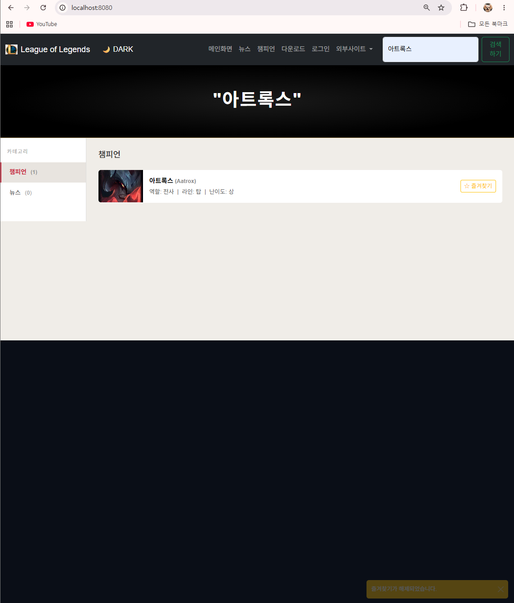

#### 2. 검색 결과 즐겨찾기 추가 후

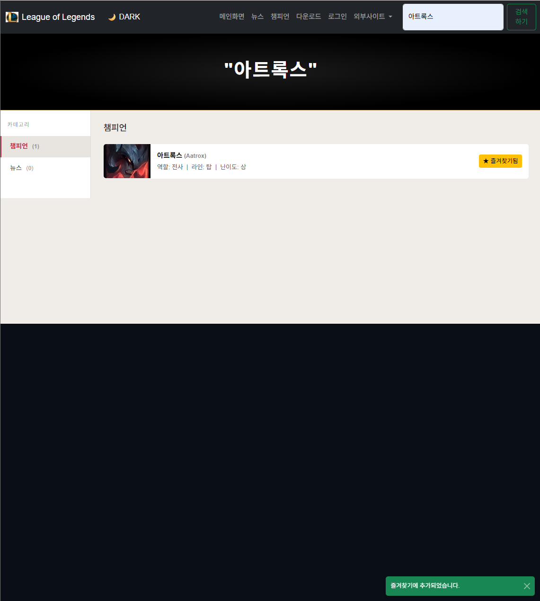

#### 3. 즐겨찾기 ID API 확인

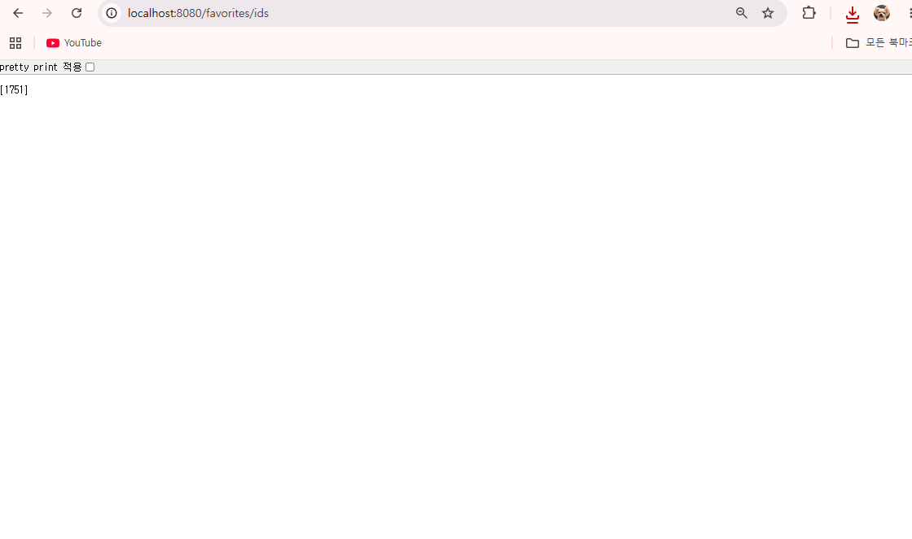

#### 4. 프로필 페이지에서 내가 찜한 챔피언 확인

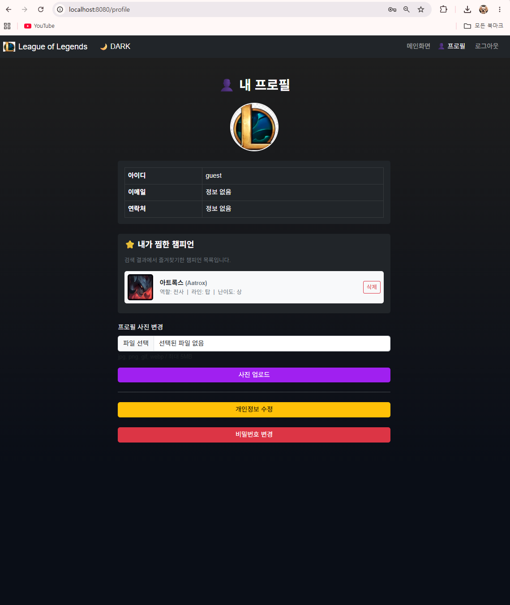

#### 5. 프로필 페이지에서 즐겨찾기 삭제

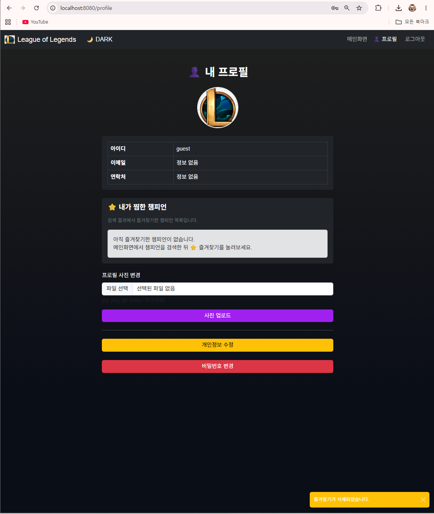

---

## 추가 구현 기능 2: 최근 본 챔피언

즐겨찾기 기능에 이어 로그인 사용자별 맞춤 기능을 추가하기 위해 **최근 본 챔피언 기능**을 구현하였다.

사용자가 검색 결과에서 챔피언 카드를 클릭하면 JavaScript의 `fetch()`를 통해 `/recent/view/{championId}` API로 요청을 보내고, 서버에서는 현재 로그인한 사용자 정보를 세션에서 확인한 뒤 `recent_champions` 테이블에 사용자 아이디, 챔피언 ID, 조회 시간을 저장한다.

이미 최근 본 목록에 존재하는 챔피언을 다시 클릭하면 중복으로 새 데이터를 만들지 않고, 기존 데이터의 조회 시간만 최신 시간으로 갱신되도록 구현하였다. 이를 통해 같은 챔피언을 여러 번 클릭해도 최근 본 목록에는 하나만 표시되고, 가장 최근에 확인한 순서로 목록을 관리할 수 있다.

프로필 페이지에는 `👀 최근 본 챔피언` 영역을 추가하여 사용자가 최근에 확인한 챔피언 목록을 볼 수 있도록 하였다. 또한 `최근 본 목록 비우기` 버튼을 추가하여 사용자가 직접 최근 본 챔피언 기록을 삭제할 수 있도록 구현하였다.

이 기능을 통해 기존 검색 기능을 단순 검색에서 끝내지 않고, 사용자 활동 기록을 저장하고 다시 보여주는 기능으로 확장하였다.

### 구현 파일

| 파일                          | 구현 내용                                        |
| ----------------------------- | ------------------------------------------------ |
| `RecentChampion.java`         | 사용자별 최근 본 챔피언 정보를 저장하는 Entity   |
| `RecentChampionResource.java` | 최근 본 챔피언 저장, 조회, 전체 삭제 REST API    |
| `search.js`                   | 챔피언 카드 클릭 시 최근 본 챔피언 저장 API 호출 |
| `profile.html`                | 프로필 페이지에 최근 본 챔피언 영역 추가         |
| `profile.js`                  | 최근 본 챔피언 목록 조회 및 삭제 기능 처리       |

### 주요 API

| API                         | Method | 설명                                          |
| --------------------------- | ------ | --------------------------------------------- |
| `/recent/view/{championId}` | POST   | 챔피언 카드 클릭 시 최근 본 챔피언 저장       |
| `/recent/my`                | GET    | 로그인 사용자가 최근 본 챔피언 목록 조회      |
| `/recent/clear`             | DELETE | 로그인 사용자의 최근 본 챔피언 목록 전체 삭제 |

### 실행 화면

#### 1. 최근 본 챔피언 API 확인

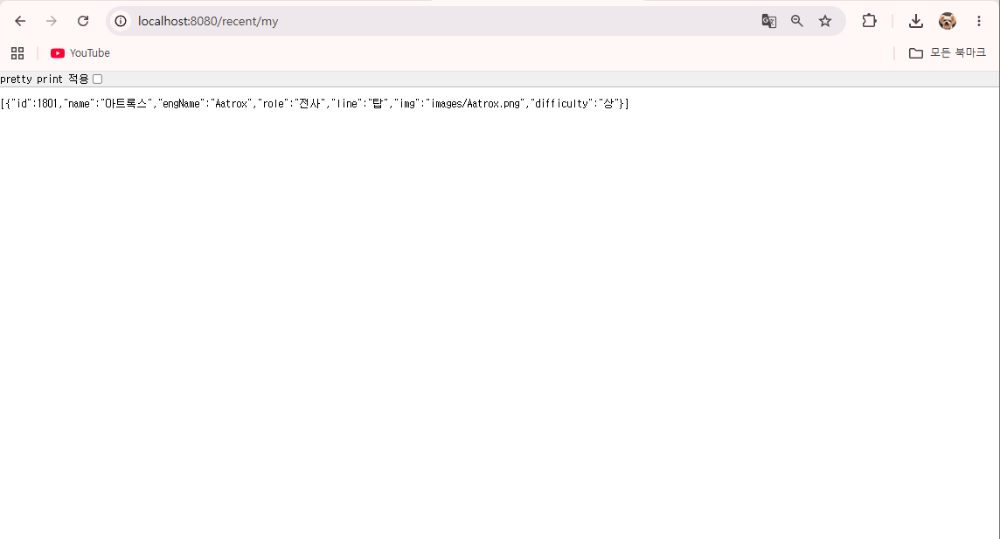

#### 2. 프로필 페이지에서 최근 본 챔피언 확인

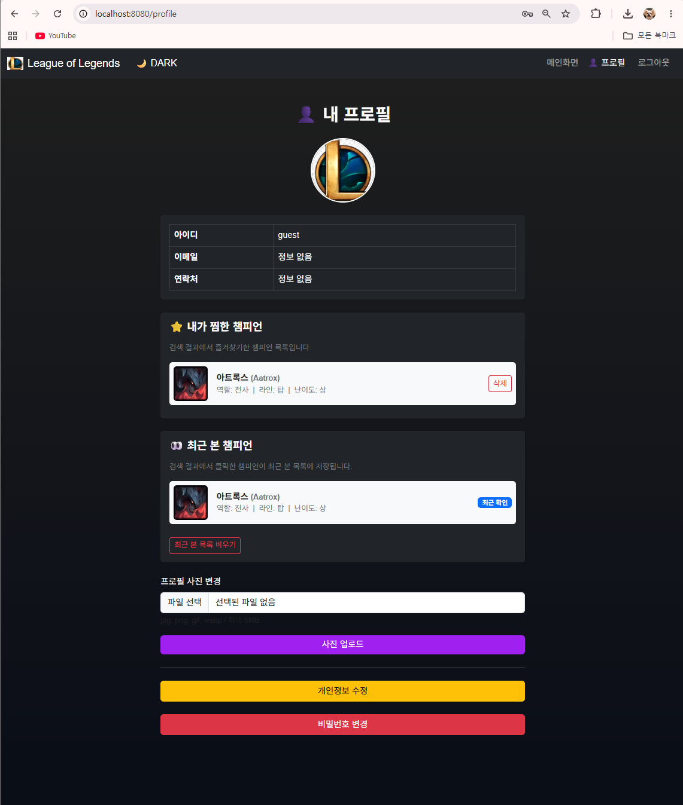

#### 3. 최근 본 챔피언 목록 삭제

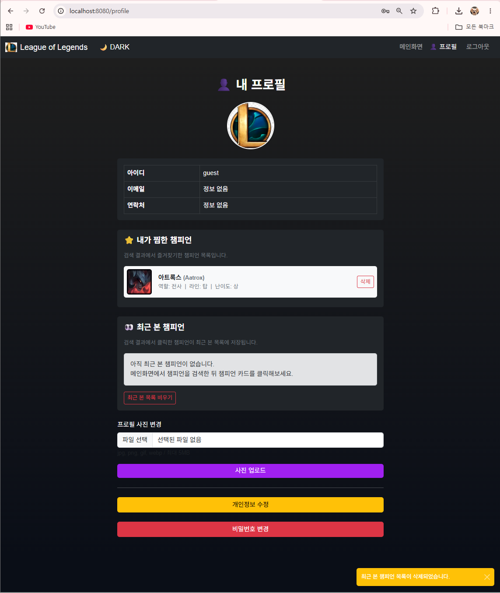

---

## 추가 구현 기능 3: 챔피언 개인 메모

즐겨찾기와 최근 본 챔피언 기능에 이어, 로그인 사용자별로 챔피언에 대한 개인 메모를 작성할 수 있는 **챔피언 개인 메모 기능**을 추가하였다.

사용자는 프로필 페이지에서 챔피언을 선택한 뒤 메모 내용을 입력하고 저장할 수 있다. 저장된 메모는 `champion_memos` 테이블에 사용자 아이디, 챔피언 ID, 메모 내용, 마지막 수정 시간과 함께 저장된다.

이미 메모가 존재하는 챔피언에 다시 메모를 저장하면 새로운 데이터가 중복으로 생성되지 않고 기존 메모 내용과 수정 시간이 갱신되도록 구현하였다. 또한 저장된 메모 목록에서 삭제 버튼을 눌러 특정 챔피언 메모를 삭제할 수 있도록 하였다.

이 기능은 단순 조회 기능이 아니라 사용자가 직접 데이터를 입력하고, 저장하고, 다시 조회하고, 삭제할 수 있는 CRUD 기능이다. 이를 통해 기존 프로젝트를 사용자 맞춤형 데이터 관리 웹 서비스로 확장하였다.

### 구현 파일

| 파일                        | 구현 내용                                                       |
| --------------------------- | --------------------------------------------------------------- |
| `ChampionMemo.java`         | 사용자별 챔피언 개인 메모 정보를 저장하는 Entity                |
| `ChampionMemoResource.java` | 메모 저장, 조회, 삭제 REST API                                  |
| `profile.html`              | 프로필 페이지에 챔피언 개인 메모 작성 영역 추가                 |
| `profile.js`                | 챔피언 목록 불러오기, 메모 저장, 메모 목록 조회, 메모 삭제 처리 |

### 주요 API

| API                   | Method | 설명                                         |
| --------------------- | ------ | -------------------------------------------- |
| `/memos/my`           | GET    | 로그인 사용자가 작성한 챔피언 메모 목록 조회 |
| `/memos/save`         | POST   | 챔피언 개인 메모 저장 또는 수정              |
| `/memos/{championId}` | DELETE | 특정 챔피언 메모 삭제                        |

### 실행 화면

#### 1. 챔피언 개인 메모 영역 추가

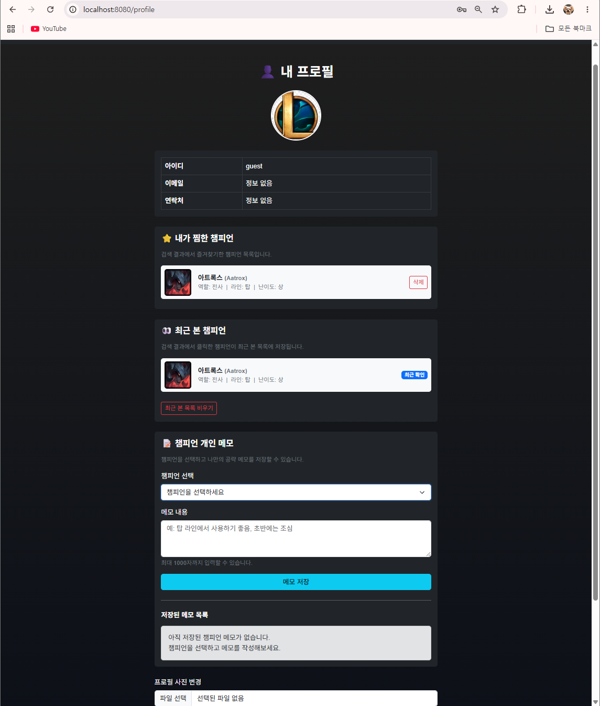

#### 2. 챔피언 개인 메모 저장

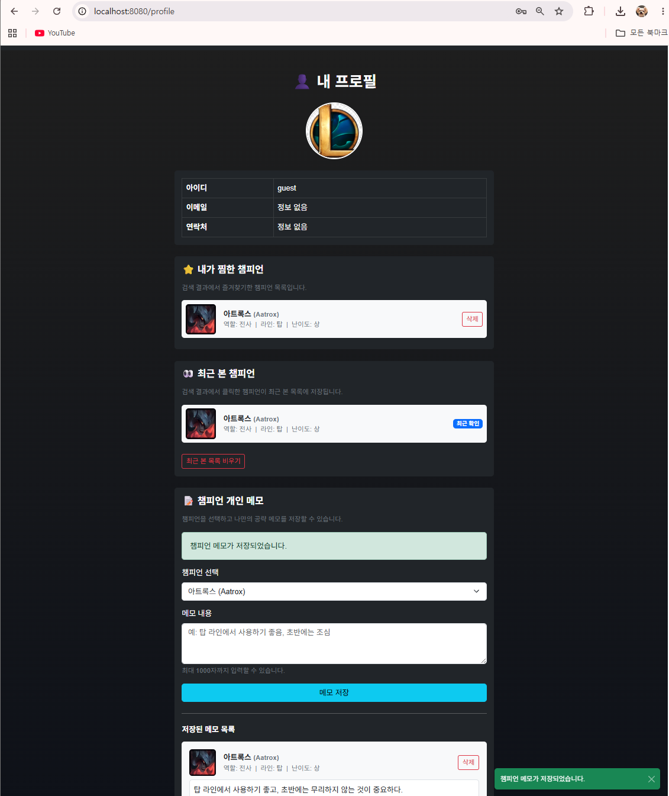

#### 3. 챔피언 개인 메모 삭제

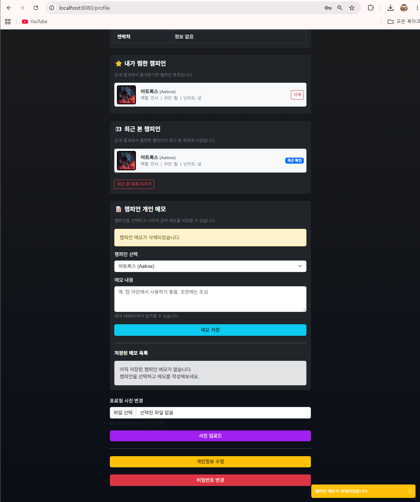

#### 4. 서버 재시작 후 챔피언 메모 유지 확인

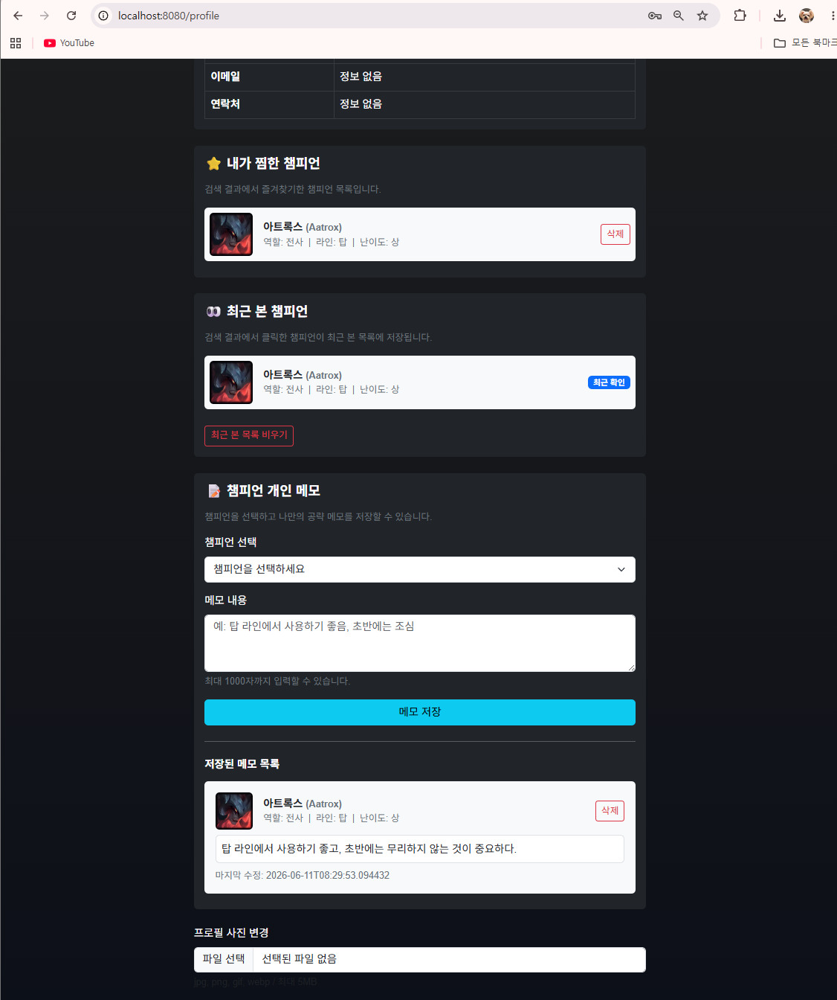

---

## 추가 구현 기능 4: 나의 활동 통계 대시보드

즐겨찾기, 최근 본 챔피언, 챔피언 개인 메모 기능을 구현한 뒤, 사용자의 활동 내역을 한눈에 확인할 수 있도록 **나의 활동 통계 대시보드** 기능을 추가하였다.

프로필 페이지 상단에 `📊 나의 활동 통계` 영역을 만들고, 로그인한 사용자가 저장한 즐겨찾기 수, 최근 본 챔피언 수, 작성한 개인 메모 수, 전체 활동 수를 카드 형태로 표시하였다.

서버에서는 `/stats/my` API를 통해 현재 로그인한 사용자의 세션 정보를 확인한 뒤, `favorite_champions`, `recent_champions`, `champion_memos` 테이블에 저장된 데이터를 각각 조회하여 개수를 계산한다. 계산된 결과는 JSON 형식으로 반환되며, 프론트엔드에서는 JavaScript의 `fetch()`를 사용하여 통계 데이터를 불러와 화면에 표시하였다.

이 기능을 통해 사용자가 프로젝트 안에서 어떤 활동을 했는지 한눈에 확인할 수 있게 되었고, 기존 개별 기능들을 통계 형태로 연결하여 프로필 페이지의 완성도를 높였다.

### 구현 파일

| 파일                     | 구현 내용                                         |
| ------------------------ | ------------------------------------------------- |
| `UserStatsResource.java` | 로그인 사용자의 활동 통계 조회 REST API           |
| `profile.html`           | 프로필 페이지에 나의 활동 통계 대시보드 영역 추가 |
| `profile.js`             | `/stats/my` API 호출 후 통계 수치를 화면에 표시   |

### 주요 API

| API         | Method | 설명                                                          |
| ----------- | ------ | ------------------------------------------------------------- |
| `/stats/my` | GET    | 로그인 사용자의 즐겨찾기, 최근 본 챔피언, 개인 메모 개수 조회 |

### 실행 화면

#### 1. 활동 통계 API 확인

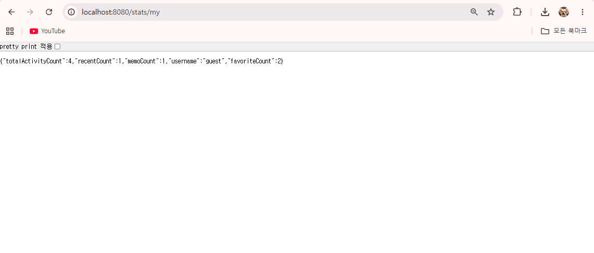

#### 2. 프로필 페이지 활동 통계 대시보드

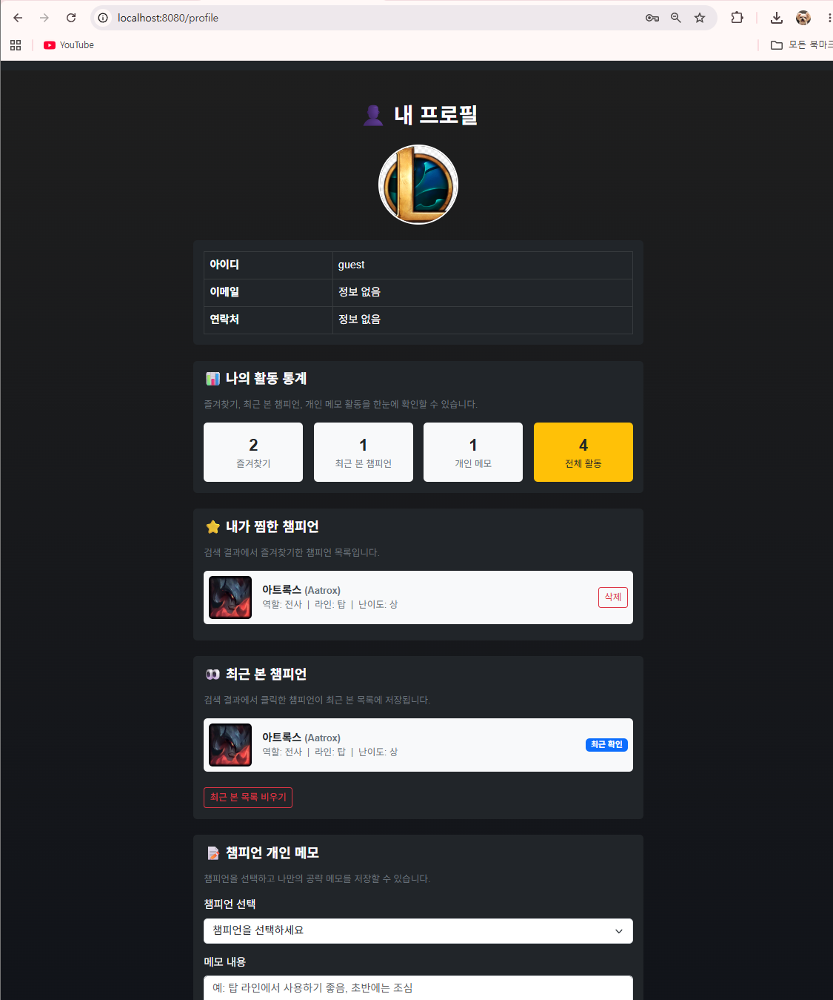

---

## 추가 구현 기능 5: 조건 기반 챔피언 추천

사용자가 원하는 라인과 난이도를 선택하면 DB에 저장된 챔피언 데이터를 기준으로 조건에 맞는 챔피언을 추천하는 **조건 기반 챔피언 추천 기능**을 추가하였다.

프로필 페이지에 `🎯 조건 기반 챔피언 추천` 영역을 만들고, 사용자가 라인과 난이도를 선택할 수 있도록 하였다. 사용자가 `추천 받기` 버튼을 누르면 JavaScript의 `fetch()`를 통해 `/recommend/champions` API로 요청을 보내고, 서버에서는 전달받은 라인과 난이도 조건을 기준으로 `champions` 테이블을 조회한다.

라인만 선택한 경우에는 해당 라인이 포함된 챔피언을 추천하고, 난이도만 선택한 경우에는 해당 난이도의 챔피언을 추천한다. 라인과 난이도를 모두 선택하면 두 조건을 모두 만족하는 챔피언만 추천되도록 구현하였다.

이 기능을 통해 기존 챔피언 검색 기능을 단순 검색에서 끝내지 않고, 사용자의 선택 조건에 따라 맞춤형 챔피언을 추천하는 기능으로 확장하였다.

### 구현 파일

| 파일                             | 구현 내용                                                      |
| -------------------------------- | -------------------------------------------------------------- |
| `ChampionRecommendResource.java` | 라인과 난이도 조건에 맞는 챔피언 추천 REST API                 |
| `profile.html`                   | 프로필 페이지에 조건 기반 챔피언 추천 영역 추가                |
| `profile.js`                     | 추천 조건 선택 후 `/recommend/champions` API 호출 및 결과 출력 |

### 주요 API

| API                                            | Method | 설명                                         |
| ---------------------------------------------- | ------ | -------------------------------------------- |
| `/recommend/champions`                         | GET    | 라인과 난이도 조건에 맞는 챔피언 추천        |
| `/recommend/champions?line=탑&difficulty=상`   | GET    | 탑 라인, 난이도 상 조건에 맞는 챔피언 추천   |
| `/recommend/champions?line=정글&difficulty=중` | GET    | 정글 라인, 난이도 중 조건에 맞는 챔피언 추천 |

### 실행 화면

#### 1. 조건 기반 챔피언 추천 API 확인

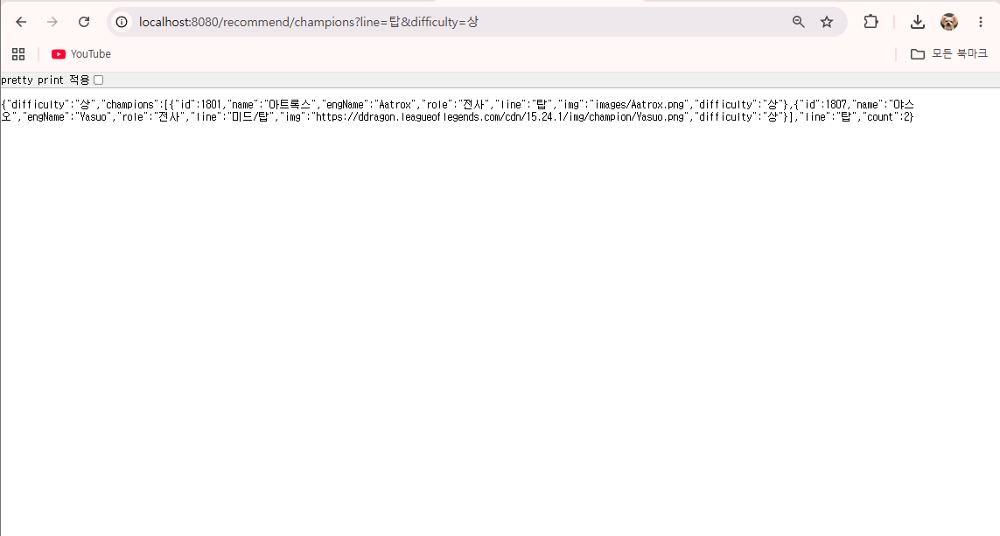

#### 2. 프로필 페이지 조건 기반 챔피언 추천 결과

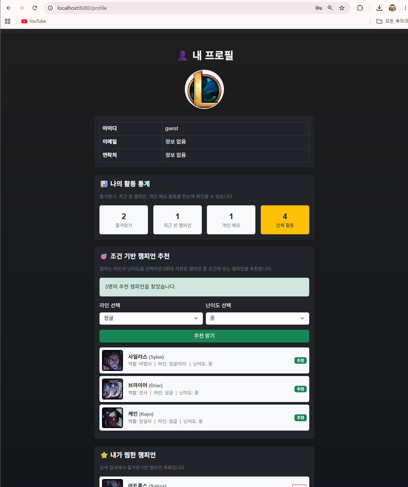

---

## 추가 구현 기능 6: 랜덤 챔피언 추천

조건을 직접 선택하지 않아도 DB에 저장된 챔피언 중 하나를 무작위로 추천받을 수 있도록 **랜덤 챔피언 추천 기능**을 추가하였다.

서버에서는 `/random/champion` API를 통해 `champions` 테이블에 저장된 전체 챔피언 목록을 조회한 뒤, 그중 하나를 랜덤으로 선택하여 JSON 형식으로 반환한다. 프론트엔드에서는 JavaScript의 `fetch()`를 사용하여 해당 API를 호출하고, 추천된 챔피언의 이미지, 이름, 영문명, 역할, 라인, 난이도를 화면에 출력하였다.

프로필 페이지에는 `🎲 랜덤 챔피언 추천` 영역을 추가하였고, 사용자가 `랜덤 챔피언 뽑기` 버튼을 누르면 매번 다른 챔피언을 추천받을 수 있도록 구현하였다.

이 기능을 통해 사용자가 특정 조건을 입력하지 않아도 웹사이트에서 자동으로 챔피언을 추천받을 수 있는 기능을 제공하였다.

### 구현 파일

| 파일                          | 구현 내용                                              |
| ----------------------------- | ------------------------------------------------------ |
| `RandomChampionResource.java` | DB에 저장된 챔피언 중 랜덤으로 한 명 추천하는 REST API |
| `profile.html`                | 프로필 페이지에 랜덤 챔피언 추천 영역 추가             |
| `profile.js`                  | `/random/champion` API 호출 및 랜덤 챔피언 결과 출력   |

### 주요 API

| API                | Method | 설명                                      |
| ------------------ | ------ | ----------------------------------------- |
| `/random/champion` | GET    | DB에 저장된 챔피언 중 랜덤으로 한 명 추천 |

### 실행 화면

#### 1. 랜덤 챔피언 추천 API 확인

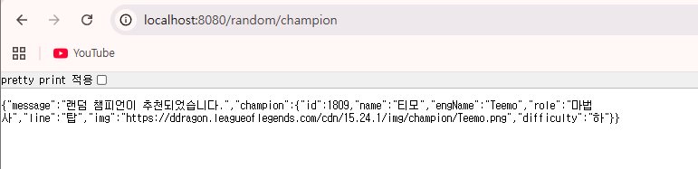

#### 2. 프로필 페이지 랜덤 챔피언 추천 결과

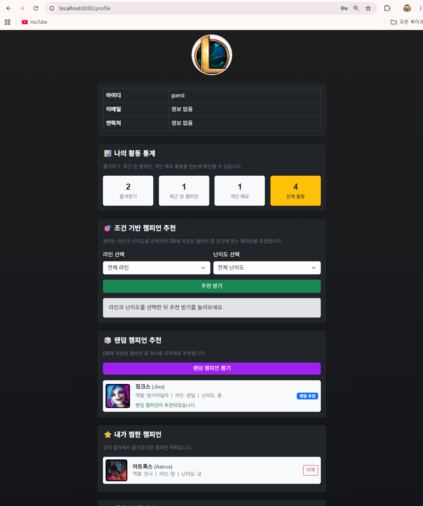

---

## 추가 구현 기능 7: 내가 찜한 챔피언 중 랜덤 추천

전체 챔피언을 대상으로 랜덤 추천하는 기능에 이어, 로그인 사용자가 직접 즐겨찾기한 챔피언 중 하나를 무작위로 추천하는 **내가 찜한 챔피언 랜덤 추천 기능**을 추가하였다.

서버에서는 `/favorite-random/champion` API를 통해 현재 로그인한 사용자의 세션 정보를 확인하고, `favorite_champions` 테이블에서 해당 사용자가 즐겨찾기한 챔피언 목록을 조회한다. 이후 실제 `champions` 테이블에 존재하는 챔피언만 후보로 사용하여 그중 하나를 랜덤으로 선택한다.

프로필 페이지에는 `💛 내가 찜한 챔피언 랜덤 추천` 영역을 추가하였고, 사용자가 `찜한 챔피언 중 랜덤 뽑기` 버튼을 누르면 자신이 즐겨찾기한 챔피언 중 하나를 추천받을 수 있도록 구현하였다.

이 기능은 단순 랜덤 추천보다 더 개인화된 기능으로, 로그인 세션과 사용자별 즐겨찾기 데이터를 활용한다는 점에서 사용자 맞춤형 웹 서비스의 성격을 강화하였다.

### 구현 파일

| 파일                                  | 구현 내용                                               |
| ------------------------------------- | ------------------------------------------------------- |
| `FavoriteRandomChampionResource.java` | 로그인 사용자가 즐겨찾기한 챔피언 중 랜덤 추천 REST API |
| `profile.html`                        | 프로필 페이지에 찜한 챔피언 랜덤 추천 영역 추가         |
| `profile.js`                          | `/favorite-random/champion` API 호출 및 결과 출력       |

### 주요 API

| API                         | Method | 설명                                                     |
| --------------------------- | ------ | -------------------------------------------------------- |
| `/favorite-random/champion` | GET    | 로그인 사용자가 즐겨찾기한 챔피언 중 랜덤으로 한 명 추천 |

### 실행 화면

#### 1. 내가 찜한 챔피언 랜덤 추천 API 확인

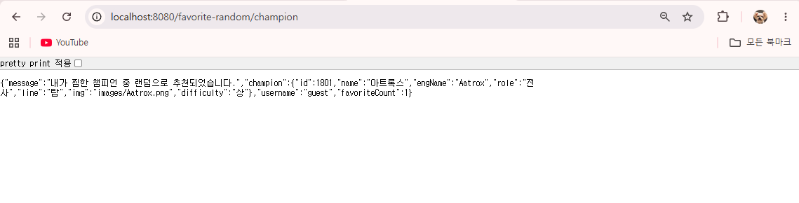

#### 2. 프로필 페이지 내가 찜한 챔피언 랜덤 추천 결과

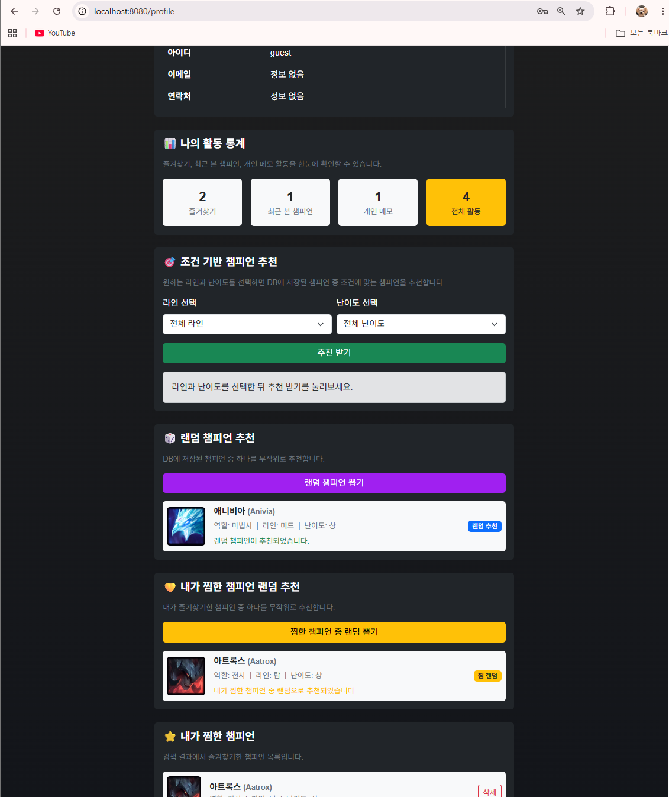

---

## 추가 구현 기능 8: 메인화면 오늘의 랜덤 챔피언

프로필 페이지 중심으로 구현된 랜덤 챔피언 추천 기능을 메인 웹사이트 화면으로 확장하기 위해 **메인화면 오늘의 랜덤 챔피언 기능**을 추가하였다.

기존에는 로그인 후 메인화면인 `/after_login`에서만 해당 기능을 확인할 수 있었지만, 오늘의 랜덤 챔피언은 로그인 여부와 관계없이 모든 사용자가 확인할 수 있는 정보성 기능이므로 로그인 전 기본 메인화면인 `/index.html`에도 동일하게 표시되도록 수정하였다.

메인화면에 `🎲 오늘의 랜덤 챔피언` 영역을 만들고, 사용자가 `오늘의 챔피언 뽑기` 버튼을 누르면 기존에 구현한 `/random/champion` API를 호출하도록 하였다. 서버에서는 DB에 저장된 챔피언 중 하나를 랜덤으로 선택하여 반환하고, 메인화면에서는 해당 챔피언의 이미지, 이름, 영문명, 역할, 라인, 난이도를 카드 형태로 출력한다.

이 기능은 기존 REST API를 재사용하여 기능을 확장했다는 점에서 코드 재사용성과 유지보수 측면에서도 의미가 있다.

### 구현 파일

| 파일                          | 구현 내용                                            |
| ----------------------------- | ---------------------------------------------------- |
| `index.html`                  | 로그인 전 메인화면에 오늘의 랜덤 챔피언 영역 추가    |
| `main_after_login.html`       | 로그인 후 메인화면에 오늘의 랜덤 챔피언 영역 유지    |
| `search.js`                   | `/random/champion` API 호출 및 랜덤 챔피언 결과 출력 |
| `RandomChampionResource.java` | DB 챔피언 중 랜덤 추천 API 제공                      |

### 주요 API

| API                | Method | 설명                                      |
| ------------------ | ------ | ----------------------------------------- |
| `/random/champion` | GET    | DB에 저장된 챔피언 중 랜덤으로 한 명 추천 |

---

## 추가 구현 기능 9: 메인화면 라인별 빠른 챔피언 추천

메인화면에서도 사용자가 원하는 라인을 빠르게 선택하여 추천 챔피언을 확인할 수 있도록 **라인별 빠른 챔피언 추천 기능**을 추가하였다.

기존에는 로그인 후 메인화면인 `/after_login`에서만 라인별 추천 기능을 확인할 수 있었지만, 라인별 챔피언 추천 역시 로그인하지 않은 사용자도 이용할 수 있는 공용 기능이므로 `/index.html`에도 동일하게 표시되도록 수정하였다.

메인화면에 `⚡ 라인별 빠른 챔피언 추천` 영역을 만들고, `탑 추천`, `정글 추천`, `미드 추천`, `원딜 추천`, `서폿 추천` 버튼을 배치하였다. 사용자가 원하는 라인 버튼을 클릭하면 JavaScript의 `fetch()`를 통해 `/recommend/champions?line=라인명` API로 요청을 보내고, 서버에서는 `champions` 테이블에서 해당 라인이 포함된 챔피언 목록을 조회한다.

조회된 챔피언 목록은 메인화면에 카드 형태로 출력되며, 각 카드에는 챔피언 이미지, 이름, 영문명, 역할, 라인, 난이도가 표시된다. 이를 통해 사용자는 검색창을 사용하지 않고도 메인화면에서 바로 라인별 추천 챔피언을 확인할 수 있다.

### 구현 파일

| 파일                             | 구현 내용                                                        |
| -------------------------------- | ---------------------------------------------------------------- |
| `index.html`                     | 로그인 전 메인화면에 라인별 빠른 챔피언 추천 영역 추가           |
| `main_after_login.html`          | 로그인 후 메인화면에 라인별 빠른 챔피언 추천 영역 유지           |
| `search.js`                      | 라인별 버튼 클릭 시 `/recommend/champions` API 호출 및 결과 출력 |
| `ChampionRecommendResource.java` | 라인 조건에 맞는 챔피언 추천 API 제공                            |

### 주요 API

| API                              | Method | 설명                  |
| -------------------------------- | ------ | --------------------- |
| `/recommend/champions?line=탑`   | GET    | 탑 라인 챔피언 추천   |
| `/recommend/champions?line=정글` | GET    | 정글 라인 챔피언 추천 |
| `/recommend/champions?line=미드` | GET    | 미드 라인 챔피언 추천 |
| `/recommend/champions?line=원딜` | GET    | 원딜 라인 챔피언 추천 |
| `/recommend/champions?line=서폿` | GET    | 서폿 라인 챔피언 추천 |

---

## 추가 구현 기능 10: 메인화면 챔피언 데이터 통계

DB에 저장된 챔피언 정보를 메인화면에서 한눈에 확인할 수 있도록 **메인화면 챔피언 데이터 통계 기능**을 추가하였다.

`/champions` API를 통해 DB에 저장된 챔피언 데이터를 불러온 뒤, JavaScript에서 전체 챔피언 수, 라인별 챔피언 수, 난이도별 챔피언 수를 계산하여 화면에 출력하였다.

처음에는 이 기능이 로그인 후 메인화면인 `/after_login`에만 들어가 있었지만, 챔피언 데이터 통계는 로그인하지 않은 사용자도 확인할 수 있는 정보성 기능이므로 로그인 전 기본 메인화면인 `/index.html`에도 동일하게 표시되도록 수정하였다.

이를 통해 로그인하지 않은 방문자도 메인화면에서 현재 사이트에 등록된 챔피언 데이터 현황을 바로 확인할 수 있게 되었다.

### 구현 파일

| 파일                    | 구현 내용                                                             |
| ----------------------- | --------------------------------------------------------------------- |
| `index.html`            | 로그인 전 메인화면에 챔피언 데이터 통계 영역 추가                     |
| `main_after_login.html` | 로그인 후 메인화면에 챔피언 데이터 통계 영역 유지                     |
| `search.js`             | `/champions` API 데이터 기반으로 전체 수, 라인별 수, 난이도별 수 계산 |
| `ChampionResource.java` | DB에 저장된 챔피언 목록을 JSON 형식으로 제공                          |

### 주요 API

| API          | Method | 설명                              |
| ------------ | ------ | --------------------------------- |
| `/champions` | GET    | DB에 저장된 전체 챔피언 목록 조회 |

### 실행 화면

#### 로그인 전 랜덤 챔피언 및 라인 추천 결과

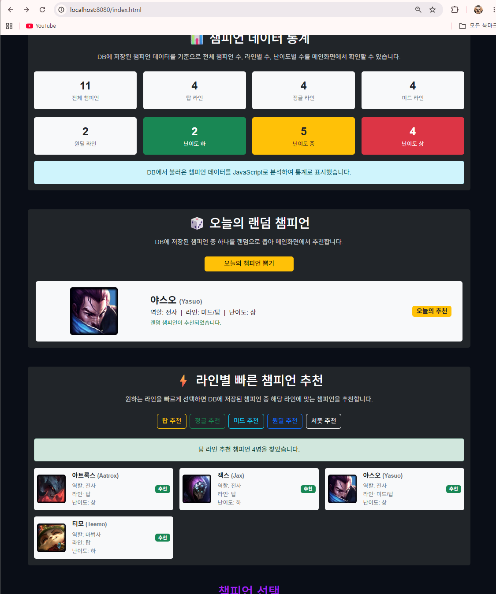

> 위 실행 화면에서 챔피언 데이터 통계, 오늘의 랜덤 챔피언, 라인별 빠른 챔피언 추천 결과를 함께 확인할 수 있다.

---

## 추가 구현 기능 11: 서버 재시작 후 데이터 유지

추가 기능 구현 과정에서 서버를 재시작할 때 기존 데이터가 초기화되지 않도록 `DataSeeder.java`를 수정하였다.

기존에는 서버가 실행될 때마다 `Champion.deleteAll()`, `User.deleteAll()`이 실행되어 챔피언과 사용자 데이터가 삭제되고 다시 생성되었다. 이 방식은 즐겨찾기, 최근 본 챔피언, 챔피언 개인 메모 기능에서 사용하는 챔피언 ID가 바뀔 수 있어 데이터 연결이 꼬일 위험이 있었다.

이를 해결하기 위해 데이터 전체 삭제 코드를 제거하고, 챔피언 데이터가 하나도 없을 때만 초기 챔피언 데이터를 등록하도록 수정하였다. 또한 `guest` 계정도 이미 존재하면 유지하고, 존재하지 않을 때만 새로 생성되도록 변경하였다.

이 개선을 통해 서버를 재시작해도 사용자가 저장한 즐겨찾기, 최근 본 챔피언, 챔피언 개인 메모 데이터가 유지되도록 하였다.

### 수정 파일

| 파일              | 수정 내용                                                     |
| ----------------- | ------------------------------------------------------------- |
| `DataSeeder.java` | 서버 시작 시 데이터 전체 삭제 제거                            |
| `DataSeeder.java` | `Champion.count() == 0`일 때만 초기 챔피언 등록               |
| `DataSeeder.java` | `User.findByUsername("guest") == null`일 때만 guest 계정 등록 |

### 실행 화면

#### 서버 재시작 후 데이터 유지 확인

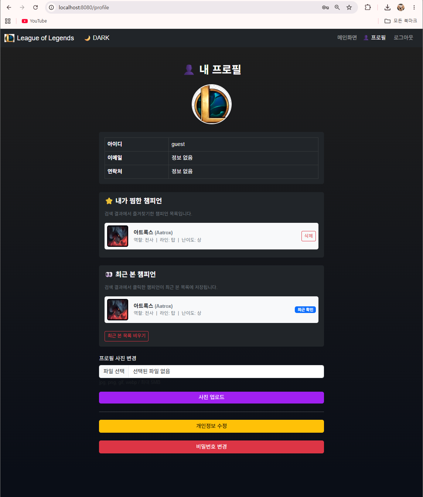

#### 서버 재시작 후 챔피언 개인 메모 유지 확인


---

## 추가 구현 기능 최종 요약

이번 추가 구현에서는 기존 수업에서 배운 로그인, 세션, MySQL 데이터베이스, REST API, JavaScript fetch, 프로필 페이지 기능을 활용하여 사용자별 맞춤 기능과 메인화면 추천 기능을 확장하였다.

| 추가 기능                       | 설명                                                                  |
| ------------------------------- | --------------------------------------------------------------------- |
| 로그인 사용자별 챔피언 즐겨찾기 | 로그인 사용자별로 원하는 챔피언을 즐겨찾기에 저장                     |
| 최근 본 챔피언                  | 검색 결과에서 클릭한 챔피언을 최근 본 목록에 저장                     |
| 챔피언 개인 메모 CRUD           | 로그인 사용자별로 챔피언에 대한 개인 메모 저장, 조회, 삭제            |
| 나의 활동 통계 대시보드         | 즐겨찾기, 최근 본 챔피언, 개인 메모 개수를 통계로 표시                |
| 조건 기반 챔피언 추천           | 라인과 난이도 조건을 기준으로 챔피언 추천                             |
| 랜덤 챔피언 추천                | DB에 저장된 챔피언 중 하나를 랜덤으로 추천                            |
| 내가 찜한 챔피언 랜덤 추천      | 로그인 사용자가 즐겨찾기한 챔피언 중 하나를 랜덤으로 추천             |
| 메인화면 오늘의 랜덤 챔피언     | 로그인 전/후 메인화면에서 DB 챔피언 중 하나를 랜덤 추천               |
| 메인화면 라인별 빠른 추천       | 로그인 전/후 메인화면에서 라인 버튼을 눌러 해당 라인의 챔피언 추천    |
| 메인화면 챔피언 데이터 통계     | 로그인 전/후 메인화면에서 전체 챔피언 수, 라인별 수, 난이도별 수 표시 |
| 서버 재시작 후 데이터 유지      | 서버 재시작 후에도 사용자 데이터가 유지되도록 수정                    |

> 기존 수업에서 구현한 로그인, 세션, DB, REST API, 프로필 기능을 활용하여 사용자별 데이터를 저장하고 조회하는 맞춤형 웹 서비스 기능으로 확장하였다. 또한 챔피언 개인 메모 기능을 추가하여 사용자가 직접 데이터를 입력, 저장, 조회, 삭제할 수 있는 CRUD 기능을 구현하였고, 활동 통계와 여러 추천 기능을 통해 사용자 경험을 높였다. 추가로 로그인 전 기본 메인화면에도 챔피언 데이터 통계, 오늘의 랜덤 챔피언, 라인별 빠른 추천 기능을 적용하여 로그인하지 않은 사용자도 사이트의 주요 추천 기능을 확인할 수 있도록 개선하였다.
