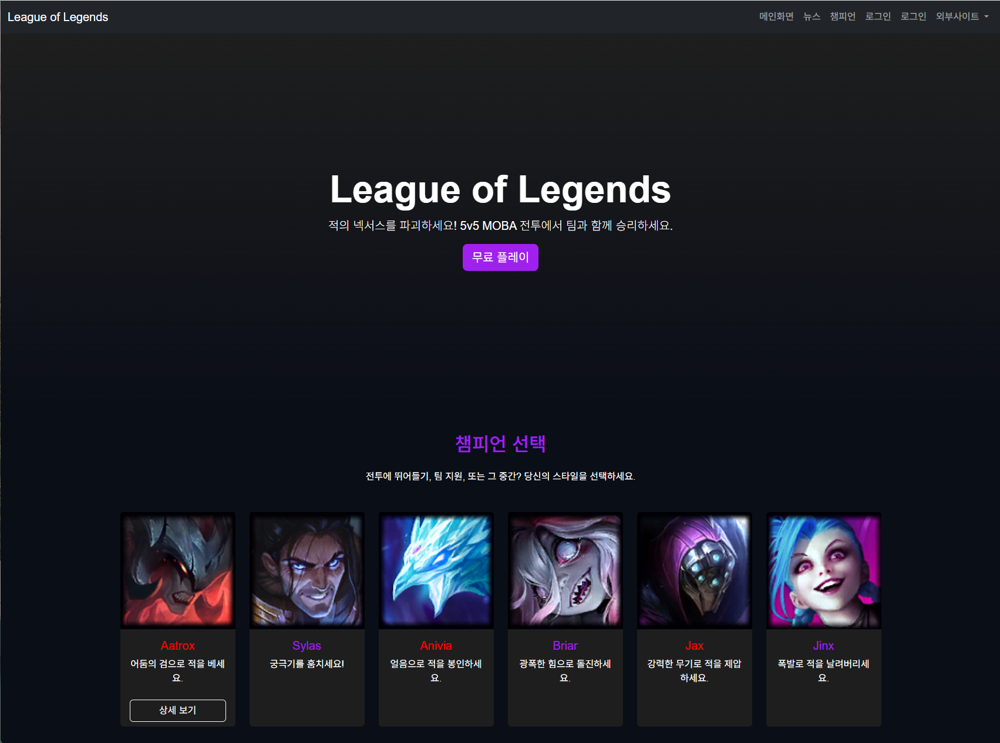
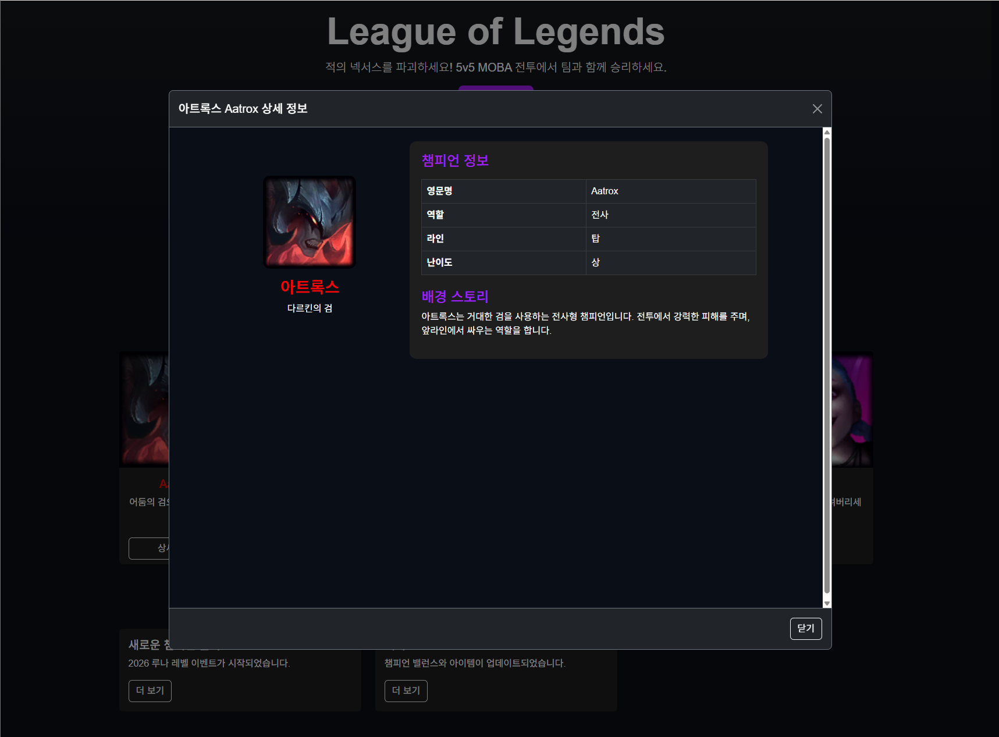
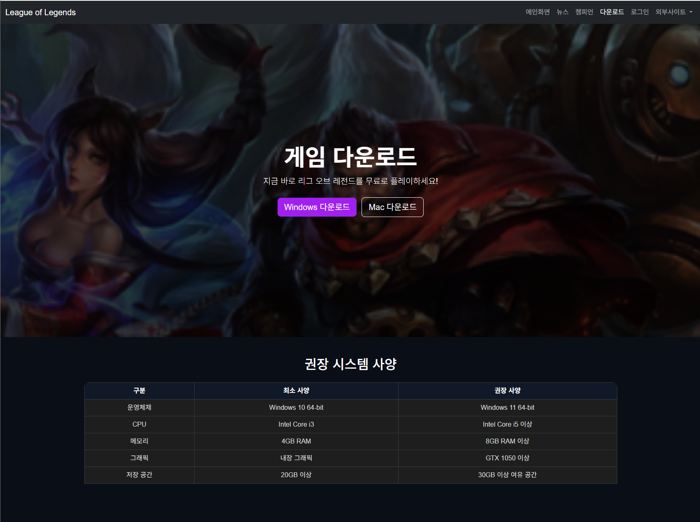

# Quarkus LOL Fan Site

자바웹프로그래밍 수업 실습 프로젝트입니다.  
Quarkus 기반으로 LOL 팬 사이트 메인 페이지, 챔피언 상세 모달, 로그인 페이지, 다운로드 페이지를 구현했습니다.

## 2주차 수업 내용

- Quarkus 개발 환경 구축
- `http://localhost:8080/` 서버 실행 확인
- `META-INF/resources/index.html` 생성
- HTML 기본 태그 작성
- Bootstrap 5 적용
- LOL 메인화면 프로토타입 구현
- 다크 테마 CSS 및 카드 hover 효과 적용

## 4주차 수업 내용

- 네비게이션 바 수정
- 메인화면 / 뉴스 / 챔피언 / 다운로드 / 로그인 메뉴 구성
- 외부사이트 드롭다운 메뉴 추가
- LOL 공식 웹사이트, Bootstrap 공식문서, Quarkus 공식문서 링크 연결
- 챔피언 카드 6개 구성
- Aatrox 상세보기 버튼 추가
- Bootstrap 모달창 구현
- `modals/Aatrox.html` 상세 페이지 생성
- iframe 방식으로 모달 내용 분리
- `images/Aatrox.png` 로컬 이미지 적용
- 로그인 서브 페이지 생성
- `login_page_sub/login.html` 연결
- 다운로드 서브 페이지 생성
- `main_page_sub/download.html` 연결
- `download-banner.jpg` 배경 이미지 적용
- 권장 시스템 사양 표 추가
- `download.css` 파일로 CSS 분리

## 실행 방법

```bash
cmd /c mvnw.cmd quarkus:dev
```

브라우저에서 아래 주소로 접속합니다.

```text
http://localhost:8080/
```

## 주요 페이지

- 메인 페이지: `http://localhost:8080/`
- 로그인 페이지: `http://localhost:8080/login_page_sub/login.html`
- 다운로드 페이지: `http://localhost:8080/main_page_sub/download.html`
- 아트록스 상세 페이지: `http://localhost:8080/modals/Aatrox.html`

## 화면 예시

### 메인 페이지



### 아트록스 상세 모달



### 다운로드 페이지


